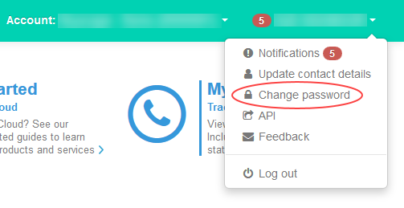

# How to reset your UKCloud Portal password or memorable word

## Overview

We recommend that you change your password at least every 90 days.

When you contact UKCloud Support, you may be asked to provide letters from a memorable word to authenticate yourself. You can change your memorable word at any time.

### Intended audience

Any Portal user can reset their own password or memorable word.

To reset another user's password or memorable word, you must be a Portal administrator.

> [!NOTE]
> For users of the Elevated OFFICIAL Portal, any changes to a user's password or memorable word must be completed by an administrator.

In the event that an administrator requires a password or memorable word reset, and no other administrators are available, contact UKCloud Support on 01252 303300 and select option 2.

## Resetting your own password or memorable word

To change your own password or memorable word:

1. [*Log in to the UKCloud Portal*](ptl-gs.html#logging-in-to-the-ukcloud-portal) as usual.

2. At the top right-hand corner, click your user name, and select **Change password**.

   

3. Enter your **Current password** to confirm your identity.

4. Change your password or memorable word as required.

   

5. Click **Save**.

## Resetting another user's password or memorable word

If a user forgets their password or memorable word, an administrator can reset them:

1. [*Log in to the UKCloud Portal*](ptl-gs.html#logging-in-to-the-ukcloud-portal) as an administrator.

2. In the navigation panel, expand **Contacts** then select **All contacts**.

   

3. Locate the user and click the **Edit** button for that user.

   

4. On the **Edit contact** tab, select the **User** tab.

5. Update the password or memorable word as required.

   

6. Click **Save**.

## Feedback

If you find a problem with this article, click **Improve this Doc** to make the change yourself or raise an [issue](https://github.com/UKCloud/documentation/issues) in GitHub. If you have an idea for how we could improve any of our services, send an email to <feedback@ukcloud.com>.
