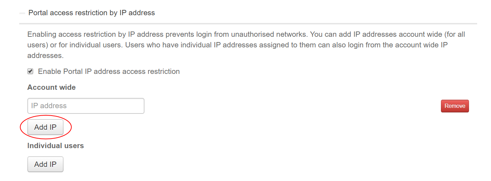
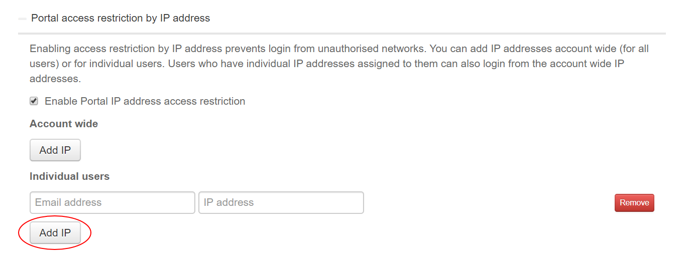

#### UKCloud Limited (“UKC”) and Virtual Infrastructure Group Limited (“VIG”) (together “the Companies”) – in Compulsory Liquidation

On 25 October 2022, the Companies were placed into Liquidation with the Official Receiver appointed as Liquidator and J Robinson and A M Hudson simultaneously appointed as Special Managers to manage the liquidation process on behalf of the Official Receiver.

Further information regarding the Liquidations can be found here: <https://www.gov.uk/government/news/virtual-infrastructure-group-limited-and-ukcloud-limited-information-for-creditors-and-interested-parties>

Contact details: 
For any general queries relating to the Liquidations please email <ukcloud@uk.ey.com> 
For customer related queries please email <ukcloudcustomers@uk.ey.com> 
For supplier related queries please email <ukcloudsuppliers@uk.ey.com>

# How to restrict access to the UKCloud Portal

## Overview

You can restrict access to the UKCloud Portal by creating an allowlist of permitted IP addresses. This helps to prevent access to the Portal from unauthorised sources as users will only be able to log in to the Portal if their request originates from an IP address on the allowlist.

> [!IMPORTANT]
> Be careful when entering IP addresses. Entering the wrong address may make the Portal inaccessible and you'll be unable to change the settings. If you lose access to the Portal, contact UKCloud Support.

> [!NOTE]
> When specifying IP addresses, you must use individual IP addresses. You cannot restrict access to groups of IP addresses, for example by range or subnet. You must create a separate entry for each individual IP address.

## Restricting access to the Portal

To restrict access to the Portal:

1. [*Log in to the UKCloud Portal*](ptl-gs.md#logging-in-to-the-ukcloud-portal) as an administrator.

2. If necessary, switch to the account for which you want to change the security settings.

3. In the navigation panel, select **Settings**.

   

4. On the *Settings* page, select the **Security Settings** tab.

   

5. Click **Portal access restriction by IP address** to expand the section.

6. Select **Enable Portal IP address access restriction**.

   

7. If you want to set up an allowlist that applies to all users, in the *Account wide* section, click **Add IP** and enter the IP address that you want users to be able to access the Portal from.

   If you want to specify multiple IP addresses, create a separate entry for each address.

   Anyone attempting to log in to the Portal must do so from one of the permitted IP addresses. Individual users can also have permitted IP addresses associated with their account (see next step).

   

8. If you want to set up an allowlist for an individual user, in the *Individual users* section, click **Add IP**, enter the user's login email address in the first field and the IP address that you want to allow in the second field.

   If you want to specify multiple IP addresses for the user, create a separate entry for each address.

   The named user must access the Portal from one of the permitted IP addresses associated with their account or one of the account wide permitted IP addresses.

   

9. When you're done, click **Save**.

## Next steps

You can also restrict access to VMware Cloud Director. For more information, see [*How to restrict access to VMware Cloud Director*](ptl-how-restrict-access-vcloud-api.md)

## Feedback

If you find an issue with this article, click **Improve this Doc** to suggest a change. If you have an idea for how we could improve any of our services, visit [UKCloud Ideas](https://ideas.ukcloud.com). Alternatively, you can contact us at <products@ukcloud.com>.
