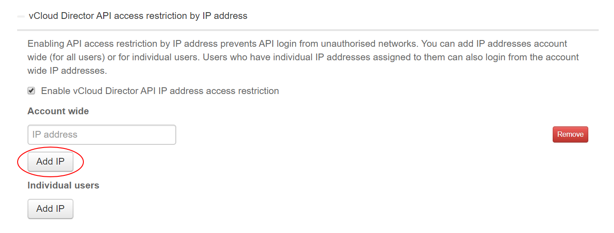

# How to restrict access to the vCloud API

## Overview

You can restrict access to the vCloud API by creating a whitelist of acceptable IP addresses. This helps to prevent access to the API from unauthorised sources as users will only be able to access the API if their request originates from an IP address on the whitelist.

> [!NOTE]
> When specifying IP addresses, you must use individual IP addresses. You cannot restrict access to groups of IP addresses, for example by range or subnet.

> [!IMPORTANT]
> Be careful when entering IP addresses. Entering the wrong address may make the vCloud API inaccessible and you will be unable to change the settings. If you lose access to the API, contact UKCloud Support.

## Restricting access to the vCloud API

To restrict access to the vCloud API:

1. Log in to the UKCloud Portal as an administrator

    For more detailed instructions, see the [*Getting Started Guide for the UKCloud Portal*](ptl-gs.md).

2. If necessary, switch to the account for which you want to change the security settings.

3. In the navigation panel, select **Settings**.

    

4. On the *Settings* page, select the **Security Settings** tab.

    

5. Click **vCloud Director API access restriction by IP address** to expand the section.

6. Select **Enable vCloud Director API IP address access restriction**.

7. To add an IP address to the whitelist, click **Add IP** in the *Account wide* section and enter the IP addresses that you want to whitelist.

    

8. To whitelist an IP address for a specific user, in addition to the account-wide IP addresses, click **Add IP** in the *Individual users* section, enter the email address for the user and the IP addresses that you want to whitelist.

    

    > [!NOTE]
    > When specifying IP addresses, you must use individual IP addresses. You cannot restrict access to groups of IP addresses, for example by range or subnet.

9. When you're done, click **Save**.

## Next steps

You can also restrict access to the UKCloud Portal. For more information, see [*How to restrict access to the UKCloud Portal*](ptl-how-restrict-access-portal.md)

## Feedback

If you find an issue with this article, click **Improve this Doc** to suggest a change. If you have an idea for how we could improve any of our services, visit [UKCloud Ideas](https://ideas.ukcloud.com). Alternatively, you can contact us at <products@ukcloud.com>.
