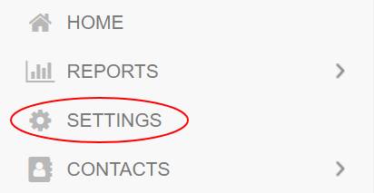
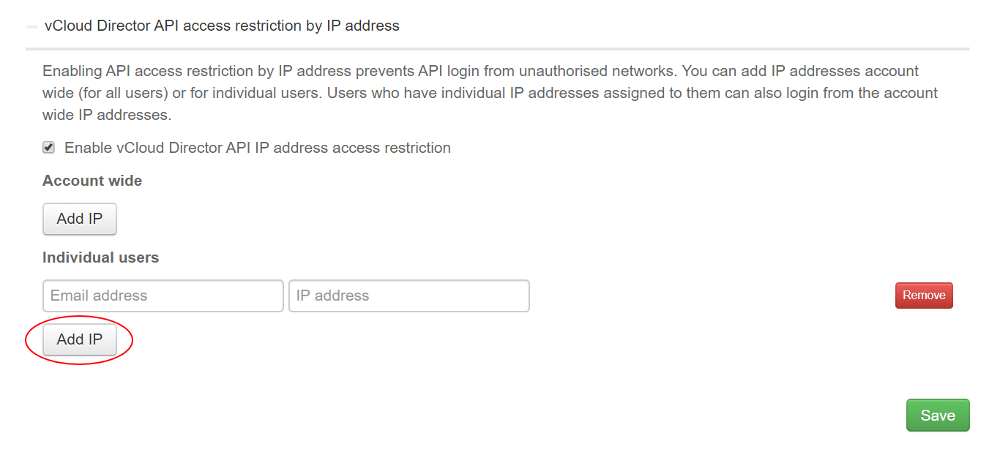

# How to restrict access to VMware Cloud Director

## Overview

You can restrict access to VMware Cloud Director by creating an allowlist of acceptable IP addresses. This helps to prevent access from unauthorised sources as users will only be able to access VMware Cloud Director if their request originates from an IP address on the allowlist.

> [!IMPORTANT]
> Enabling this option restricts access to both the vCloud API and the VMware Cloud Director UI.

> [!NOTE]
> - Be careful when entering IP addresses. Entering the wrong address may make the API and UI inaccessible until you change the settings.
>
> - When specifying IP addresses, you must use individual IP addresses. You cannot restrict access to groups of IP addresses, for example by range or subnet.

## Restricting access to VMware Cloud Director

1. Log in to the UKCloud Portal as an administrator

    For more detailed instructions, see the [*Getting Started Guide for the UKCloud Portal*](ptl-gs.md).

2. If necessary, switch to the account for which you want to change the security settings.

3. In the navigation panel, select **Settings**.

    

4. On the *Settings* page, select the **Security Settings** tab.

    

5. Click **vCloud Director access restriction by IP address** to expand the section.

6. Select **Enable vCloud Director IP address access restriction**.

7. To add an IP address to the allowlist, click **Add IP** in the *Account wide* section and enter the IP addresses that you want to allow.

    

8. To allow an IP address for a specific user, in addition to the account-wide IP addresses, click **Add IP** in the *Individual users* section, enter the email address for the user and the IP addresses that you want to allow.

    

9. When you're done, click **Save**.

## Next steps

You can also restrict access to the UKCloud Portal. For more information, see [*How to restrict access to the UKCloud Portal*](ptl-how-restrict-access-portal.md)

## Feedback

If you find an issue with this article, click **Improve this Doc** to suggest a change. If you have an idea for how we could improve any of our services, visit [UKCloud Ideas](https://ideas.ukcloud.com). Alternatively, you can contact us at <products@ukcloud.com>.
