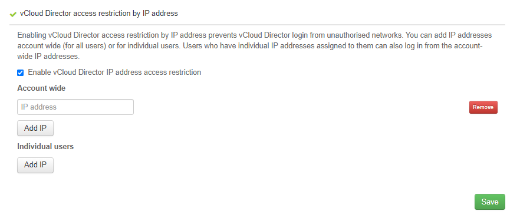
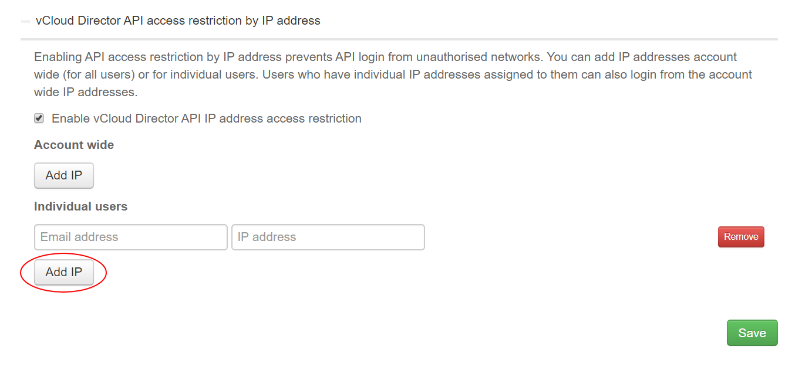

# How to restrict access to the vCloud API via IP address

## Overview

You can restrict access so that specific IP addresses are unable to access the vCloud API. This helps to prevent access to the API from unauthorised sources.

> [!NOTE]
> When specifying IP addresses, you must use individual IP addresses. You cannot restrict access to groups of IP addresses, for example by range or subnet.

## Restricting access to the vCloud API

To restrict access to the vCloud API:

1. Log in to the UKCloud Portal as an administrator

    For more detailed instructions, see the [*Getting Started Guide for the UKCloud Portal*](ptl-gs.md).

2. If necessary, switch to the account for which you want to change the security settings.

3. In the navigation panel, select **Settings**.

    

4. On the *Settings* page, select the **Security Settings** tab.

    

5. Click **vCloud Director API access restriction by IP address** to expand the section.

6. Select **Enable vCloud Director API IP address access restriction**.

7. To restrict access from the specified IP addresses for all users of the account, click **Add IP** in the *Account wide* section and enter the IP addresses that you want to prevent from accessing the API.

    

8. To restrict access from the specified IP addresses for specific users, click **Add IP** in the *Individual users* section and enter the email address for the user and the IP addresses that you want to prevent that user accessing the API from.

    

    > [!NOTE]
    > When specifying IP addresses, you must use individual IP addresses. You cannot restrict access to groups of IP addresses, for example by range or subnet.

9. When you're done, click **Save**.

## Next steps

You can also restrict IP access to the UKCloud Portal. For more information, see [*How to restrict access to the UKCloud Portal via IP address*](ptl-how-restrict-ip-access-portal.md)

## Feedback

If you find an issue with this article, click **Improve this Doc** to suggest a change. If you have an idea for how we could improve any of our services, visit [UKCloud Ideas](https://ideas.ukcloud.com). Alternatively, you can contact us at <products@ukcloud.com>.
