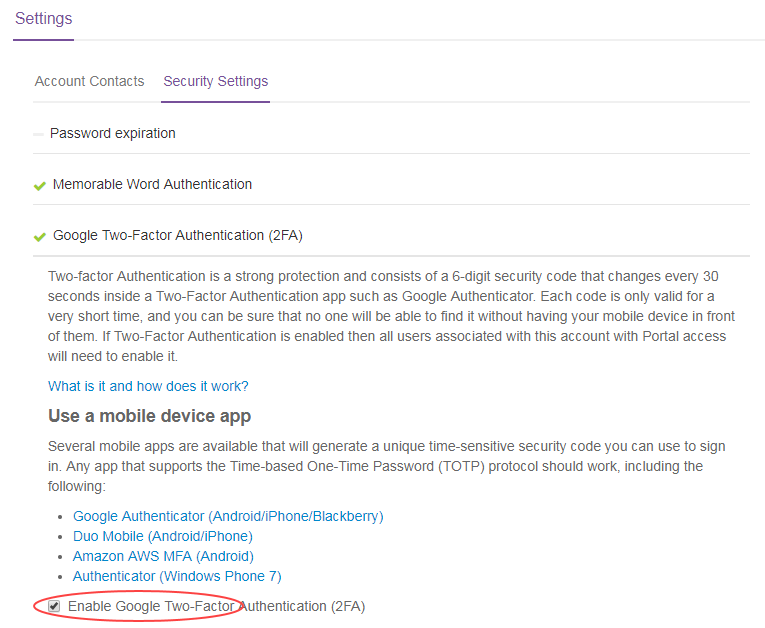
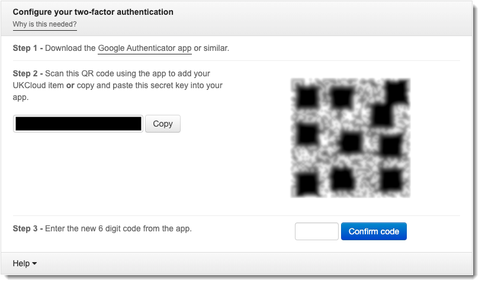

# How to set up two-factor authentication in the UKCloud Portal

## Overview

To provide additional security, you may want to set up two-factor authentication (2FA) in the UKCloud Portal. 2FA in the Portal requires that users enter a randomly generated code, as well as their user name and and password, when logging in to the Portal.

To set up 2FA, a Portal administrator must first enable 2FA for the Portal account. After enabling 2FA for the account, the next time a user attempts to log in, they will be prompted to set up 2FA for their user account by registering their Portal account with an authenticator app, such as Google Authenticator.

## Enabling 2FA in the UKCloud Portal (administrators)

If you are a Portal administrator, you can enable 2FA for an account so that users must provide a 2FA code when they log in as well as their user name and password.

To enable 2FA:

1. Log in to the UKCloud Portal as an administrator.

    For more detailed instructions, see the [*Getting Started Guide for the UKCloud Portal*](ptl-gs.md).

2. In the navigation panel, click **Settings**.

3. Select the **Security Settings** tab.

4. Expand the *Google Two-Factor Authentication (2FA)* section.

5. Select the **Enable Google Two-Factor Authentication (2FA)** check box.

    

6. When you're done, click **Save**.

## Setting up 2FA for a user account (all users)

When you first log in to a Portal account that has 2FA enabled, you'll be prompted to set up 2FA:

1. Log in to the UKCloud Portal, providing your user name and password as usual and memorable word, if required.

    For more detailed instructions, see the [*Getting Started Guide for the UKCloud Portal*](ptl-gs.md).

2. Per the instructions in the *Configure your two-factor authentication* dialog box, install an authenticator app and scan the provided QR code.

    

3. When you've installed and set up your authenticator app, enter the 6 digit code provided by the app in the *Configure your two-factor authentication* dialog box and click **Confirm code** to log in to the Portal.

4. For future logins to the Portal, use your authenticator app to generate a 2FA code to confirm your identity and complete the log in process.

## Related videos

- [*UKCloud Portal overview video*](ptl-vid-portal.md)

## Feedback

If you find an issue with this article, click **Improve this Doc** to suggest a change. If you have an idea for how we could improve any of our services, visit [UKCloud Ideas](https://ideas.ukcloud.com). Alternatively, you can contact us at <products@ukcloud.com>.
