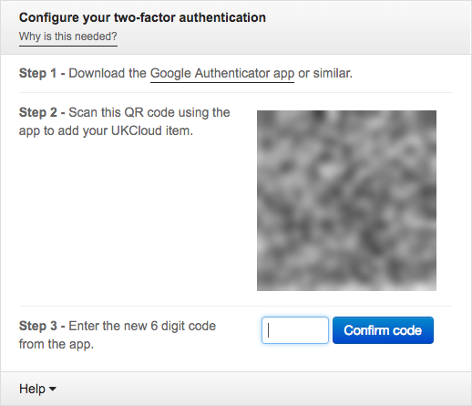

# How to set up two-factor authentication for a user account

## Overview

If your Portal administrator has enabled two-factor authentication (2FA) in the UKCloud Portal, you must enter a randomly generated code, as well as your user name and password, when logging in to the Portal.

The first time you log into the Portal after 2FA is enabled, you'll need to to set up 2FA for your user account by registering your account with an authenticator app, such as Google Authenticator.

## Setting up 2FA

When you first log in to a Portal account that has 2FA enabled, you'll be prompted to set up 2FA:

1. Log in to the UKCloud Portal, providing your user name and password as usual.

    For more detailed instructions, see the [*Getting Started Guide for the UKCloud Portal*](ptl-gs.md).

2. Install an authenticator app if you don't already have one which is compatible. UKCloud has tested 2FA with Google Authenticator, which is a smart phone app, and Authy, which is available as a smart phone app, desktop app or Chrome plug-in. Other authenticator apps may also be compatible but have not been tested. Once the authenticator app is installed, scan the QR code. This is a one-off set up and does not need to be repeated as part of the normal Portal log-in process.

    

3. When you've installed and set up your authenticator app, enter the 6 digit code provided by the app in the *Configure your two-factor authentication* dialog box and click **Confirm code** to log in to the Portal.

4. For future logins to the Portal, use your authenticator app to generate a 2FA code to confirm your identity and complete the log in process.

## Related videos

- [*UKCloud Portal overview video*](ptl-vid-portal.md)

## Feedback

If you find an issue with this article, click **Improve this Doc** to suggest a change. If you have an idea for how we could improve any of our services, visit the [Ideas](https://community.ukcloud.com/ideas) section of the [UKCloud Community](https://community.ukcloud.com).
