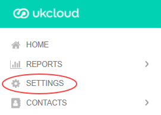
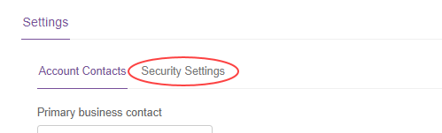
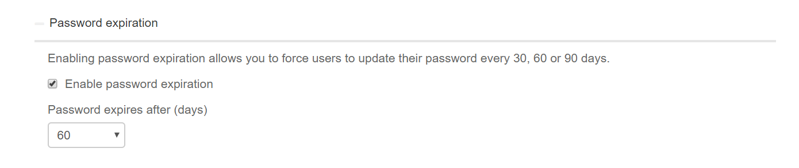

# How to set up password expiration

## Overview

You can set Portal passwords to expire after a specified number of days to ensure that users frequently change their passwords.

## Setting password expiration

To set up password expiration:

1. Log in to the UKCloud Portal as an administrator

    For more detailed instructions, see the [*Getting Started Guide for the UKCloud Portal*](ptl-gs.md).

2. If necessary, switch to the account for which you want to change the security settings.

3. In the navigation panel, select **Settings**.

    

4. On the *Settings* page, select the **Security Settings** tab.

    

5. Click **Password expiration** to expand the section.

6. Select **Enable password expiration**.

7. In the **Password expires after** field, select the number of days after which passwords should expire: 30, 60 or 90 days.

    

8. When you're done, click **Save**.

## Feedback

If you find an issue with this article, click **Improve this Doc** to suggest a change. If you have an idea for how we could improve any of our services, visit [UKCloud Ideas](https://ideas.ukcloud.com). Alternatively, you can contact us at <products@ukcloud.com>.