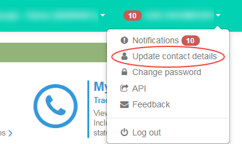
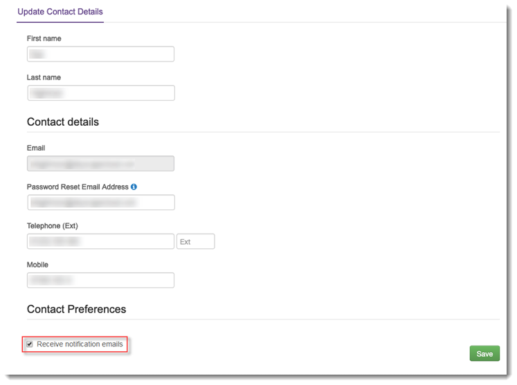

# How to sign up for Portal notifications

## Overview

When you use the UKCloud Portal, you'll notice that notifications are provided at the top of every page. These notifications provide information about:

- Updates to UKCloud services
- Planned maintenance
- Incidents

If you want, you can also opt to have these notifications sent to you by email. This feature is available in both the Assured and Elevated Portals.

## Opting in to Portal notifications by email

1. Log in to the UKCloud Portal.

    For more details see the [*Getting Started Guide for the UKCloud Portal*](ptl-gs.md)

2. In the top-right of the toolbar, click your user name and select **Update contact details**.

    

3. In the *Contact Preferences* section of the *Update Contact Details* page, select the **Receive notification emails** checkbox and then click **Save**.

    

4. You should now receive Portal notification emails to the email address associated with your Portal account.

> [!NOTE]
> This may not happen immediately as the update will need to sync with Active Directory. If you experience any issues with receiving emails from the Portal, raise a ticket with UKCloud Support.

## Feedback

If you have any comments on this document or any other aspect of your UKCloud experience, send them to <products@ukcloud.com>.