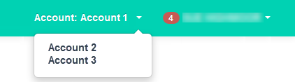

# How to switch to a different account in the UKCloud Portal

## Overview

Each Portal user account is associated with one or more customer accounts. Within the Portal, you can work within any customer account to which you have access.

### Intended audience

Any Portal user with access to multiple accounts can switch between those accounts in the Portal.

## Switching accounts

To switch to a different account:

1. [*Log in to the UKCloud Portal*](ptl-gs.md#logging-in-to-the-ukcloud-portal).

2. The Portal toolbar indicates the current customer account that you are working in.

   

3. Click the account name and select the account that you want to switch to.

   

   You can now manage the services associated with the selected account.

## Feedback

If you find a problem with this article, click **Improve this Doc** to make the change yourself or raise an [issue](https://github.com/UKCloud/documentation/issues) in GitHub. If you have an idea for how we could improve any of our services, send an email to <feedback@ukcloud.com>.
