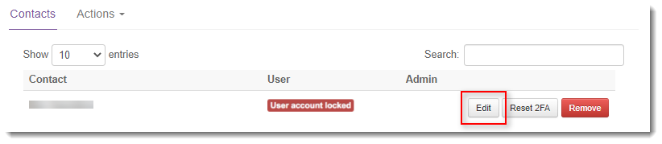
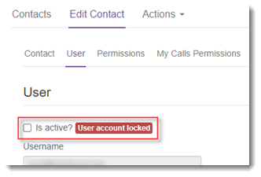
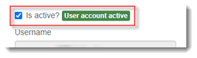

# How to lock or unlock a Portal user account

## Overview

A UKCloud Portal user account may be locked or unlocked by a Portal administator.

> [!NOTE]
> If a Portal administrator account becomes locked and there are no other administrator accounts to unlock it, you'll need to contact UKCloud Customer Support on 01252 303 300 (select option 2).

## Intended audience

To complete the steps in this guide you must be a Portal administrator.

## Locking a user account

A Portal administrator may need to lock a user account to prevent access to the Portal, for example if the security of an account is suspected to be compromised.

To lock a user account:

1. [*Log in to the UKCloud Portal*](ptl-gs.md#logging-in-to-the-ukcloud-portal) as a Portal administrator.

2. In the navigation panel, expand the **Contacts** option and then select **All Contacts**.

   

3. Locate the account that you want to lock and click the **Edit** button.

   

4. On the *Edit Contact* page, select the **User** tab.

5. You'll see that the **Is active?** check box is selected and the account is tagged as **User account active**.

   

6. Deselect the **Is active?** check box to lock the account, then click **Save**.

   The tag next to the check box changes to **User account locked**.

   

## Unlocking a user account

A Portal administrator may lock a user account or an account may become locked due to multiple failed logins. A locked account must be unlocked by a Portal administrator.

To unlock a user account:

1. [*Log in to the UKCloud Portal*](ptl-gs.md#logging-in-to-the-ukcloud-portal) as a Portal administrator.

2. In the navigation panel, expand the **Contacts** option and then select **All Contacts**.

   

3. Locate the locked user account and click the **Edit** button.

   

4. On the *Edit Contact* page, select the **User** tab.

5. You'll see that the **Is active?** check box is not selected and the account is tagged as **User account locked**.

   

6. Select the **Is active?** check box to unlock the account, then click **Save**.

   The tag next to the check box changes to **User account active**.

   

## Next steps

For more information about the UKCloud Portal, see the [*Getting Started Guide for the UKCloud Portal*](ptl-gs.md)

## Feedback

If you find a problem with this article, click **Improve this Doc** to make the change yourself or raise an [issue](https://github.com/UKCloud/documentation/issues) in GitHub. If you have an idea for how we could improve any of our services, send an email to <feedback@ukcloud.com>.
