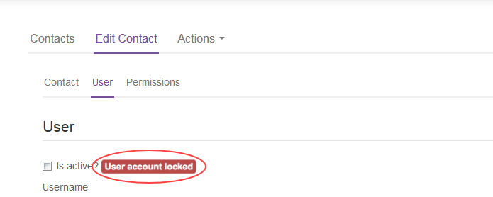

# How to unlock a user account

## Overview

A user account may be locked after too many failed login attempts. A locked user account must be unlocked by a Portal administrator.

## Intended audience

To complete the steps in this guide you must be a Portal administrator.

## Unlocking a user account

If a user incorrectly enters their password three times, they'll be prompted to enter a captcha code until they successfully log in. If the user then incorrectly enters the captcha code or password another three  times, a seventh unsuccessful login attempt will result in the account being locked.

A locked user account must be unlocked by a Portal administrator.

To unlock a user account:

1. Log in to the UKCloud Portal.

    For more detailed steps, see the [*Getting Started Guide for the UKCloud Portal*](ptl-gs.md).

2. In the navigation panel, expand the **Contacts** option and then select **All Contacts**.

    

3. Locate the locked user account and click the **Edit** button.

    

4. Select the **User** tab.

    Next to the **Is active?** check box, you'll see the tab: **User account locked**.

    

5. Select the **Is active?** check box to unlock the account.

6. Click **Save**.

    The tag next to the check box changes to User account active.

    

    > [!NOTE]
    > If a Portal administrator account becomes locked and there are no other administrator accounts to unlock it, you'll need to contact UKCloud Customer Support on 01252 303 300 (select option 2).

## Next steps

For information about resetting a user's forgotten password, see [*How to reset your UKCloud Portal password or memorable word*](ptl-how-reset-password.md).

For more information about the UKCloud Portal, see the [*Getting Started Guide for the UKCloud Portal*](ptl-gs.md)

## Feedback

If you find a problem with this article, click **Improve this Doc** to make the change yourself or raise an [issue](https://github.com/UKCloud/documentation/issues) in GitHub. If you have an idea for how we could improve any of our services, send an email to <feedback@ukcloud.com>.
