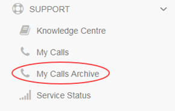

# How to use the My Calls Archive

## Overview

The My Calls Archive area of the UKCloud Portal provides access to older tickets raised using the previous version of My Calls.

> [!IMPORTANT]
> To raise new support tickets you must use the new My Calls.

### Intended audience

This guide is intended for any UKCloud Portal user who wants to use the *My Calls Archive* to monitor older support tickets. To complete the steps in this guide you must have access to the UKCloud Portal with the appropriate Portal permissions for Support. The tasks you can perform will depend on the level of permissions you have.

&nbsp; | Read | Update | All
-------|------|--------|----
**User Support Tickets** | View your own support tickets | Update your own support tickets | All Read and Update privileges on your own tickets
**Account Support Tickets** | View all tickets logged by users across the account | Update any support ticket across the account | All Read and Update privileges on tickets across the account

## Accessing the My Calls Archive

1. Log in to the UKCloud Portal.

    For more detailed instructions, see the [*Getting Started Guide for the UKCloud Portal*](ptl-gs.md).

2. In the Portal navigation panel, expand the **Support** option and select **My Calls Archive**.

    

3. The **My Calls** tab is divided into two further tabs:

    - **Your Calls** lists all the support tickets (incident reports and service requests) that you have raised.

    - **Account Calls** lists all the support tickets that have been raised against the current customer account

4. By default, each tab lists 10 tickets per page. Use the **Show entries** list to display more tickets (up to 100 per page) if you prefer.

    

5. You can use the **Search** field to search for a specific ticket.

    

## Monitoring an existing support ticket

You can view old support ticket to monitor progress, add more information, subscribe to notifications, add attachments or cancel the ticket.

> [!NOTE]
> The actions you can perform on a ticket depend on your Support permissions.

1. In the *My Calls Archive*, find the ticket you want to view either by browsing through the list of tickets or using the **Search** field.

2. Next to the ticket, click the **View** button.

    

3. The resulting page lists all details for the ticket, including status, priority and any associated change requests, updates or attached files.

4. If the ticket was created by someone else, you can click the **Subscribe** button to receive email notifications when the ticket is updated.

    

    > [!NOTE]
    > You're automatically subscribed to any tickets that you create.

5. To change ownership of the ticket, click the **Change** button, select the new owner from the list and then click **Update**.

6. To add further details to the ticket, in the *Add update* section, enter text in the **Description** field and click **Add**.

7. To attach a file to the ticket, in the *Attachments* section, click **Choose files**, select up to five files and then click **Upload**.

8. To cancel a ticket, select **Cancel this Service Request** from the **Actions** tab then click **Yes** in the confirmation dialog box.

    

## Next steps

For more information about what you can do in the UKCloud Portal, see the [*Getting Started Guide for the UKCloud Portal*](ptl-gs.md).

## Related videos

- [*UKCloud Portal overview video*](ptl-vid-portal.md)

## Feedback

If you find an issue with this article, click **Improve this Doc** to suggest a change. If you have an idea for how we could improve any of our services, visit [UKCloud Ideas](https://ideas.ukcloud.com). Alternatively, you can contact us at <products@ukcloud.com>.