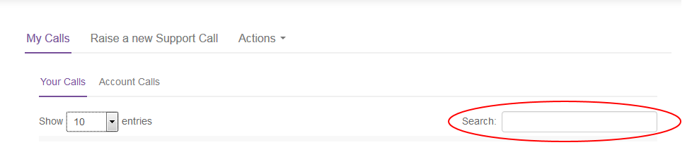

# How to use My Calls in the UKCloud Portal

## Overview

The My Calls area of the UKCloud Portal is a one‑stop place to raise new support tickets with UKCloud and monitor existing tickets.

The My Calls feature covers the ITIL standards of:

- Raising faults and outages
- Raising service requests, for example, to request service or system information, restore backups or request logs
- Raising change requests, for example, to request a new virtual data centre (VDC), provision a new service or perform initial service set up

For faults and outages, raise an incident report. For more information, see [Raising a new incident report](#raising-a-new-incident-report).

For service and change requests, raise a service request. For more information, see [Raising a new service request](#raising-a-new-service-request).

### Intended audience

This guide is intended for any UKCloud Portal user who wants to use *My Calls* to raise or monitor a support ticket. To complete the steps in this guide you must have access to the UKCloud Portal with the appropriate Portal permissions for Support. The tasks you can perform
will depend on the level of permissions you have.

&nbsp; | Create | Read | Update | All
-------|--------|------|--------|----
**User Support Tickets** | Log your own support tickets in your name | View your own support tickets | Update your own support tickets | All Create, Read and Update privileges on your own tickets
**Account Support Tickets** | Log your own support tickets | View all tickets logged by users across the account | Update any support ticket across the account | All Create, Read and Update privileges on tickets across the account

## Accessing My Calls

1. Log in to the UKCloud Portal.

    For more detailed instructions, see the [*Getting Started Guide for the UKCloud Portal*](ptl-gs.md).

2. In the Portal navigation panel, expand the **Support** option and select **My Calls**.

    

3. The **My Calls** tab is divided into two further tabs:

    - **Your Calls** lists all the support tickets (incident reports and service requests) that you have raised.
    - **Account Calls** lists all the support tickets that have been raised against the current customer account

4. By default, each tab lists 10 tickets per page. Use the **Show entries** list to display more tickets (up to 100 per page) if you prefer.

    

5. You can use the **Search** field to search for a specific ticket.

    

## Raising a new incident report

If you're experiencing a fault or outage with your service, raise an incident report to inform us of the issue.

1. In **My Calls**, select the **Raise a new Support Call** tab.

    

2. From the **How can we help you?** list, select **I am experiencing a fault/outage**.

    

3. From the **Select Product** list, select the UKCloud service or product with which you want to raise the ticket, for example **VMware Cloud** or **Snapshot Protection**.

4. In the remaining fields, provide as much information as you can to enable our support team to resolve the incident as quickly and effectively as possible.

5. When you are done, click **Submit**.

## Raising a new service request

If you want to request a new service, make changes to an existing service or request information, raise a service request.

1. In **My Calls**, select the **Raise a new Support Call** tab.

    

2. From the **How can we help you?** list, select **I am requesting information on/administration of my service**.

    

3. From the **Select Product** list, select the UKCloud service or product for which you want to raise the ticket, for example **VMware Cloud** or **Journaling Protection (Powered by Zerto)**.

4. From the **What is the nature of your query?** list select the option that best matches your request. The options in this list are dependent on the selected service or product.

5. In the remaining fields, provide as much information as you can to enable our support team to fulfil your request as quickly and effectively as possible.

6. When you are done, click **Submit**.

## Monitoring an existing support ticket

After raising a support ticket, you can view the ticket to monitor progress, add more information, subscribe to notifications, add attachments or cancel the ticket.

> [!NOTE]
> The actions you can perform on a ticket depend on your Support permissions.

1. In **My Calls**, find the ticket you want to view either by browsing through the list of tickets or using the **Search** field.

2. Next to the ticket, click the **View** button.

    

3. The resulting page lists all details for the ticket, including status, priority and any associated change requests, updates or attached files.

4. If the ticket was created by someone else, you can click the **Subscribe** button to receive email notifications when the ticket is updated.

    

    > [!NOTE]
    > You're automatically subscribed to any tickets that you create.

5. To change ownership of the ticket, click the **Change** button, select the new owner from the list and then click **Update**.

6. To add further details to the ticket, in the *Add update* section, enter text in the **Description** field and click **Add**.

7. To attach a file to the ticket, in the *Attachments* section, click **Choose files**, select up to five files and then click **Upload**.

8. To cancel a ticket, select **Cancel this Service Request** from the **Actions** tab then click **Yes** in the confirmation dialog box.

    

## Next steps

For more information about what you can do in the UKCloud Portal, see the [*Getting Started Guide for the UKCloud Portal*](ptl-gs.md).

## Related videos

- [UKCloud Portal overview video](https://vimeo.com/298596419)

## Feedback

If you have any comments on this document or any other aspect of your UKCloud experience, send them to <products@ukcloud.com>.