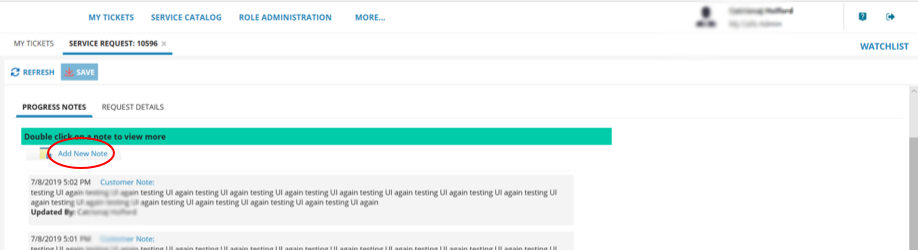

# How to use My Calls to raise and monitor support tickets

## Overview

My Calls is your one‑stop place, accessed via the UKCloud Portal, to raise new support tickets (incidents and requests) with UKCloud and monitor existing tickets.

My Calls covers the ITIL standards of:

- Raising faults and outages (incidents)

- Raising service requests, for example, to request service or system information, restore backups or request logs

### Intended audience

This article is intended for any UKCloud Portal user who wants to use My Calls to raise or monitor support tickets. To complete the steps in this article, you must be able to log in to the UKCloud Portal with the following My Calls permissions:

- If you have the *My Tickets* permission, you can create new support tickets and view and update the tickets that you've created

- If you have the *Account Tickets* or *My Calls Admin* permission, you can create new support tickets and view and update any ticket raised (including those raised by other users)

## Accessing My Calls

1. [*Log in to the UKCloud Portal*](ptl-gs.md#logging-in-to-the-ukcloud-portal).

2. If necessary, [*switch to the account*](ptl-how-switch-account.md) in which you want to work.

3. In the navigation panel, expand **Support**, then select **My Calls**.

   

   > [!TIP]
   > You can also access My Calls by clicking the **My Calls** tile on the Portal home page.
   >
   > 

4. On the *UKCloud Support* page, click **Go to My Calls Portal**.

   

5. The My Calls home page shows a simple view of tickets raised.

   

   - **My Tickets** lists the support tickets (incidents and service requests) that you can view, depending on your permissions. These are listed with the newest first. You can use the search tool to find a specific ticket and use filter options to find tickets with a particular status or date.

   - You can raise new tickets using the **New Incident** and **New Service Request** buttons.

   - Select the **Service Catalog** tab to find incident and service request templates to raise tickets.

## Raising a support ticket

- If you want to request a new service or make changes to an existing service, [*raise a service request ticket*](#raising-a-service-request-ticket)

- If you want to report a fault or outage, [*raise an incident*](#raising-an-incident-ticket)
  
  > [!NOTE]
  > Before reporting an incident, check the [UKCloud Service Status page](https://status.ukcloud.com/) to see if it's a known issue that we're already working on.

### Raising a service request ticket

1. [*In My Calls*](#accessing-my-calls), click **New Service Request**.

   

   This opens the *Service Catalog*, which lists the different templates that you can use to raise service requests.

2. Search the *Service Catalog* for the type of request you want to raise. You can browse by product type or most popular, or enter keywords to search for.

   

3. Select the service request template that you want to use.

   > [!TIP]
   > If you can't find an appropriate template or are not sure which one to use, select the **Other Service Request** template.

4. The fields on the **Service Request** tab will vary depending on the the template you selected. Provide as much information as possible, including completing any mandatory fields, which are marked with a red asterisk. This is so that our Support Team can start working on your ticket as soon as possible.

   

5. When you're done, click **Review & Submit**. You can then edit the information in your request or submit it.

   

> [!NOTE]
> You're automatically subscribed to any tickets that you create.

### Raising an incident ticket

> [!NOTE]
> Before reporting an incident, check the [UKCloud Service Status page](https://status.ukcloud.com/) to see if it's a known issue that we're already working on.

1. [*In My Calls*](#accessing-my-calls), select **New Incident**.

   

2. On the **Incident** tab, from the **Service** list, select the service against which you need to raise the incident.

3. The remaining information required will depend on the service you selected. Provide as much information as possible, including completing any mandatory fields, which are marked with a red asterisk. This is so that our Support Team can start working on your ticket as soon as possible.

   

   > [!TIP]
   > You can use the *Service Catalog* to locate a specific template for your incident if you prefer. For example, if the incident relates to our UKCloud for VMware service, you can select the **Submit New VMware Incident** template.

4. When you're done, click **Save Incident**.

   

> [!NOTE]
> You're automatically subscribed to any tickets that you create.

## Accessing an existing support ticket

After raising a support ticket, you can view the ticket to monitor progress, add more information, add attachments, close or cancel the ticket.

> [!NOTE]
> The actions you can perform on a ticket depend on your support permissions. You'll always be able to update support tickets that you raised yourself. If you have the *Account Tickets* or *My Calls Admin* permissions, you can also view and edit tickets raised by other users on the account.

In My Calls, on the **My Tickets** tab, find the ticket you want to view by:

- Browsing through the list of tickets. By default, tickets are listed with the newest first.

- Using the search field to find your ticket.

- Using filter options to find tickets with a particular status or date. You can also filter by incident and request ticket types.

### Updating an existing service request ticket

1. When you find your service request ticket, double click to open it.

   The top of the request details who logged the ticket, ticket status, the service that is being requested, a summary of the request, when it was raised and when it was last modified.

   

2. The **Progress Notes** tab contains the following information:

   - **Add New Note** enables you to provide additional information relating to your request and respond to any questions from our support team.

     

     In the *Notes History*, you can also read updates on your requests from the support team. Double-click to open an update. You can see who provided the update and the date it was provided.

   - Click **Attach** to attach documents to your service request. Any documents you attach will be listed in the ticket. For security purposes some file attachments formats are not accepted.

     

3. The **Request Details** tab contains details of the request that was submitted. For example:

   

4. When you're done, click **Save**.

   

### Monitoring an existing incident ticket

1. When you find your incident ticket, double click to open it.

   The top of the incident details who logged the ticket, the ticket status, the service that the incident was logged against, a description of the incident, when it was raised and last modified and any resolution.

   

2. The **Progress Notes** tab contains the following information:

   - **Add New Note** enables you to provide additional information relating to the incident and respond to any questions from our support team.

     
  
     In the *Notes History*, you can also read updates on the incident from the support team. Double-click to open an update. You can see who provided the update and the date it was provided.

   - Click **Attach** to attach documents to the incident. Any documents you attach will be listed in the ticket. For security purposes, some file attachment formats are not accepted.

     

   - Click **Close Incident** to close an incident. You'll be prompted to add a reason for closure. When you're done click **OK**.

     

     If you need to re-open an incident that has been closed, click **Re-open Incident**. You'll be prompted for a reason for re-opening the incident. When you're done click **OK**.

3. When you're done, click **Save**.

   

## Providing feedback

We value your feedback on your UKCloud customer support experience to help us understand what we're doing right and how we could improve. For each ticket you raise, you have the opportunity to fill in a brief survey to tell us what you think.

To access the survey:

- For service requests tickets - Edit the ticket and select the **Customer Satisfaction Survey** tab then click **Complete new survey**.

  

- For incident tickets - Edit the ticket and in the *Survey* section at the bottom of the page, click **Complete new survey**.

  

Answer the questions in the survey and when you're done, click **Save**.

## Next steps

- For more information about the UKCloud support process, see [*Raising and escalating support tickets with customer support*](ptl-ref-raise-escalate-service-request.md)

- For information about how administrators can give Portal users access to My Calls, see [*How to manage My Calls users*](ptl-how-manage-my-calls.md)

- For information about what else you can do in the UKCloud Portal, see the [*Getting Started Guide for the UKCloud Portal*](ptl-gs.md)

## Related videos

- [*Creating support tickets in My Calls*](ptl-vid-mycalls.md)

- [*UKCloud Portal overview video*](ptl-vid-portal.md)

## Feedback

If you find a problem with this article, click **Improve this Doc** to make the change yourself or raise an [issue](https://github.com/UKCloud/documentation/issues) in GitHub. If you have an idea for how we could improve any of our services, send an email to <feedback@ukcloud.com>.
