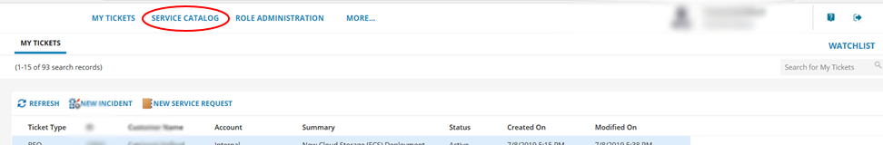
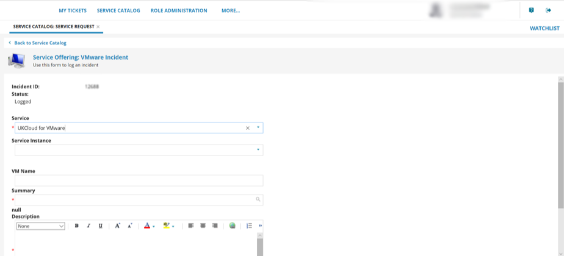

# How to use My Calls in the UKCloud Portal

## Overview

The *My Calls* area of the UKCloud Portal is a one‑stop place to raise new support tickets (incidents and requests) with UKCloud and monitor existing tickets.

*My Calls* covers the ITIL standards of:

- Raising faults and outages (incidents)

- Raising service requests, for example, to request service or system information, restore backups or request logs

### Intended audience

This guide is intended for any UKCloud Portal user who wants to use *My Calls* to raise or monitor a support ticket. To complete the steps in this article, you must have access to the UKCloud Portal with the appropriate Portal permissions for Support. The tasks you can perform will depend on the level of permissions you have.

  | Create | Read | Update | All | Manage My Calls
-------|--------|------|--------|-----|---------------------------------
**My Tickets** | Log your own support tickets in your name | View your own support tickets | Update your own support tickets | All Create, Read and Update privileges on your own tickets | N/A
**Account Tickets** | Log your own support tickets | View all tickets logged by users across the account | Update any support ticket across the account | All Create, Read and Update privileges on tickets across the account | N/A
**My Calls Admin** | Log your own support tickets | View all tickets logged by users across the account | Update any support ticket across the account | All Create, Read and Update privileges on tickets across the account | Ability to update user permissions in My Calls across the account

## Accessing My Calls

1. Log in to the UKCloud Portal.

    For more detailed instructions, see the [*Getting Started Guide for the UKCloud Portal*](ptl-gs.md).

2. In the Portal navigation panel, expand the **Support** option and select **My Calls**.

    

3. For additional security, re-enter your UKCloud Portal user credentials to access My Calls.

    

4. If two-factor authentication (2FA) has been enabled for your account, you'll be prompted to enter a six digit code. Use your 2FA app to generate the code and enter it here.

5. The My Calls home page shows a simple view of all tickets that have been raised.

    

    - **My Tickets** lists the support tickets (incidents and service requests) that you can view, depending on your permissions. These are listed with the newest first. You can use the search tool to find a specific ticket and use filter options to find tickets with a particular status or date.

    - You can raise new incidents and requests using the **New Incident** and **New Service Request** buttons.

    - Select the **Service Catalog** tab to find incident and service request templates to raise tickets.

## Raising a support ticket

- If you want to request a new service or make changes to an existing service, [raise a service request ticket](#raising-a-service-request-ticket)

- If you want to report a fault or outage, [raise an incident](#raising-an-incident-ticket)

### Raising a service request ticket

1. In *My Calls*, select the **Service Catalog** tab.

    

2. Search the *Service Catalog* for the request offering you'd like to raise. You can browse by product type or most popular or enter keywords to search for.

    

3. Select the service request template that you want to use.

    

4. Complete the fields in the form with as much information as possible, including any mandatory fields, which are marked with a red asterisk. This is so that our Support Team can address your ticket promptly.

    

5. When you're done, click **Review & Submit**. You can then edit the information in your request or submit it.

    

   > [!NOTE]
   > You're automatically subscribed to any tickets that you create.

### Raising an incident ticket

1. In *My Calls*, select the **Service Catalog** tab.

    

2. Search the *Service Catalog* for the incident type you'd like to raise. You can browse by product type or most popular or enter keywords to search for.

    

3. Select the incident template that you want to use (for example, **VMWare Incident**).

    

4. Complete the fields in the form with as much information as possible, Including any mandatory fields, which are marked with a red asterisk. This is so that our Support Team can address your ticket promptly.

    

5. When you're done, click **Save Incident**

    

    > [!NOTE]
    > You're automatically subscribed to any tickets that you create.

## Accessing an existing support ticket

After raising a support ticket, you can view the ticket to monitor progress, add more information, add attachments, close or cancel the ticket.

   > [!NOTE]
   > The actions you can perform on a ticket depend on your support permissions. You'll always be able to update support tickets that you have raised. If you have the **Account Tickets** or **My Calls Admin** permissions, you can also view and edit tickets raised by other users on the account.

In *My Calls*, on the **My Tickets** tab, find the ticket you want to view by:

- Browsing through the list of tickets. By default, tickets are listed with the newest first.

- Use the search field to find your ticket.

- Use filter options to find tickets with a particular status or date. You can also filter by incident and request ticket types.

### Updating an existing service request ticket

1. When you find your service request ticket, double click to open it.

    The top of the request details who logged the ticket, ticket status, the service that is being requested, a summary of the request, when it was raised and when it was last modified.

    

2. The **Progress Notes** tab contains the following information:

    - **Add New Note** enables you to provide additional information relating to your request and respond to any questions from our engineers.

        

      In the *Notes History*, you can also read updates on your requests from our engineers. Double-click to open an update. You can see who provided the update and the date it was provided.

    - Click **Attach** to attach documents to your service request. Any documents you attach will be listed in the ticket. For security purposes some file attachments formats are not accepted.

        

3. The **Request Details** tab contains details of the request that was submitted.

    

4. When you're done, click **Save**.

    

### Monitoring an existing incident ticket

1. When you find your incident ticket, double click to open it.

    The top of the incident details who logged the ticket, the ticket status, the service that the incident was logged against, a description of the incident, when it was raised and last modified and any resolution.

    

2. The **Progress Notes** tab contains the following information:

   - **Add New Note** enables you to provide additional information relating to the incident and respond to any questions from our engineers.

        
  
      In the *Notes History*, you can also read updates on the incident from our engineers. Double-click to open an update. You can see who provided the update and the date it was provided.

   - Click **Attach** to attach documents to the incident. Any documents you attach will be listed in the ticket. For security purposes, some file attachment formats are not accepted.

        

   - Click **Close Incident** to close an incident. You'll be promoted to add a reason for closure. When you're done click **OK**.

        

   - If you need to re-open an incident that has been closed, click **Re-open Incident**. You'll be prompted for a reason for re-opening the incident. When you're done click **OK**.

        

3. When you're done, click **Save**.

    

## Providing feedback

We value your feedback on your UKCloud customer support experience to help us understand what we're doing right and how we could improve. For each ticket you raise, you have the opportunity to fill in a brief survey to tell us what you think.

To access the survey:

- For service requests tickets - Edit the ticket and select the **Customer Satisfaction Survey** tab then click **Complete new survey**.

  

- For incident tickets - Edit the ticket and in the *Survey* section at the bottom of the page, click **Complete new survey**.

  

Answer the questions in the survey and when you're done, click **Save**.

## Managing My Calls user permissions

If you have the **My Calls Admin** Portal permission, you can manage the permissions level for other My Calls users across your account.

1. In *My Calls*, select the **Role Administration** tab.

    

2. From the list of users, select the user that you want to edit.

    

    > [!TIP]
    > You can filter the list of users or use the search field to find a specific user.

3. Select the permission level you want to apply to the user: My Tickets, Account Tickets or My Calls Admin.

     The options offered will depend on the current role assigned to the user. Each user can have only one permission level, so the role you select here replaces any previous permissions.

    

    > [!NOTE]
    > For details of what the different permission levels mean, see the table in the [Intended audience](#intended-audience) section.

4. When you're done, click **Save**.

## Setting up a new My Calls user

You can enable new users on your account with access to My Calls.

1. In the UKCloud Portal navigation panel, expand the **Contacts** option and select **All Contacts**.

    

2. From the **Actions** menu, select **Add new contact**.

    

3. On the *New Contact* page, provide the user's name and contact information, then click **Save**.

    

    > [!NOTE]
    > If you receive an error message, contact UKCloud Customer Support at <support@ukcloud.com>.

4. After you've created the user account, select the **User** tab, select the **Is active?** check box, provide the user with a password, then click **Save**.

    

    > [!NOTE]
    > It takes about 15 minutes for the user to be available within the Portal.

5. To provide the user with access to My Calls, you must raise a service request using the **New user setup in My Calls** offering in the Service Catalog.

    

    For detailed steps, see [*Raising a service request ticket*](#raising-a-service-request-ticket).

6. When UKCloud Support have set up the user in My Calls, you can manage their permission level to give them the appropriate access.

    For detailed steps, see [*Managing My Calls user permissions*](#managing-my-calls-user-permissions).

## Disabling a new My Calls user

If you need to disable a user on your account from accessing My Calls, raise a generic service request.

For detailed steps, see [*Raising a service request ticket*](#raising-a-service-request-ticket).

## Next steps

- For more information about the UKCloud support process, see [*How to raise and escalate incidents and service requests*](ptl-how-raise-escalate-service-request.md).

- For more information about what you can do in the UKCloud Portal, see the [*Getting Started Guide for the UKCloud Portal*](ptl-gs.md).

## Related videos

- [*UKCloud Portal overview video*](ptl-vid-portal.md)

## Feedback

If you find an issue with this article, click **Improve this Doc** to suggest a change. If you have an idea for how we could improve any of our services, visit the [Ideas](https://community.ukcloud.com/ideas) section of the [UKCloud Community](https://community.ukcloud.com).
