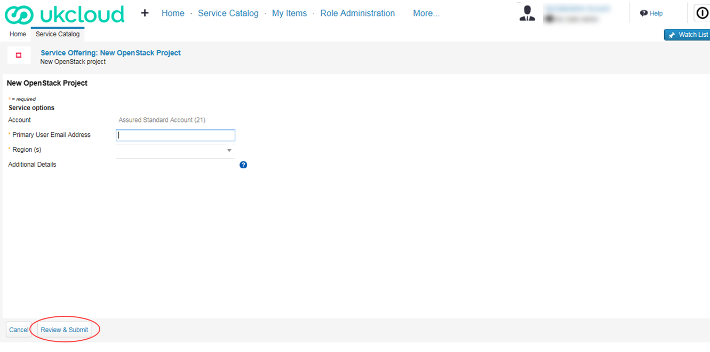
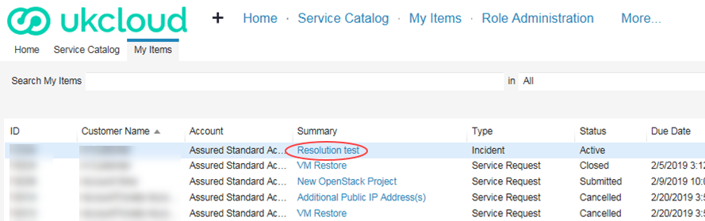
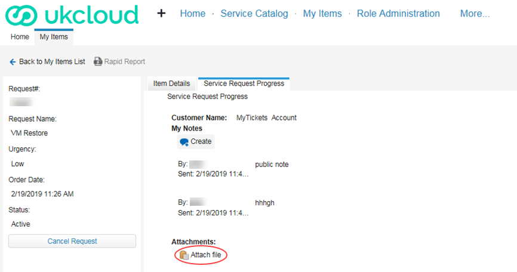
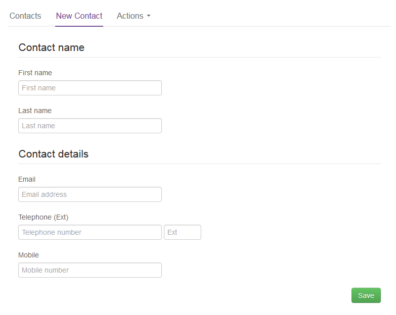
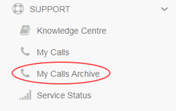

# How to use My Calls in the UKCloud Portal

## Overview

The *My Calls* area of the UKCloud Portal is a one‑stop place to raise new support tickets (incidents and requests) with UKCloud and monitor existing tickets.

*My Calls* covers the ITIL standards of:

- Raising faults and outages (incidents)

- Raising service requests, for example, to request service or system information, restore backups or request logs

### Intended audience

This guide is intended for any UKCloud Portal user who wants to use *My Calls* to raise or monitor a support ticket. To complete the steps in this article, you must have access to the UKCloud Portal with the appropriate Portal permissions for Support. The tasks you can perform will depend on the level of permissions you have.

  | Create | Read | Update | All | Manage My Calls
-------|--------|------|--------|-----|---------------------------------
**My Tickets** | Log your own support tickets in your name | View your own support tickets | Update your own support tickets | All Create, Read and Update privileges on your own tickets | N/A
**Account Tickets** | Log your own support tickets | View all tickets logged by users across the account | Update any support ticket across the account | All Create, Read and Update privileges on tickets across the account | N/A
**My Calls Admin** | Log your own support tickets | View all tickets logged by users across the account | Update any support ticket across the account | All Create, Read and Update privileges on tickets across the account | Ability to update user permissions in My Calls across the account

## Accessing My Calls

1. Log in to the UKCloud Portal.

    For more detailed instructions, see the [*Getting Started Guide for the UKCloud Portal*](ptl-gs.md).

2. In the Portal navigation panel, expand the **Support** option and select **My Calls**.

    

3. For additional security, re-enter your UKCloud Portal user credentials to access My Calls.

    

4. The *My Calls* home page is divided into four main areas:

    

    - **Outstanding Items** lists the support tickets (incident and service requests) that you can view, depending on your permissions. You can also see support tickets by selecting the **My Items** tab.

    - **Report List** provides customer related reporting around tickets (coming soon).

    - **Log an Incident using Template** provides templates for you to use to raise tickets. You can also see incident templates by selecting the **Service Catalog** tab.

    - **Top 5 Service Catalogue Offerings** lists the most popular service catalogue offerings to provide a quick way to raise a request. To see all request offerings, select the **Service Catalog** tab.

## Raising a support ticket

If you want to request a new service, make changes to an existing service or request information, use the Service Catalogue to raise a service request. If you need to notify UKCloud of an incident, use an incident template to raise an incident.

1. In *My Calls*, select the **Service Catalog** tab.

    

2. Search the *Service Catalog* for the request offering or incident type you'd like to raise. You can browse by product type or most popular or enter keywords to search for.

    > [!TIP]
    > There is a generic incident template if you cannot find anything that matches what you're looking for.

    

3. Select the request or incident form that you want to use.

4. Complete the fields in the form with as much information as possible so that our Support Team can address your ticket promptly.

5. When you're done, click **Review & Submit**.

    

    > [!NOTE]
    > You're automatically subscribed to any tickets that you create.

## Monitoring an existing support ticket

After raising a support ticket, you can view the ticket to monitor progress, add more information, add attachments, close or cancel the ticket.

> [!NOTE]
> The actions you can perform on a ticket depend on your Support permissions. You will always be able to update support tickets that you have raised. If you have the **Account Tickets** or **My Calls Admin** permissions, you can also view and edit tickets raised by other users on the account.

1. In *My Calls*, select the **My Items** tab.

    

2. Find the ticket you want to view either by browsing through the list of tickets or by using the **Search** field.

    

    > [!TIP]
    > You can also filter by incident (Issue), request or active tickets.

3. When you find your ticket, click the **Summary**.

    

4. The **Item Details** tab shows the information submitted in the request or incident.

    

5. Select the **Service Request Progress** tab to update the details of the ticket.

    

    - To add an update or reply to a message from our Support Team, click **Create** under **My Notes**, add your updates.

        

    - To add an attachment, click **Attach Files**. For security purposes, some file attachment formats are not accepted.

        

6. When you're done, click **Save**.

7. To cancel a ticket, select **Cancel Request** in the left-hand panel and click **Yes** to confirm.

    

## Managing My Calls user permissions

If you have the **My Calls Admin** Portal permission, you can manage the permissions level for other My Calls users across your account.

1. In *My Calls*, select the **Role Administration** tab.

    

2. From the list of users, select the user that you want to edit.

    

    > [!TIP]
    > You can filter the list of users or use the search field to find a specific user.

3. Select the permission level you want to apply to the user: My Tickets, Account Tickets or My Calls Admin.

     The options offered will depend on the current role assigned to the user. Each user can have only one permission level, so the role you select here replaces any previous permissions.

    

    > [!NOTE]
    > For details of what the different permission levels mean, see the table in the [Intended audience](#intended-audience) section.

4. When you're done, click **Save**.

## Setting up a new My Calls user

You can enable new users on your account with access to My Calls.

1. In the Portal navigation panel, expand the **Contacts** option and select **All Contacts**.

    

2. From the **Actions** menu, select **Add new contact**.

    

3. On the *New Contact* page, provide the user's name and contact information, then click **Save**.

    

    > ![NOTE]
    > If you receive an error message, contact UKCloud Customer Support at <support@ukcloud.com>.

4. After you've created the user account, select the **User** tab, select the **Is active?** check box, provide the user with a password and memorable word, then click **Save**.

    

    > [!NOTE]
    > It takes about 15 minutes for the user to be available within the Portal.

5. To provide the user with access to My Calls, you must raise a service request using the **Setting up a user in My Calls** offering in the Service Catalogue.

    For detailed steps, see [*Raising a support ticket*](#raising-a-support-ticket).

6. When UKCloud Support have set up the user in My Calls, you can manage their permission level to give them the appropriate access.

    For detailed steps, see [*Managing My Calls user permissions*](#managing-my-calls-user-permissions).

## Accessing old support tickets

If you need to access older tickets, created using the previous version of My Calls, you can use the *My Calls Archive*.

> [!NOTE]
> To raise new support tickets you must use the new My Calls.

1. In the Portal navigation panel, expand the **Support** option and select **My Calls Archive**.

    

2. For information about how to work with tickets in the My Calls Archive, see [*How to use the My Calls Archive*](ptl-how-use-my-calls-archive.md)

## Next steps

- For more information about the UKCloud support process, see [*How to raise and escalate incidents and service requests*](ptl-how-raise-escalate-service-request.md)

- For more information about what you can do in the UKCloud Portal, see the [*Getting Started Guide for the UKCloud Portal*](ptl-gs.md).

## Related videos

- [*UKCloud Portal overview video*](ptl-vid-portal.md)

## Feedback

If you find an issue with this article, click **Improve this Doc** to suggest a change. If you have an idea for how we could improve any of our services, visit the [Ideas](https://community.ukcloud.com/ideas) section of the [UKCloud Community](https://community.ukcloud.com).
