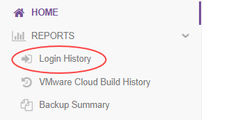
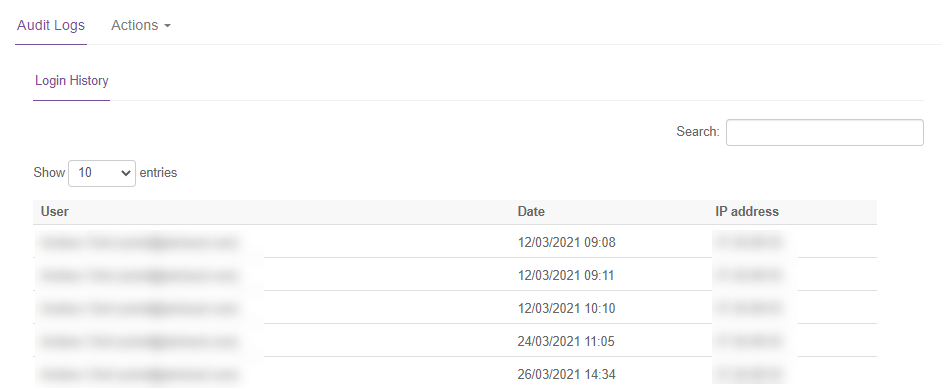
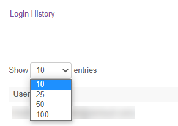
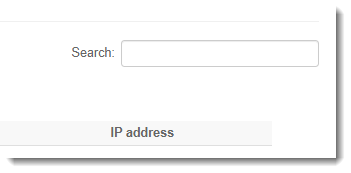

#### UKCloud Limited (“UKC”) and Virtual Infrastructure Group Limited (“VIG”) (together “the Companies”) – in Compulsory Liquidation

On 25 October 2022, the Companies were placed into Liquidation with the Official Receiver appointed as Liquidator and J Robinson and A M Hudson simultaneously appointed as Special Managers to manage the liquidation process on behalf of the Official Receiver.

Further information regarding the Liquidations can be found here: <https://www.gov.uk/government/news/virtual-infrastructure-group-limited-and-ukcloud-limited-information-for-creditors-and-interested-parties>

Contact details: 
For any general queries relating to the Liquidations please email <ukcloud@uk.ey.com> 
For customer related queries please email <ukcloudcustomers@uk.ey.com> 
For supplier related queries please email <ukcloudsuppliers@uk.ey.com>

# How to view login information

## Overview

The UKCloud Portal provides a report of who has logged into your account over the last 30 days. The report currently records the following activity against the account:

- User name

- Date and time

- Source IP address

> [!NOTE]
> To ensure appropriate segregation, if you have access to multiple accounts, you must switch accounts to view login information for each account.

### Intended audience

To view Portal login information, you must be a Portal administrator.

## Viewing login history

1. [*Log in to the UKCloud Portal*](ptl-gs.md#logging-in-to-the-ukcloud-portal) as an administrator.

2. If necessary, [*switch to the account*](ptl-how-switch-account.md) for which you want to view the login report.

3. In the navigation panel, click **Reports** and then **Login history**.

   

4. The resulting table provides a list of all the users who have logged in to your environment over the last 30 days.

   The table indicates the name of the user, the date and time of each login and the IP address from which the login occurred. You can sort the results by username, date or IP address.

   

5. Use the **Next** button at the bottom of the table to page through the results, or click a page number to go directly to that page.

   By default, the table lists 10 records at a time. You can use the drop down list at the top left of the table to increase the number of records shown per page to **25**, **50** or **100**.

   

6. Use the **Search** field at the top right of the table to find a particular user or IP address.

   

7. To export the login data, click the **Actions** tab and select **Export login history**.

   

## Feedback

If you find a problem with this article, click **Improve this Doc** to make the change yourself or raise an [issue](https://github.com/UKCloud/documentation/issues) in GitHub. If you have an idea for how we could improve any of our services, send an email to <feedback@ukcloud.com>.
