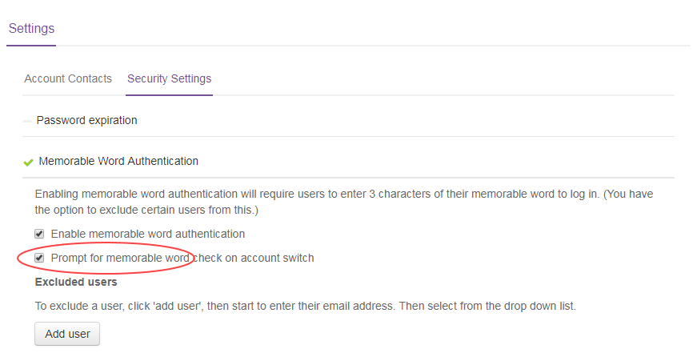
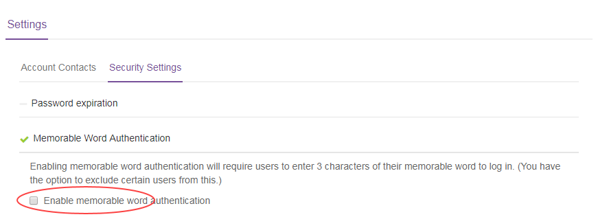

# How to enable memorable word on account switch

## Overview

The UKCloud Portal login process offers a second level of authentication through a memorable word. If you enable this feature, when users login to the Portal, after entering their password they are also prompted for a random combination of letters from their memorable word.

You can extend your use of the memorable word feature to also prompt users for letters from their memorable word when they switch accounts.

## Enabling memorable word on account switch:

1. Login to the Portal as an administrator

2. In the navigation panel, click **Settings** and then select the **Security Settings** tab.

3. Expand the *Memorable Word Authentication* section.

4. Select the **Prompt for memorable word check on account switch** check box.

    

    If you cannot see the **Prompt for memorable word check on account switch** check box, this means that you have not yet enabled memorable word authentication for your account. You can enable this by selecting the **Enable memorable word check box**, which will then select the **Prompt for memorable word check on account switch** by default.

    

5. To disable memorable word authentication on account switch, deselect the **Prompt for memorable word check on account switch** check box. You can also completely disable memorable word authentication by deselecting the **Enable memorable word authentication** check box.

If you require any further assistance, contact UKCloud by raising a Service Request.

## Feedback

If you find an issue with this article, click **Improve this Doc** to suggest a change. If you have an idea for how we could improve any of our services, visit [UKCloud Ideas](https://ideas.ukcloud.com). Alternatively, you can contact us at <products@ukcloud.com>.
