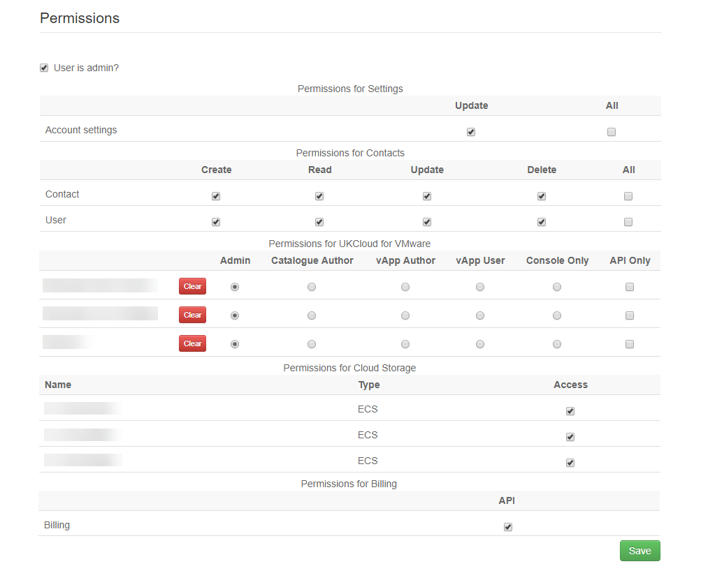

# Portal permissions

## Overview

System administrators are presented with several options to control user permissions through the UKCloud Portal. The information below is intended as a brief guide to which permissions are applied using each setting.

## User is admin?

User gets full administrative privileges across the entire account. This includes all of the permissions listed below.

## Permissions for Settings

**Update:** A user can update all of the account settings. This includes changing the security methods applied to the account, such as updating security restrictions to require password timeout and 2FA. These users can also change the details of the account's primary and secondary contacts.

**All:** Presently this offers the same capability the update permission.

Leave these boxes unchecked to deny a user these capabilities.

## Permissions for Contacts

Contact and user permissions dictate whether the user is able to make changes to who has access to the account, and their role inside of it.

A contact is just contact details, they may not necessarily have an actual user account. To enable a contact to have user access, they must be marked as "active".

&nbsp; | Create | Read | Update | Delete | All
------ | ------ | ---- | ------ | ------ | ---
**Contact** | Can create a new contact for that account. | Can view existing contacts in that account. | Can edit existing contacts but cannot create new ones. | Can delete existing contacts. | All of the above.
**User** | Can create a user associated to a contact for that account and assign permissions. | Can view existing users for contacts. | Can edit existing users and their permissions. | Can delete existing users from contacts. | All of the above.

## Permissions for Support

Support permissions dictate whether a user can view other users support tickets.

&nbsp; | Read | Update | All
------ | ---- | ------ | ---
**User support tickets** | Can view their own support tickets.| Can update their own support tickets. | All of the above.
**Account support tickets** | Can view all tickets logged by users across that account. | Can update anyone’s support ticket across that account. | All of the above.

## Permissions for UKCloud for VMware

Compute service permissions are based on the vCloud director RBAC (role based access control permissions). These roles are applied on a service by service basis - for example someone might be a catalogue author of one service, and a console only user in a secondary service.

The roles exposed are:

- Admin

- Catalogue Author

- vApp Author

- vApp User

- Console Only

You can find further details of these roles in the [vCloud Director Administrator's Guide](https://docs.vmware.com/en/vCloud-Director/9.7/com.vmware.vcloud.admin.doc/GUID-BC504F6B-3D38-4F25-AACF-ED584063754F.html).

In addition, UKCloud have created an API Only role, that restricts users to accessing vCloud Director solely via the API, with no GUI access.

## Permissions for Cloud Storage

Users need to be granted access to the relevant namespace. Once access is granted, the user will be able to see the namespace, list the buckets in the namespace and reset the secret key. The user will also be able to see consumption data for namespaces and buckets.

## Permissions for UKCloud for OpenStack

Users need to be granted access to the relevant OpenStack project. Once access is granted, the user can access the Horizon dashboard for the project.

## Permissions for Billing

Users can see financial data for their compute services in My VMs. This includes spend to date and estimated spend for the month.

## Permissions for Monitoring

Users with **Read** permissions can view information from the Protective Monitoring service on the *My Security Events* page.

## Feedback

If you find an issue with this article, click **Improve this Doc** to suggest a change. If you have an idea for how we could improve any of our services, visit the [Ideas](https://community.ukcloud.com/ideas) section of the [UKCloud Community](https://community.ukcloud.com).
