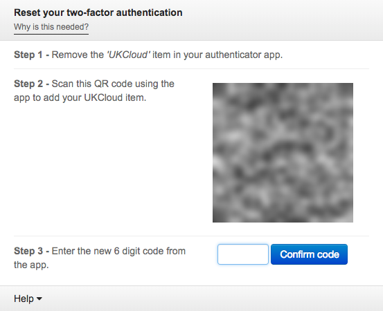

# Resetting Two-Factor Authentication for Single Sign On

With the introduction of our new UKCloud Single Sign On service, we require all Portal users currently using Two-Factor Authentication (2FA) to reset their 2FA token. Single Sign On is an exciting new service that enables us to provide:

- Unified logon across our major multi-cloud offerings, including VMware, OpenStack and OpenShift

- Roll out of 2FA for technology stacks where this has not previously been an option

If your Portal administrator has enabled 2FA on your Portal account and you scanned the QR code before August 1 2018, then next time you log in after October 1 2018 you'll see the following information:

Follow the steps provided:

1. Open the app that you use to generate the 2FA code and remove the existing UKCloud entry.

2. Scan the QR code or copy the seed provided in the Portal to add the new UKCloud entry.

3. Enter the six digit code generated in your authenticator app into the field in the Portal.

4. You will then be logged into the Portal and the next time you attempt to log in, you'll be prompted for your 2FA code as usual.

## Feedback

If you find an issue with this article, click **Improve this Doc** to suggest a change. If you have an idea for how we could improve any of our services, visit the [Ideas](https://community.ukcloud.com/ideas) section of the [UKCloud Community](https://community.ukcloud.com).
