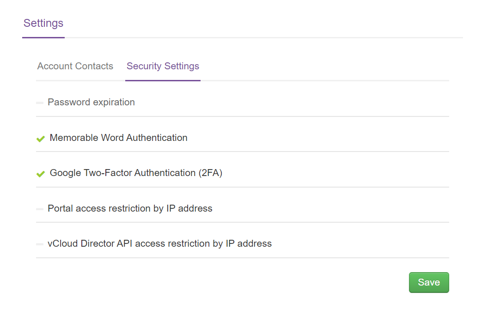

# UKCloud Portal security settings

The UKCloud Portal provides various settings to enable you to provide additional security to your accounts.

> [!TIP]
> A green tick next to a section indicates that particular security setting has been enabled.

- **Password expiration** - Set passwords to expire after a specified number of days. This ensures that users change their passwords frequently. For more information, see [*How to set up password expiration*](ptl-how-setup-password-expiration.md).

- **Google two-factor authentication (2FA)** - Add an extra level of authentication whereby users provide a security code from an authenticator app (such as Google Authenticator or Authy) as well as their password to confirm their identity. For more information, see [*How to enable two-factor authentication in the UKCloud Portal*](ptl-how-setup-2fa.md).

- **Portal access restriction by IP address** - Restrict access so that users can only log in to the Portal from specific IP addresses. For more information, see [*How to restrict access to the Portal*](ptl-how-restrict-access-portal.md).

- **vCloud Director API access restriction by IP address** - Restrict access so that users can only access the vCloud API from specific IP addresses. For more information, see [*How to restrict access to the vCloud API*](ptl-how-restrict-access-vcloud-api.md).

To change Portal security settings:

1. Log in to the UKCloud Portal as an administrator.

    For more detailed instructions, see the [*Getting Started Guide for the UKCloud Portal*](ptl-gs.md).

2. If necessary, switch to the account for which you want to change the security settings.

3. In the navigation panel, select **Settings**.

    

4. On the *Settings* page, select the **Security Settings** tab.

    

5. Click a section to expand it, make changes as required and when you're done, click **Save**.

## Feedback

If you find an issue with this article, click **Improve this Doc** to suggest a change. If you have an idea for how we could improve any of our services, visit [UKCloud Ideas](https://ideas.ukcloud.com). Alternatively, you can contact us at <products@ukcloud.com>.
