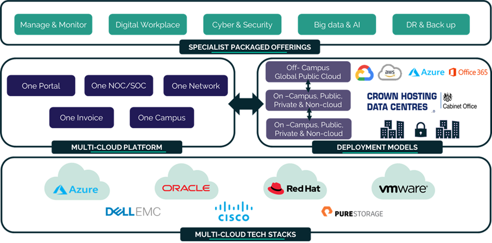

#### UKCloud Limited (“UKC”) and Virtual Infrastructure Group Limited (“VIG”) (together “the Companies”) – in Compulsory Liquidation

On 25 October 2022, the Companies were placed into Liquidation with the Official Receiver appointed as Liquidator and J Robinson and A M Hudson simultaneously appointed as Special Managers to manage the liquidation process on behalf of the Official Receiver.

Further information regarding the Liquidations can be found here: <https://www.gov.uk/government/news/virtual-infrastructure-group-limited-and-ukcloud-limited-information-for-creditors-and-interested-parties>

Contact details: 
For any general queries relating to the Liquidations please email <ukcloud@uk.ey.com> 
For customer related queries please email <ukcloudcustomers@uk.ey.com> 
For supplier related queries please email <ukcloudsuppliers@uk.ey.com>

# Private Cloud

  

    <h2>What private cloud services does UKCloud offer?</h2>
  

  

    
UKCloud offers a variety of private cloud products for those organisations with workloads that need to be in a single-tenant environment.

    
The following provides a brief overview of our managed operations products; click the links for further details.

    <ul>
      <li><a href="https://ukcloud.com/app/uploads/2022/08/ukc-svc-236-private-cloud-service-definition-13.0.pdf"><strong>Private Cloud.</strong></a> A high assurance, cost-effective alternative to hosting and managing your own compute and storage infrastructure. This secure single-tenant cloud platform provides physical hardware separation and isolation from other customers. Offered on a choice of technology stacks, including VMware, Microsoft Azure Stack, Oracle Virtual Machine, Oracle Cloud at Customer or Red Hat OpenStack implementations. We can deploy Private Cloud in either of our UK data centres to gain the benefits of our Assured and Elevated security domains, within the Crown Campus or within your own data centre.</li>
      <li><a href="https://ukcloud.com/app/uploads/2022/08/ukc-svc-237-private-cloud-for-oracle-software-service-definition-13.0-1-1.pdf"><strong>Private Cloud for Oracle Software.</strong></a> Enables you to have private implementations of Oracle's Engineered Systems within UKCloud's assured, sovereign data centres, Crown Hosting Data Centres or even on premises. It enables you to have a tailored Oracle environment specifically for the high performance or big data analytical platforms that are proprietary to Oracle, while connecting to workloads that you have within the rest of our multi-cloud ecosystem.</li>
      <li><a href="https://ukcloud.com/app/uploads/2022/08/ukc-svc-234-private-cloud-storage-service-definition-13.0-1.pdf"><strong>Private Cloud Storage.</strong></a> Provides a secure single-tenant storage platform that is a cost-effective alternative to hosting and managing your own storage infrastructure. Designed to be deployed as part of a larger solution to include genuine multi-cloud services such as UKCloud for VMware and UKCloud for OpenStack, this service enables you leverage the benefits of the UKCloud platform, even on infrastructure that is entirely dedicated to your organisation.</li>
      <li><a href="https://ukcloud.com/app/uploads/2022/08/ukc-svc-227-dedicated-compute-v2-service-definition-13.0.pdf"><strong>Dedicated Compute v2.</strong></a> A flexible solution designed for when you need guaranteed performance. This service delivers exceptional performance through dedicated compute hosts and meets your security obligations by addressing compliance and regulatory requirements through physical separation of workloads. Hosts are assigned for your sole use and are enabled for granular configuration to meet your workload requirements.</li>
    </ul>
  

<!-- begin Getting Started -->

  

    <h2>Let's get started!</h2>
    
For in-depth product details, see the appropriate Service Scope.

  

  

    
<a href="prc-sco.md">Private Cloud</a>

    
<a href="../oracle/orcl-sco-private.md">Private Cloud for Oracle Software</a>

  

  

    
<a href="prc-sco-storage.md">Private Cloud Storage</a>

    
<a href="prc-sco-dc.md">Dedicated Compute v2</a>

  
  

<!-- end Getting Started -->

<!-- begin Find More -->

  

    <h2>Want to know more?</h2>
  

  

    
Find answers to common questions in our FAQs for <a href="prc-faq.md"><strong>Private Cloud</strong></a> and <a href="prc-faq-storage.md"><strong>Private Cloud Storage</strong></a>. Use the table of contents on the left to browse all private cloud articles or use the search box at the top to search the whole Knowledge Centre.

    
For more information about UKCloud and how we work, browse our <a href="https://ukcloud.com/"><strong>website</strong></a>.

  

<!-- end Find More -->

<!-- begin How to Buy -->

  

    <h2>How to buy</h2>
  

  

    
The <a href="https://ukcloud.com/pricing-guide"><strong>UKCloud Pricing Guide</strong></a> lists all our product pricing. If you're interested in buying any of UKCloud's private cloud products, or would like a quote:

  

  

    
<strong>If you're already a UKCloud customer</strong>

    
Raise a Service Request, contact your Service Delivery Manager or email <a href="mailto:servicedelivery@ukcloud.com"><strong>servicedelivery@ukcloud.com</strong></a>

  

  

    
<strong>If you're new to UKCloud</strong>

    
<a href="https://ukcloud.com/contact/"><strong>Contact us</strong></a> via our website or call us on 01252 303 300

  

<!-- end How to Buy -->

<!-- begin Additional Products -->

  

    <h2>Additional options</h2>
  

  

    
To get the most out of our platform, see below for some additional options and products you might want to consider using with your private cloud solution (additional charges apply).

  

  

    
<strong>Product options</strong>

  

  

    
<strong>Complementary products</strong>

  

  

      
<strong>Automated VM backup.</strong> Provides the peace of mind that VMs on your private hosts are backed up in the event of a failure.

      
<strong>Site replication and failover.</strong> For solutions with private hosts on two separate regions on the UKCloud platform.

  

  

      
<a href="https://ukcloud.com/app/uploads/2022/08/ukc-svc-251-managed-it-operations-service-definition-13.0.pdf"><strong>Managed IT Operations.</strong></a> Reduce the amount of time spent on managing your IT infrastructure.

      
<a href="https://ukcloud.com/app/uploads/2022/08/ukc-svc-239-security-operations-service-service-definition-13.0.pdf"><strong>Security Operations Service.</strong></a> People, processes and tooling to assist with cyber monitoring capabilities.

      
<a href="https://ukcloud.com/app/uploads/2022/08/ukc-svc-232-ukcloud-professional-services-service-definition-13.0-1.pdf"><strong>Professional Services.</strong></a> Help with solution design and digitisation projects.

      
<a href="https://ukcloud.com/app/uploads/2022/08/ukc-svc-230-cross-domain-security-zone-service-definition-13.0-1.pdf"><strong>Cross Domain Security Zone.</strong></a> Enable data communication between assured and elevated security domains.

      
<a href="https://ukcloud.com/app/uploads/2022/08/ukc-svc-229-cloud-storage-service-definition-13.0-2.pdf"><strong>Cloud Storage.</strong></a> Cost effective unstructured object storage for data archive.

  

  

    
If you want to find out more about any of these options or products, contact your Service Delivery Manager or email <a href="mailto:servicedelivery@ukcloud.com"><strong>servicedelivery@ukcloud.com</strong></a>

  

<!-- end Additional Products -->

<!-- begin Why UKCloud -->

  

    <h2>Why UKCloud?</h2>
  

  

    
<strong><a href="https://ukcloud.com/our-platform/">The right cloud for every platform.</a></strong> Modernise legacy workloads across the board by rehosting traditional systems with UKCloud for VMware or exploring new and emerging technologies with OpenShift. We can help you build a cloud specific to your needs.

  

  

    
<strong><a href="https://ukcloud.com/ukcloud-support/customer-experience/">An award-winning customer experience.</a></strong> The customer sits at the heart of everything we do. Whether that's through our 24/7 support function – a service we provide at no extra charge – or by giving every single one of our customers a dedicated Service Delivery Manager.

  

  

    
<strong><a href="https://ukcloud.com/sectors/">Dedicated to the public sector.</a></strong> From our unique assurance and connectivity options to the people we employ &ndash; everything we do comes back to our mission to help public sector organisations deliver better digital services at a lower cost.

  

  

    
<strong><a href="https://ukcloud.com/governance/">Uncompromising security and integrity.</a></strong> Our UK-based data centres help protect your organisation from regulations such as GDPR, whilst our unique assurance and connectivity options enable you to move your most secure and sensitive systems to the cloud.

  

  

    
<strong><a href="https://ukcloud.com/solutions/public-sector-innovation/">Champions of innovation.</a></strong> We've partnered with over 300 specialist organisations who have built their pioneering digital services on top of our government-grade infrastructure. From AI to RPA, our partner ecosystem has you covered.

  

  

    
<strong><a href="https://ukcloud.com/why-ukcloud/social-value-overview/">Committed to doing the right thing.</a></strong> From paying our taxes to undergraduate and apprentice programmes. From Carbon Neutral solutions to charity work. Everything we do can be traced back to our commitment to doing the right thing.

  

  

    
  

<!-- end Why UKCloud -->

<!-- begin Feedback -->

  

    <h2>Get in touch</h2>
  

  

    
  

<!-- end Feedback -->
