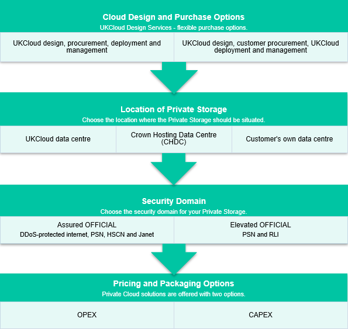

# Private Cloud for Storage Service Definition

## What is Private Cloud for Storage?

Private Cloud Storage provides a secure single-tenant storage platform, which is a cost-effective alternative to hosting and managing your own storage infrastructure. Your data can be hosted in one of our UK data centres, to gain the benefits of our mature and proven Assured OFFICIAL and Elevated OFFICIAL security domains; within the Government's Crown Campus or within your own data centre.

Private Cloud Storage is designed to be deployed as part of a larger solution to include genuine multi-cloud services such as UKCloud for VMware and UKCloud for OpenStack. This enables you to leverage the benefits of the UKCloud platform; even on infrastructure that is entirely dedicated to your organisation.

## What the service can help you achieve

- **Increased Security and Compliance.** Gain the advantages of cloud while retaining regulatory compliance through physical separation.

- **Deployment of secure disconnected environments.** Provides connectivity via private and secure network links, rather than over the public internet.

- **Resolves migration challenges.** Provides full control over configuration, simplifying migration from legacy on-premise environments.

- **Guaranteed resources.** Gives you your own private environment, structured to your requirements, to mitigate the risk of contention from other organisations.

## Product options

The service is designed to be flexible and enables you to choose from the list below to match your requirements.

## Pricing and packaging

Full pricing with all options is available in the [UKCloud Pricing Guide](https://ukcloud.com/pricing-guide).

## Accreditation and information assurance

The security of our platform is our number one priority. We've always been committed to adhering to exacting standards, frameworks and best practice. Everything we do is subject to regular independent validation by government accreditors, sector auditors and management system assessors. Details are available on the [UKCloud website](https://ukcloud.com/governance/).

## Connectivity options

UKCloud provides one of the best-connected cloud platforms for the UK Public Sector. We enable access to our secure platform by DDoS-protected internet, PSN, Janet, HSCN, RLI and your own leased lines via our HybridConnect or CrownConnect services. The full range of flexible connectivity options is detailed in the [UKCloud Pricing Guide](https://ukcloud.com/pricing-guide).

## An SLA you can trust

We understand that enterprise workloads need a dependable service that underpins the reliability of the application to users and other systems, which is why we offer one of the best SLAs on G-Cloud. For full details on the service SLA, including measurements and service credits, see the [*SLA definition*](../other/other-ref-sla-definition.md).

## The small print

Private Cloud Storage operates a minimum commitment of 24 months. Early exit charges apply if you exit this service whilst still within the minimum commitment term. If you exit the service within the minimum commit then UKCloud will bill all the remaining committed term's fees and asset costs within the final invoice.

For full terms and conditions, including onboarding and responsibilities, refer to the [*Terms and conditions documents*](../other/other-ref-terms-and-conditions.md).

For more information about this service, see the [*Service Scope*](prc-sco-storage.md) and [*FAQs*](prc-faq-storage.md).

## Why UKCloud?

UKCloud is dedicated to the digital transformation of our nation's public services through our flexible, secure and cost-effective multi-cloud platform and the expertise of our people and partners. We believe that diversity of technology drives value and innovation and so we bring together different cloud technologies, with different deployment models spanning on-premises (private cloud), on-campus (Government's Crown Campus) and off-campus global public cloud services. This enables you to choose the right cloud for creating new workloads or migrating or replacing existing applications to the cloud with specialist SaaS solutions.

We recognise the importance of public services to UK citizens and businesses, which is why we include the highest level of support to all our customers at no extra cost. This includes dedicated 24/7 UK support, a Network Operations Centre (NOC), utilising protective and proactive monitoring tools, and access to UKCloud's experts. UKCloud can also provide outcome-based professional services or managed services to help you with digital transformation.

## Feedback

If you find a problem with this article, click **Improve this Doc** to make the change yourself or raise an [issue](https://github.com/UKCloud/documentation/issues) in GitHub. If you have an idea for how we could improve any of our services, send an email to <feedback@ukcloud.com>.
