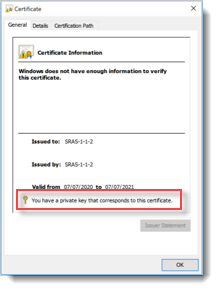
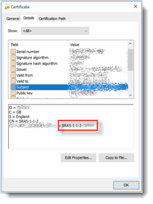

<br>**UKCloud Limited (“UKC”) and Virtual Infrastructure Group Limited (“VIG”) (together “the Companies”) – in Compulsory Liquidation**

On 25 October 2022, the Companies were placed into Liquidation with the Official Receiver appointed as Liquidator and J Robinson and A M Hudson simultaneously appointed as Special Managers to manage the liquidation process on behalf of the Official Receiver.

Further information regarding the Liquidations can be found here: <https://www.gov.uk/government/news/virtual-infrastructure-group-limited-and-ukcloud-limited-information-for-creditors-and-interested-parties>

Contact details:<br>
For any general queries relating to the Liquidations please email <ukcloud@uk.ey.com><br>
For customer related queries please email <ukcloudcustomers@uk.ey.com><br>
For supplier related queries please email <ukcloudsuppliers@uk.ey.com>

# Getting Started Guide for Secure Remote Access

## Overview

### Intended audience

This document is for customers who have:

- Completed the UKCloud Assurance Wrap

- Been approved to use the Secure Remote Access (SRA) service to manage services in the Elevated OFFICIAL security domain on the UKCloud platform

## Post approval

Once the SRA Assurance Wrap has been approved, we'll raise a Service Request for the implementation of the SRA virtual data centre (VDC) and, if needed, an Elevated VDC. If a Service Request for this VDC implementation already exists, we'll provide updates in that one rather than create a new one.

You can track the progress of the Service Request using the [My Calls](https://portal.skyscapecloud.com/support/ivanti) section of the UKCloud Portal.

As part of the build, we may reach out to confirm some of the following details if not already defined and where appropriate:

- Confirm your Elevated OFFICIAL customer account number as we'll create a new Org under that account to contain the SRA VDC. The Org number is used as an identifier when signing certificates.

- The preferred IP pool you want to use for your client devices. If the IP pool you'd prefer is in use by another customer then we'll need to choose a different one. We'll inform you if this is the case.

- If you want to specify an IP from the IP pool for each device, we'll need you to supply the mapping.

- Any specified DNS servers.

- A certificate signing request for each remote access device.

## Certificate Signing Request (CSR) generation

To enable SRA access, we'll need the certificate-signing request (CSR) from each remote access device you'll be using. The certificate-generation process will vary depending on the OS of the client device.

### Windows

Follow the steps below to generate the CSR for a Windows device.

1. Open the Certificates MMC snap-in (click **Start**, click **Run**, type `mmc` and then press **Enter**).

2. Select **File** > **Add/Remove Snap-in** > **Certificates** > **Add** > **Computer Account** > **Next** > **Local computer** > **Finish**.

3. In the console tree, double-click **Personal** and then click **Certificates**.

4. On the **Actions** menu, point to **All Tasks**, **Advanced Options** and then click **Create Custom Request** to start the *Certificate Enrolment* wizard. Click **Next**.

5. On the *Custom request* page, from the **Templates** list, we recommend using the **Custom Request** option as your domain policy may be incompatible with the SRA service.

    - Select **Proceed without enrolment policy** and click **Next**.

6. Select **(No template) CNG key** and ensure the **PKCS#10** radio button is selected, then click **Next**.

7. At the **Certificate Information** page, click the down arrow next to **Details** then click the **Properties** button.

8. Click the **Private Key** tab, then the down arrow to the right of **Key options**.

9. Change the **Key size** to **2048** and click **Apply**.

    - **Optional:** If you want to back up the certificate (to protect against client device failure) click the check boxes for the **private key**. You'll be asked for a password.

10. For the file format, select **Base 64** and then save the CSR.

### Linux and Mac OS

For Linux and Mac OS, an equivalent OpenSSL command would be the following:

```none
openssl req -nodes -newkey rsa:2048 -keyout myserver.key -out server.csr
```

Ensure that the key file is preserved for the later installation steps below, as without this the AnyConnect client will not be able to connect the SRA service.

## CSR submission to UKCloud

We request that you provide the CSR in a Service Request via the Elevated UKCloud Portal by adding it as an attachment to the ticket so that we can generate the associated certificate(s). Should you not have access to the Elevated Portal, or not be able to copy the CSR into the Elevated domain, get in touch and we'll advise an alternative way for you to send this to us.

## Cisco AnyConnect client setup

Upon completion of the build, as part of the Getting Started pack, we'ill provide you with access to the required Cisco AnyConnect Client installation files.

Should you or any additional users need to acquire the AnyConnect installation files at a later date, raise a Service Request and we can provide access to the required files.

### Windows

Whilst the Windows installation may come with the full AnyConnect package, the only component required for connecting to the SRA VPN is the `core-vpn` component. You may install the additional components if you want.

You can install the client in one of the following ways:

- Right-click the `anyconnect-win-<version>-core-vpn-predeploy-k9.msi` file and select install.

- Run `setup.exe` and select the required components from the installation wizard.

### Linux

```none
tar zxvf anyconnect-linux-64-<version number>-k9.tar.gz

cd anyconnect-<version number>-/vpn

sudo ./vpn_install.sh
```

### Mac OS

Double-click the `anyconnect-macos-<version number>-predeploy-k9.dmg` file.

In the pop-up window, double click `AnyConnect.pkg` and then follow the installation wizard to install the AnyConnect software.

If prompted to select which components to install, the only component required for the SRA VPN is the `core-vpn`.

## Post-installation configuration

Once you've installed the AnyConnect software and certificates on your device, you'll need to install the required connection profile. Access to the required connection profiles will be shared via the Getting Started pack, which is sent on completion of the solution build. Should you or any additional users need to acquire the profiles at a later date, raise a Service Request and we can provide access to the required files.

Unzip the file and copy the XML file(s) to the following location:

OS type      | CPA XML location
-------------|-----------------
Windows      | `C:\ProgramData\Cisco\Cisco AnyConnect Secure Mobility Client\Profile`
Linux/Mac OS | `/opt/cisco/anyconnect/profile`

### For Linux only

In addition to the AnyConnect profile(s), you'll also need to install a local policy. If you want to connect from a Linux device, raise a Service Request and we can provide access to the required file.

Once you've copied the connection profile and local policy to the correct locations, you need to restart the AnyConnect service (using the command `service vpnagentd restart`) or reboot your machine.

## AnyConnect client upgrades

UKCloud will periodically update the minimum AnyConnect client version required to connect to the Secure Remote Access service. As per our standard notice period, we'll always try to provide a minimum of two weeks' notice where possible before performing an upgrade but **withhold the right to perform necessary upgrades at shorter notice where any security concerns dictate.**

Automatic upgrades will be pushed to AnyConnect clients when connecting to the SRA VPN for the first time following an upgrade. To enable automatic upgrades, you must permit access to the SRAS VPN endpoints via port `TCP/443`. The AnyConnect upgrade **does not** require administrative privileges on the device. Any custom measures implemented through Group Policy that restrict the installation of software or network adapters may prevent the installation of the upgrade and you may need to install the updated client on the necessary machines prior to UKCloud performing the upgrade. If you require a manual installation or would like to install the updated client ahead of time, you can raise a Service Request via the UKCloud Portal and we can provide you with the required Cisco AnyConnect installation files.

## Certificate installation

Once we've set up your Secure Remote Access solution, we'll send you an email containing the certificates we've generated (based on the CSR sent to us as above), which you'll need to install on your remote access device.

For each customer SRA service, a unique IssuingCA certificate is generated and used to sign each individual device certificates. The IssuingCA certificate along with the specific certificate for the device will be emailed. You need to install both the certificates.

The certificates sent through will be named as below:

- **IssuingCA** – `clientcert.pem`

- **Device Certificate** - `E51FFC7D50C<HEX VALUE>.pem`

### Windows certificate store

Follow the steps below to import the certificates into the Windows certificate store. This assumes that you have the certificates we sent accessible to the MMC:

1. Open the Certificates MMC snap-in (click **Start**, click **Run**, type **mmc**, and then press **Enter**). Select **Certificates** and then **Local Computer Account**.

2. In the console tree, open **Trusted Root Certification Authorities**, right-click **Certificates** and select **All tasks – Import - Next**.

3. Click **Browse** and change the filter from **X.509 Certificate (*.cer, *.crt)** to **All files**.

4. Find the IssuingCA sent to you, double-click **clientcert.pem** and click **Next**.

5. Ensure that the **Place all certificates** radio button has **Trusted Root Certification Authorities** selected then click **Next** then **Finish**.

6. In the console tree, open **Personal**, right click **Certificates** and select **All tasks – Import - Next**.

7. Click **Browse** and change the filter from **X.509 Certificate (*.cer, *.crt)** to **All files**.

8. Find the device certificate sent to you, double-click **E51FFC7D50C<HEX VALUE>.pem** and click **Next**.

9. Ensure that the **Place all certificates** radio button has **Personal** selected then click **Next** then **Finish**.

10. Using the example customer **SRAS-1-1-2** you should now see the client certificate in the Personal store.

11. You should now see the client certificate in the **Personal** store. For example, the certificate for customer **SRAS-1-1-2** would look like the following:

    

12. Double-click the certificate:

    - On the **General** tab you should see the following text: **You have a private key that corresponds to this certificate**.

      

    - The UID is displayed in the **Subject** line on the **Details** tab, for example, **SRAS-1-1-2-_xxx_**.

      

    - The certification path listed on the **Certification Path** tab shows the IssuingCA, for example:

      

### Linux and Mac OS

The Linux and Mac OS certificate store is just a file structure under the user account you'll be using to connect to the SRA VPN. For the AnyConnect client to work, the following must be true:

- All certificate files must end with the extension `.pem`

- All private key files must end with the extension `.key`

- A client certificate and its corresponding private key must have the same file name, for example `client.pem` and `client.key`

- **The certificate and key must be owned by the same user and stored in that user's file structure.**

Using the example customer issued certificate SRAS1-1-2-001.pem, the files would be stored in the following locations for root. You must move and rename the key file generated above appropriately.

PEM file certificate store folders                       | Type of certificates stored
---------------------------------------------------------|----------------------------
`~/.cisco/certificates/client/private/SRAS1-1-2-001.key` | Private keys
`~/.cisco/certificates/client/SRAS1-1-2-001.pem`         | Client certificates
`~/.cisco/certificates/ca/clientcert.pem`                | Trusted CA and root certificates

If the above directories do not already exist, you can create them manually.

## Connecting to SRA

Once connected to the SRA VPN, you can access your Elevated OFFICIAL environment via IP address or DNS name (if you have DNS configured), providing you have permitted connectivity from your assigned SRA VPN subnet. Client connection methods are listed below.

### Windows

When you open the Cisco AnyConnect client, you'll see a window appear. Providing you have installed the SRA XML profile as explained previously, you'll be able to select the SRA VPN endpoint from the dropdown box.


Click the **Connect** button and after a couple of status checks the client should scan the certificate store and give you the option to select a certificate to connect with. If you have multiple certificates installed on your machine, you may need to select **More Choices** to reveal the required certificate.


Once you've selected the require certificate, AnyConnect should connect you to the SRA VPN.

### Linux and Mac OS

Once you've restarted AnyConnect and installed the certificates, you can use the client with the following command line (SRA endpoints are defined in the connection profiles installed previously):

```none
/opt/cisco/anyconnect/bin/vpn connect \<sras-endpoint\>
```

If you use MacOS or a Linux Desktop distribution, you should be able to use the Cisco AnyConnect Graphical User Interface (GUI).

## Accessing the UKCloud Portal using SRA

There is no direct access to the UKCloud Elevated Portal once the Cisco AnyConnect client connects.

In most cases, we'll create a virtual machine (*bastion VM*) within the SRA VDC that you can RDP to once connected to the VPN. From the bastion VM, you can access and log in to the UKCloud Elevated Portal to provision and manage your SRA and Elevated environments. Once we've deployed the bastion VM, it becomes your responsibility to manage and maintain it. This VM will be billed according to the standard UKCloud billing process.

To obtain the IP addresses and domains for our additional shared services within the Elevated OFFICIAL platform, for example, WSUS and RHUI, raise a Service Request via the **My Calls** section of the UKCloud Portal.

## Feedback

If you find a problem with this article, click **Improve this Doc** to make the change yourself or raise an [issue](https://github.com/UKCloud/documentation/issues) in GitHub. If you have an idea for how we could improve any of our services, send an email to <feedback@ukcloud.com>.
