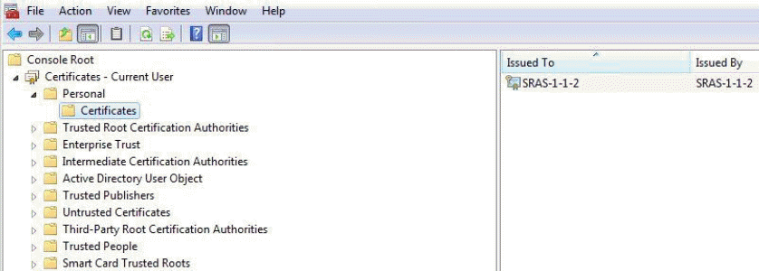
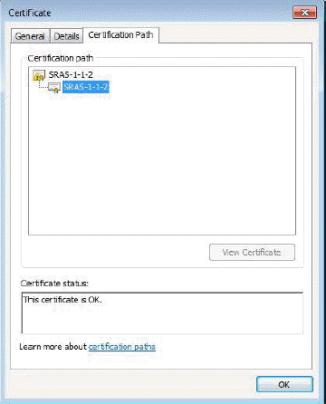

# Getting Started Guide for Secure Remote Access

## Overview

### Intended audience

This document is for customers who have:

- Completed the UKCloud Assurance Wrap

- Been approved to use the Secure Remote Access (SRA) service to manage services in the Elevated OFFICIAL security domain on the UKCloud platform

## Post approval

Once the SRA Assurance Wrap has been approved, we'll raise a Service Request for the implementation of the SRA virtual data centre (VDC) and, if needed, an Elevated VDC. If a service request for this VDC implementation already exists, a new one won't be raised.

You can track the progress of the Service Request using the [My Calls](https://portal.skyscapecloud.com/support/ivanti) section of the UKCloud Portal.

As part of the build, we may reach out to confirm some of the following details if not already defined and where appropriate:

- Confirm your Elevated OFFICIAL customer account number as a new Org will be created under the account to contain the SRA VDC. The Org number will be used as an identifier when signing certificates.

- The preferred IP pool you want to use for your client devices. If the IP Pool you'd prefer is in use by another customer then another will have to be chosen. We'll inform you if this is the case.

- If you want to specify an IP from the IP pool for each device, we'll need you to supply the mapping.

- Any specified DNS servers.

- A certificate signing request for each remote access device.

## Certificate Signing Request (CSR) generation

To enable SRA access, we'll need the certificate-signing request (CSR) from each remote access device you'll be using. The certificate-generation process will vary depending on the OS of the client device.

### Windows

Follow the steps below to generate the CSR for a Windows device.

1. Open the Certificates MMC snap-in (click **Start**, click **Run**, type **mmc** and then press **Enter**)

2. Select File > Add/Remove Snap-in > **Certificates** > Add > **Computer Account** > Next > **Local computer** > Finish

3. In the console tree, double-click **Personal** and then click **Certificates**.

4. On the **Actions** menu, point to **All Tasks**, **Advanced Options** and then click **Create Custom Request** to start the Certificate Enrolment wizard. Click **Next**.

5. On the Custom request page, in the **Templates** list, we recommend using the **Custom Request** option as your domain policy may be incompatible with the SRA service.

    - Select **Proceed without enrolment policy** and click **Next**.

6. Select **(No template) CNG key** and ensure the **PKCS#10** radio button is selected, then click **Next**.

7. At the **Certificate Information** page, click the down arrow next to **Details** then click the **Properties** button.

8. Click the **Private Key** tab, then the down arrow to the right of **Key options**.

9. Change the **Key size** to **2048** and click **Apply**.

    - **Optional:** If you want to back up the certificate (to protect against client device failure) click the check boxes for the **private key**. You'll be asked for a password.

10. For the file format, select **Base 64** and then save the CSR.

### Linux & Mac OS

For Linux & Mac OS, an equivalent OpenSSL command would be the following:

    openssl req -nodes -newkey rsa:2048 -keyout myserver.key -out server.csr

Ensure that the key file is preserved for the later installation steps below, as without this the AnyConnect client will not be able to connect the SRA service.

## CSR submission to UKCloud

We request that you provide the CSR in a service request via the Elevated UKCloud Portal by adding it as an attachment to the ticket so that we can generate the associated certificate(s). Should you not have access to the Elevated Portal or not be able to copy the CSR into the Elevated domain, please get in touch and we'll advise where this can be sent.

## Cisco AnyConnect client setup

Upon completion of the build, as part of the getting Started pack, we will provide you with access to the required Cisco AnyConnect Client installation files.

Should you or any additional users need to acquire the AnyConnect installation at a later date, please raise a service request and we can provide access to the required files.


### Linux

#### Install the AnyConnect client

```
tar zxvf anyconnect-linux-64-<version number>-k9.tar.gz

cd anyconnect-<version number>-/vpn

sudo ./vpn_install.sh
```

### Windows

#### Install the AnyConnect client

Whilst the Windows installation may come with the full AnyConnect package, the only component required for connecting to the SRAS VPN is the `core-vpn` component. You may install the additional components if you wish.

Either Right-Click on the `anyconnect-win-<version>-core-vpn-predeploy-k9.msi` and select install. Alternatively, run setup.exe and select the required components from the installation wizard.

### Mac OS

Double click the `anyconnect-macos-<version number>-predeploy-k9.dmg` file.

In the pop-up window, double click `AnyConnect.pkg` and then follow the installation wizard to install the AnyConnect software.

If prompted to select which components to install, the only component required for the SRAS VPN is the `core-vpn`.

## Post-installation configuration

Once you've installed the AnyConnect software and certificates on your device, you will need to install the required connection profile. Access to the required connection profiles will be shared via the Getting Started pack which is sent upon completion of the solution build. Should you or any additional users need to acquire the profiles at a later date, please raise a service request and we can provide access to the required files.

Unzip the file and copy the XML file(s) to the following locations:

OS type | CPA XML location
--------|-----------------
Linux/Mac OS | `/opt/cisco/anyconnect/profile`
Windows | `C:\ProgramData\Cisco\Cisco AnyConnect Secure Mobility Client\Profile`

### For Linux only

In addition to the AnyConnect profile(s), you will also need to install a local policy. If you wish to connect from a Linux device, please raise a service request and we can provide access to the required file.

Once you've copied the connection profile and local policy to the correct locations, you need to restart the AnyConnect service (using the command `service vpnagentd restart`) or reboot your machine.

## AnyConnect Client Upgrades

UKCloud will periodically update the minimum AnyConnect client version required to connect to the Secure Remote Access service. As per our standard notice period, we will always try to provide a minimum of 2 weeks notice where possible before performing an upgrade but **withhold the right to perform necessary upgrades at shorter notice where any security concerns dictate.**

Automatic upgrades will be pushed to AnyConnect clients when connecting to the SRAS VPN for the first time following an upgrade. To enable automatic upgrades, port TCP/443 must be permitted to the SRAS VPN endpoints. The AnyConnect upgrade **does not** require administrative privileges on the device. Any custom measures implemented through Group Policy which restrict the installation of software or network adapters may prevent the installation of the upgrade and you may need to install the updated client on the necessary machines prior to UKCloud performing the upgrade. If you require a manual installation or would like to install the updated client ahead of time, you can raise a support request via the UKCloud Portal and we can provide you with the required Cisco AnyConnect installation files.

## Certificate Installation

Once your Secure Remote Access solution has been setup, we'll send you an email containing the certificates we've generated (based on the CSR sent to us as above) which you'll need to install on your remote access device.

For each customer SRA service a unique IssuingCA certificate is generated and used to sign each individual device certificates. The IssuingCA certificate along with the specific certificate for the device will be emailed. Both the certificates need to be installed.

The certificates sent through will named as below:

- **IssuingCA** – `clientcert.pem`

- **Device Certificate** - `E51FFC7D50C<HEX VALUE>.pem`

### Windows certificate store

Follow the steps below to import the certificates into the Windows certificate store. This assumes that you have the certificates we sent accessible to the MMC:

1. Open the Certificates MMC snap-in (click **Start**, click **Run**, type **mmc**, and then press **Enter**) select **Certificates** and then **Local Computer Account**.

2. In the console tree, open **Trusted Root Certification Authorities**, right click **Certificates** and select **All tasks – Import - Next**.

3. Click **Browse**, change the filter from **X.509 Certificate (*.cer, *.crt)** to **All files**.

4. Find the IssuingCA sent to you, double click **clientcert.pem** and click **Next**.

5. Ensure that the **Place all certificates** radio button has **Trusted Root Certification Authorities** selected then click **Next** then **Finish**.

6. In the console tree, open **Personal**, right click **Certificates** and select **All tasks – Import - Next**.

7. Click **Browse**, change the filter from **X.509 Certificate (*.cer, *.crt)** to **All files**.

8. Find the device certificate sent to you, double click **E51FFC7D50C<HEX VALUE>.pem** and click **Next**.

9. Ensure that the **Place all certificates** radio button has **Personal** selected then click **Next** then **Finish**.

10. Using the example customer **SRAS-1-1-2** you should now see the client certificate in the Personal store.

**Example:**

Using the example customer **SRAS-1-1-2** you should now see the client certificate in the Personal store.



Double click it and as in the examples pictures below:

- In the **General** tab it should say "You have a private key that corresponds to this certificate".

    

- The UID should be displayed the **Details** tab in the **Subject** line in the format SRAS-1-1-2-xxx

    

- The certification path listed in the **Certification Path** tab as highlighted in the example below should show the IssuingCA

    

### Linux & Mac OS 

The Linux & Mac OS certificate store is just a file structure under the user account you'll be using to connect to the SRAS VPN. For the AnyConnect client to work, the following must be true:

- All certificate files must end with the extension `.pem`

- All private key files must end with the extension `.key`

- A client certificate and its corresponding private key must have the same filename. For example `client.pem` and `client.key`

- **The certificate and key must be owned by the same user and stored in that user's file structure.**

Using the example customer issued certificate SRAS1-1-2-001.pem the files would be stored in the following locations for root. The key file generated above needs to moved and renamed appropriately.

PEM file certificate store folders | Type of certificates stored
-----------------------------------|----------------------------
~/.cisco/certificates/client/private/SRAS1-1-2-001.key | Private keys
~/.cisco/certificates/client/SRAS1-1-2-001.pem | Client certificates
~/.cisco/certificates/ca/clientcert.pem | Trusted CA and root certificates

If the above directories do not already exist, they can be manually created.

## Connecting to SRAS

Once connected to the SRAS VPN, you can access your Elevated OFFICIAL environment via IP address or DNS name (if you have DNS configured) providing you have permitted connectivity from your assigned SRAS VPN subnet. Client connection methods are listed below.

### Linux & Mac OS

Once you've restarted AnyConnect and installed the certificates, you can use the client with the following command line (SRAS endpoints are defined in the connection profiles installed previously):

/opt/cisco/anyconnect/bin/vpn connect \<sras-endpoint\>

If you use MacOS or a Linux Desktop distribution, you should be able to use the Cisco AnyConnect Graphical User Interface (GUI).

### Windows

When you open the Cisco AnyConnect client, you'll see a window appear. Providing you have installed the SRAS XML profile as explained previously, you will be able to select the SRAS VPN endpoint from the dropdown box.


Click the **Connect** button and after a couple of status checks the client should scan the certificate store and give you the option to select a certificate to connect with. If you have multiple certificates installed on your machine, you may need to select 'More Choices' to reveal the required certificate.


Once you have selected the require certificate, AnyConnect should connect you to the SRAS VPN.

## Accessing the UKCloud Portal using SRAS

There is no direct access to the UKCloud Elevated Portal once the Cisco AnyConnect client connects.

In most cases, we will create a virtual machine (Bastion VM) within the SRA VDC that you can RDP to once connected to the VPN. From the Bastion VM, you can access and log in to the UKCloud Elevated Portal to provision and manage your SRA and Elevated environments. Once the Bastion VM is deployed, it becomes your responsibility to manage and maintain it. This VM will be billed according to the standard UKCloud billing process.

The IP addresses and domains for our additional shared services within the Elevated OFFICIAL platform e.g. WSUS, RHUI etc. can be obtained by raising a Service Request through the **My Calls** section of the UKCloud Portal.

## Feedback

If you find a problem with this article, click **Improve this Doc** to make the change yourself or raise an [issue](https://github.com/UKCloud/documentation/issues) in GitHub. If you have an idea for how we could improve any of our services, send an email to <feedback@ukcloud.com>.
