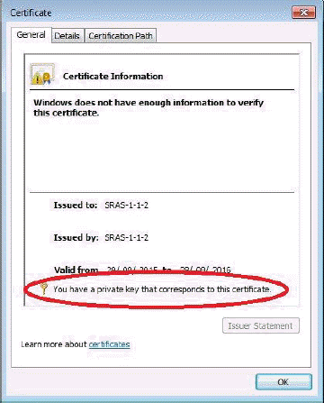
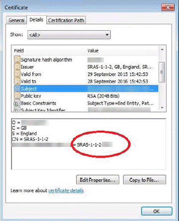
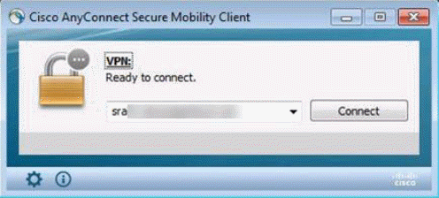
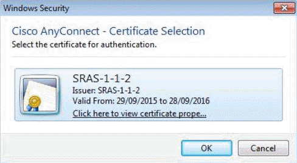

# Getting Started Guide for Secure Remote Access

## Overview

### Intended audience

This document is for customers who have:

- Completed the UKCloud Assurance Wrap

- Been approved to use the Secure Remote Access (SRA) service to manage services in the Elevated OFFICIAL security domain on the UKCloud platform

## Post approval

Once the SRA Assurance Wrap has been approved, we'll raise a Service Request for the implementation of the SRA virtual data centre (VDC) and, if needed, an Elevated VDC. (If a service request for this VDC implementation already exists, a new one won't be raised.)

You can track the progress of the Service Request using the [My Calls](https://portal.skyscapecloud.com/support/ivanti) section of the UKCloud Portal.

During creation of the UKCloud SRA VDC, we'll ask you for some additional information
via the Service Request:

- Confirm the customer account number in Elevated as a new Org will be created under the account to contain the SRA VDC. The Org number will be used as an identifier when signing certificates.

- The preferred IP pool you want to use for your client devices. If the IP Pool you'd prefer is in use by another customer then another will have to be chosen. We'll inform you if this is the case.

- If you want to specify an IP from the IP pool for each device, we'll need you to supply the mapping.

- Any specified DNS servers.

- The Elevated Network Firewall Tenant (NFT) number and the Elevated organisation containing it for connection into Elevated.

- A certificate signing request for each remote access device.

## Certificate signing request generation

To enable SRA access, we'll need the certificate-signing request (CSR) from each remote access device you'll be using. The certificate-generation process will vary depending on the OS of the client device.

### Windows

Follow the steps below to generate the CSR for a Windows device.

1. Open the Certificates MMC snap-in (click **Start**, click **Run**, type **mmc** and then press **Enter**) select **Certificates** and then **Computer Account**.

2. In the console tree, double-click **Personal** and then click **Certificates**.

3. On the **Actions** menu, point to **All Tasks**, point to **Advanced Options** and then click **Create Custom Request** to start the Certificate Enrolment wizard. Click **Next**.

4. On the Custom request page, in the **Templates** list, we recommend using the **Custom Request** option as your domain policy may be incompatible with the SRA service.

    - Select **Proceed without enrolment policy** and click **Next**.

5. Select **(No template) CNG key** and ensure the **PKCS#10** radio button is selected, then click **Next**.

6. At the **Certificate Information** page, click the down arrow next to **Details** then click the **Properties** button.

7. Click the **Private Key** tab, then the down arrow to the right of **Key options**.

8. Change the **Key size** to **2048** and click **Apply**.

    - **Optional:** If you want to back up the certificate (to protect against client device failure) click the check boxes for the **private key**. You'll be asked for a password.

9. For the file format, select **Base 64** and then save the CSR.

### Linux

For Linux, an equivalent OpenSSL command would be the following:

    openssl req -nodes -newkey rsa:2048 -keyout myserver.key -out server.csr

Ensure that the key file is preserved for the later installation steps below, as without this the AnyConnect client will not be able to connect the SRA service.

## CSR submission to UKCloud

We request that you paste the contents of the CSR file directly into a ticket for us to generate the associated certificate(s), but you can also email it to us if you cannot access the Portal.

## VPN Cisco AnyConnect client setup

To access your SRA VDC you need to download the Cisco AnyConnect client and install it on your remote access devices (requires UKCloud Portal login).

For each OS there is the main Cisco AnyConnect client software install and an additional executable to enable the FIPS capability. You need to run both.

### Download link

<https://portal.skyscapecloud.com/support/knowledge_centre/a0e452d8-cd7b-49a4-a3ca-f791620cb084>

### Linux

#### Install the AnyConnect client

```
tar zxvf anyconnect-linux-64-<version number>-k9.tar.gz

cd anyconnect-<version number>-/vpn

sudo ./vpn_install.sh
```

#### Enable FIPS

```
tar zxvf anyconnect-linux-64-<version number>-enableFIPS.tar.gz

./ anyconnect-linux-64-<version number>-enableFIPS
```

### Windows

#### Install the AnyConnect client

The windows installation has the option of `.msi` or `.iso` (that contains the `.msi`) for the AnyConnect client image. The following installs may need to be run as administrator depending on the local policy of your Windows device.

Right click on the `anyconnect-win-<version number>-pre-deploy.msi` and select Install.

#### Enable FIPS

Double click `anyconnect-EnableFIPS-win-<version number>.exe` and then enter `y` when asked at the command prompt.

### Mac

No further instructions required.

## AnyConnect client software

We'll make the latest Cisco AnyConnect client software available via the Knowledge Centre using the link above. Using the latest version of the AnyConnect client will probably be a requirement of your ITSHC or service assurance wrap so it will be worth checking the above articles periodically.

If a client is upgraded from a previous install then the following post installation steps will need to be performed again to ensure the client configuration isn't reverted to the default.

## Post-installation configuration

Once you've installed the AnyConnect software and certificates on your device, you need to install the connection profile which is available in the Knowledge Centre (<https://portal.skyscapecloud.com/support/knowledge_centre/25a7111c-139e-4fd2-a52c-3412689bf1d3>). Unzip the file and copy the xml to the following location:

OS type | CPA XML location
--------|-----------------
Linux/Mac | `/opt/cisco/anyconnect/profile`
Windows | `C:\ProgramData\Cisco\Cisco AnyConnect Secure Mobility Client\Profile`

### For Linux only

In addition to the AnyConnect profile, you also need to install a local policy which is available in the Knowledge Centre:

<https://portal.skyscapecloud.com/support/knowledge_centre/2effd0b2-1eda-4999-87a6-6140e5fc07ea>

Unzip the file and copy it to: `/opt/cisco/anyconnect/AnyConnectLocalPolicy.xml`.

Once you've copied the connection profile and local policy to the correct locations, you need to restart the AnyConnect service (using the command service `vpnagentd restart`) or reboot the VM.

## SRA certificates

Once the SRA VDC has been set up (and Elevated VDC, if needed), we'll send you an email containing the certificates we've generated (based on the CSR sent to us as above) which you need to install onto your remote access devices.

For each customer SRA service a unique IssuingCA certificate is generated and used to sign each individual device certificates. The IssuingCA certificate along with the specific certificate for the device will be emailed. Both the certificates need to be installed.

The certificates sent through will named as below:

- **IssuingCA** – `clientcert.pem`

- **Device Certificate** - `E51FFC7D50C<HEX VALUE>.pem`

### Windows certificate store

Follow the steps below to import the certificates into the Windows certificate store. This assumes that you have the certificates we sent accessible to the MMC:

1. Open the Certificates MMC snap-in (click **Start**, click **Run**, type **mmc**, and then press **Enter**) select **Certificates** and then **Computer Account**.

2. In the console tree, open **Trusted Root Certification Authorities**, right click **Certificates** and select **All tasks – Import - Next**.

3. Click **Browse**, change the filter from **X.509 Certificate (*.cer, *.crt)** to **All files**.

4. Find the IssuingCA sent to you, double click **clientcert.pem** and click **Next**.

5. Ensure that the **Place all certificates** radio button has **Trusted Root Certification Authorities** selected then click **Next** then **Finish**.

6. In the console tree, open **Personal**, right click **Certificates** and select **All tasks – Import - Next**.

7. Click **Browse**, change the filter from **X.509 Certificate (*.cer, *.crt)** to **All files**.

8. Find the device certificate sent to you, double click **E51FFC7D50C<HEX VALUE>.pem** and click **Next**.

9. Ensure that the **Place all certificates** radio button has **Personal** selected then click **Next** then **Finish**.

Using the example customer **SRAS-1-1-2** you should now see the client certificate in the **Personal** store.


Double click it and as in the examples pictures below:

- In the **General** tab it should say "You have a private key that corresponds to this certificate".

    

- The UID should be displayed the **Details** tab in the **Subject** line in the format SRAS-1-1-2-<Unique Number>

    

- The certification path listed in the **Certification Path** tab as highlighted in the example below should show the IssuingCA

    

### Linux certificate store

The Linux certificate store is just a file structure under the root or user account depending on how you use Linux OS. For the Linux client to work the following must be true:

- All certificate files must end with the extension `.pem`

- All private key files must end with the extension `.key`

- A client certificate and its corresponding private key must have the same filename. For example `client.pem` and `client.key`

Using the example customer issued certificate SRAS1-1-2-001.pem the files would be stored in the following locations for root. The key file generated above needs to moved and renamed appropriately.

PEM file certificate store folders | Type of certificates stored
-----------------------------------|----------------------------
~/.cisco/certificates/client/private/SRAS1-1-2-001.key | Private keys
~/.cisco/certificates/client/SRAS1-1-2-001.pem | Client certificates
~/.cisco/certificates/ca/clientcert.pem | Trusted CA and root certificates

## Connecting to SRA

Once connected to your SRA VPN, you can access your SRA walled garden via IP address or DNS name (if you have a DNS set up). Client connection methods are listed below.

### Linux

Once you've restarted AnyConnect and installed the certificates, you can use the client with the following command line:

    /opt/cisco/anyconnect/bin/vpn connect sra01.ukcloud.com

Or if you use a Linux desktop the client software should be available as an icon.

### Windows

When you open the AnyConnect client you'll see a small window appear and the location of the SRA service should be populated:



Click the **Connect** button and after a couple of status checks the client should scan the certificate store and offer the relevant certificate to initiate access.



Select the certificate and click **OK**.

## Accessing the UKCloud Portal using SRA

There is no direct access to the Elevated portal once the AnyConnect client connects.

In most instances we'll create a virtual machine (VM) within the SRA VDC that you can VPN into in order to log in to the Elevated portal to provision and manage your SRA and Elevated VDC. Once this VM is deployed, it becomes your responsibility to manage and maintain it. This VM will be billed according to standard UKCloud billing process.

Addresses to hit the Elevated portal and vCloud Director API can be obtained by raising a Service Request through the [My Calls](https://portal.skyscapecloud.com/support/ivanti) section of the UKCloud Portal.

## Feedback

If you find a problem with this article, click **Improve this Doc** to make the change yourself or raise an [issue](https://github.com/UKCloud/documentation/issues) in GitHub. If you have an idea for how we could improve any of our services, send an email to <feedback@ukcloud.com>.
