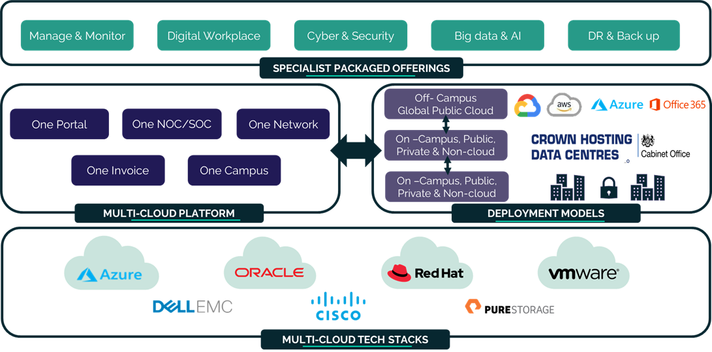

# Secure Remote Access Service Definition

## What is Secure Remote Access?

The Secure Remote Access (SRA) service enables you to securely connect to the UKCloud platform's Elevated OFFICIAL security domain using National Cyber Security Centre (NCSC)-approved internet virtual private network (VPN) technologies and the walled garden architectural pattern.

System administrators and mobile workers can securely access workloads running on Elevated OFFICIAL from locations that don't have alternative secure network connections such as PSN.

The SRA service:

- Provides flexible connectivity for remote administrators and mobile workers to the UKCloud Elevated OFFICIAL security domain

- Is delivered as a cloud service – no need to purchase and manage NCSC-approved VPN hardware

- Offers a flexible application process, including a self-assessment route for customers with simple implementations and an assurance review approach with UKCloud's experienced professionals for more complex implementations

## Pricing and packaging

SRA pricing can be as low as £5.00 per licence per month. Full pricing with all options is available in the [UKCloud Pricing Guide](https://ukcloud.com/pricing-guide).

## Accreditation and information assurance

The security of our platform is our number one priority. We've always been committed to adhering to exacting standards, frameworks and best practice. Everything we do is subject to regular independent validation by government accreditors, sector auditors and management system assessors. Details are available on the [UKCloud website](https://ukcloud.com/governance/).

## Connectivity options

UKCloud provides one of the best-connected cloud platforms for the UK public sector. We enable access to our secure platform by DDoS-protected internet, PSN, Janet, HSCN, MCN and your own leased lines via our HybridConnect or CrownConnect services. The full range of flexible connectivity options is detailed in the [UKCloud Pricing Guide](https://ukcloud.com/pricing-guide).

## An SLA you can trust

We understand that enterprise workloads need a dependable service that underpins the reliability of the application to users and other systems, which is why we offer one of the best SLAs on G-Cloud. For full details on the service SLA, including measurements and service credits, see the [*SLA definition*](../other/other-ref-sla-definition.md).

## The small print

For full terms and conditions, including onboarding and responsibilities, refer to the [*Terms and conditions documents*](../other/other-ref-terms-and-conditions.md).

For more information about this service, see the [*Service Scope*](sra-sco.md) and [*FAQs*](sra-faq.md).

## Why UKCloud?

UKCloud is dedicated to the digital transformation of our nation's public services through our flexible, secure and cost-effective multi-cloud platform and the expertise of our people and partners. We believe that diversity of technology drives value and innovation and so we bring together different cloud technologies, with different deployment models spanning on-premises (private cloud), on-campus (Government's Crown Campus) and off-campus global public cloud services. This enables you to choose the right cloud for creating new workloads or migrating or replacing existing applications to the cloud with specialist SaaS solutions.

We recognise the importance of public services to UK citizens and businesses, which is why we include the highest level of support to all our customers at no extra cost. This includes dedicated 24/7 UK support, a Network Operations Centre (NOC), utilising protective and proactive monitoring tools, and access to UKCloud's experts. UKCloud can also provide outcome-based professional services or managed services to help you with digital transformation.

## Feedback

If you find a problem with this article, click **Improve this Doc** to make the change yourself or raise an [issue](https://github.com/UKCloud/documentation/issues) in GitHub. If you have an idea for how we could improve any of our services, send an email to <feedback@ukcloud.com>.
