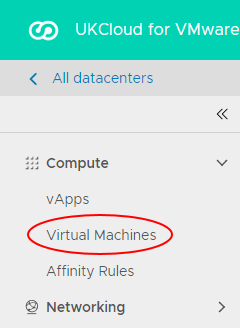
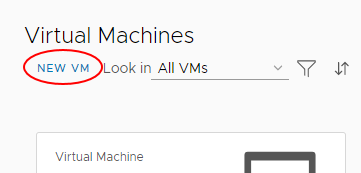
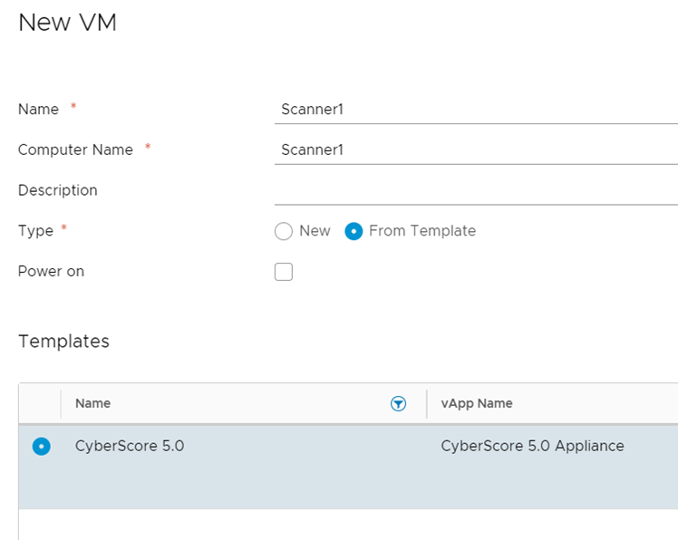
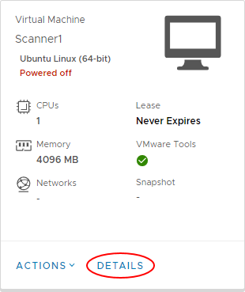
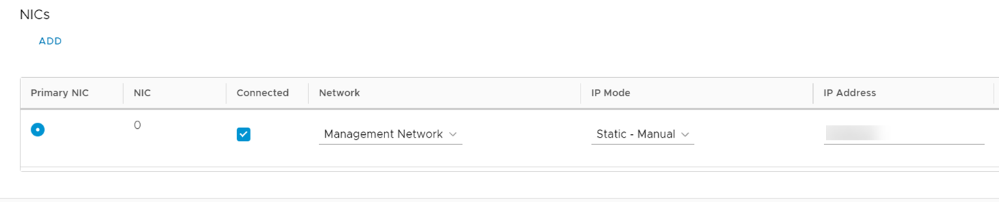
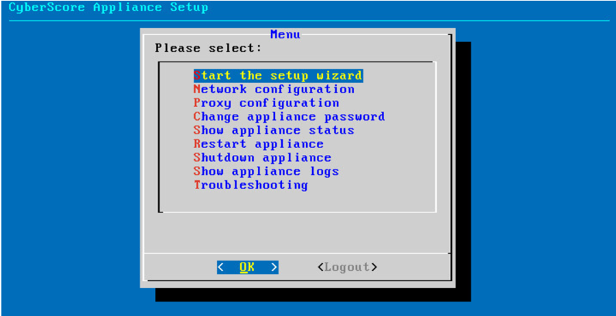

# How to deploy a CyberScore virtual machine in vCloud Director

## Overview

To run CyberScore against your UKCloud for VMware environment, you need to deploy a virtual machine (VM) and set it up as a CyberScore scanner.

## Prerequisites

Before completing the steps in this article, make sure you have set up your environment as described in [*XQ Cyber CyberScore scanner deployment environment requirements*](third-ref-cyberscore-prereqs.md).

## Deploying a CyberScore virtual machine

1. In the vCloud Director *Virtual Datacenters* dashboard, select the virtual data centre (VDC) in which you want to create the VM.

    For more detailed steps for accessing vCloud Director, see the [*Getting Started Guide for UKCloud for VMware*](../vmware/vmw-gs.md).

2. In the left navigation panel, select **Virtual Machines**.

    

3. Click **New VM**.

    

4. In the *New VM* dialog box, enter a **Name**, **Computer Name** and **Description** for the VM.

    > [!NOTE]
    > **Name** is a name to identify the VM, **Computer Name** is the host name of the VM.
    >
    > The **Computer Name** is copied from the **Name** field but can contain only alphanumeric characters and hyphens, so you may need to edit it if your VM **Name** contains spaces or special characters.

5. From the **Type** radio buttons, select **From Template**.

6. Deselect the **Power on** check box.

7. In the *Templates* section, select the **CyberScore 5.0** template.

    > [!TIP]
    > To find the template, click the filter icon (funnel) in the **Name** column and enter `CyberScore`.

    

8. When you're done, click **OK**.

9. When the CyberScore VM deployment is finished and the VM shows a status of **Powered Off**, in the card for the VM, select **Details**.

    

10. Expand the *Hardware* section.

11. In the *NICs* section, from the **Network** list, select the network that you want to attach the VM to.

12. From the **IP Mode** list, select **Manual** then enter the **IP Address** for the VM.

13. Select the **Connected** check box, then click **Save**.

    

14. In the card for the VM, select **Actions** then **Power On**.

15. When the VM has powered on, in the card for the VM, select **Actions**, then **Launch Web Console**.

16. In the Web Console, after logging in to the VM, select **Start the setup wizard**.

    

17. When the setup process is finished, make a note of your 16 digit registration code.

18. Log in to the [CyberScore Portal](https://secure.cyberscore.com) and register your scanner using your 16 digit registration code.

19. Back in the vCloud Director Web Console, you'll see a message that your registration is completed.

    

20. Close the Web Console.

21. You can now configure and run scans from the CyberScore Portal.

## Feedback

If you find an issue with this article, click **Improve this Doc** to suggest a change. If you have an idea for how we could improve any of our services, visit the [Ideas](https://community.ukcloud.com/ideas) section of the [UKCloud Community](https://community.ukcloud.com).
