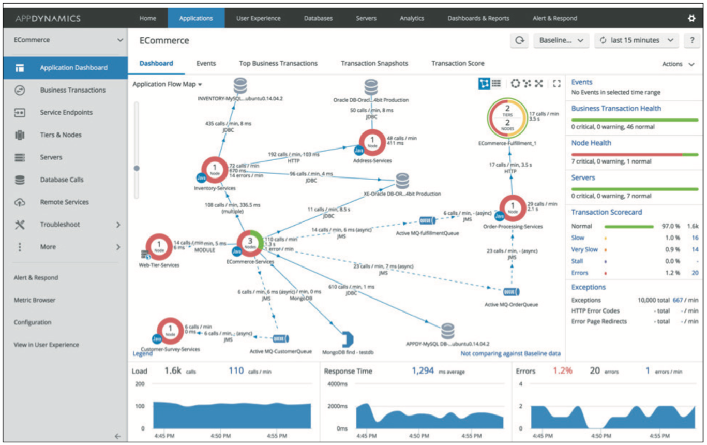

# Cisco AppDynamics from UKCloud Service Definition

## Why UKCloud?

UKCloud is dedicated to helping the UK Public Sector and UK citizens by delivering more choice and flexibility through safe and trusted cloud technology. We own and operate a UK-sovereign, industry-leading, multi-cloud platform, located within the Government's Crown Campus, offering multiple cloud technologies, including VMware, Azure, OpenStack, OpenShift and Oracle. This enables customers to choose the right technology for creating new workloads or migrating existing applications to the cloud.

We recognise the importance of government services in making the country run smoothly, which is why we include the highest level of support to all our customers at no extra cost. This includes a dedicated 24/7 UK telephone and ticket support, and Network Operations Centre (NOC) utilising protective and proactive monitoring tools, and access to UKCloud's technical experts.

## What is Cisco AppDynamics from UKCloud?

Cisco AppDynamics provides application performance management, end user monitoring, infrastructure visibility and business performance monitoring.

AppDynamics helps businesses deliver consistently flawless digital experiences by connecting end-user experience and application performance to business outcomes.

AppDynamics monitors, correlates, analyses, and acts on application and business performance data in real-time. This automated, cross-stack intelligence enables developers, IT ops, and business owners to make the mission critical and strategic improvements that win customers at every moment.

For full information regarding this product visit our [Knowledge Centre](https://docs.ukcloud.com).

## What the service can help you achieve

Cisco AppDynamics is for IT Operations, Production support, Developers, Architects and anyone whose phone rings when the application is having problems. It helps you:

- Visualize your entire application, from browser and mobile app to backend database.

- Monitor hybrid environments with Java, .NET, PHP, Node.js, Python and C++.

- Troubleshoot bottlenecks 90% faster with deep code-level diagnostics.

- Automate common fixes with Application Run Book Automation.

- Improve situational awareness and DevOps collaboration with single pane of glass for cross-tier monitoring, role-based views, virtual war room.

Cisco AppDynamics enables customers to solve the following problems:

- Uptime and availability

- Slow response time

- Memory leaks and thrash

- Stalls

- Deadlocks

- Slow database response

- Database connection pool areas

- End-user monitoring

- Mobile application performance monitoring

The AppDynamics web interface provides an intuitive view of your application allowing for quick identification and remediation of application performance issues, including the Application Flow Map illustrated below.

## Product options

Cisco AppDynamics offers three editions:

- APM Pro: Provides end-to-end monitoring of key business transactions within your applications. Features the core Application Performance Management functionality, with flexibility to switch between languages; includes basic infrastructure monitoring.

- APM Advanced: Enables deeper insights into your application stack with Server and Network Visibility. Contains everything from APM Pro plus Server Visibility and Network Visibility.

- APM Peak – provides everything in APM Advanced with the addition of real-time business performance monitoring, transaction analytics and Business Journeys.

## Pricing and packaging

Cisco AppDynamics pricing is per agent per year, from £2,290, dependent on the type of agent and the edition. Full pricing is available in the [*3rd Party Software Pricing Guide*](https://ukcloud.com/3rd-party-pricing-guide).

## Free trial

A 15-day free trial with complete access to all AppDynamics platform components is available. Please contact UKCloud for details.

## Accreditation and information assurance

The security of our platform is our number one priority. We've always been committed to adhering to exacting standards, frameworks and best practice. Everything we do is subject to regular independent validation by government accreditors, sector auditors, and management system assessors. Details are available on the [UKCloud website](https://ukcloud.com/governance/).

## Connectivity options

UKCloud provides one of the best-connected cloud platforms for the UK Public Sector. We offer a range of flexible connectivity options detailed in the [UKCloud Pricing Guide](https://ukcloud.com/pricing-guide) which enable access to our secure platform by DDoS-protected internet, native PSN, Janet, HSCN and RLI and your own lease lines via our HybridConnect service.

## The small print

For full terms and conditions, please refer to the [*Terms and conditions documents*](../other/other-ref-terms-and-conditions.md) and the [AppDynamics End User Terms and Conditions](third-ref-eula.md).

## Feedback

If you find a problem with this article, click **Improve this Doc** to make the change yourself or raise an [issue](https://github.com/UKCloud/documentation/issues) in GitHub. If you have an idea for how we could improve any of our services, send an email to <feedback@ukcloud.com>.
