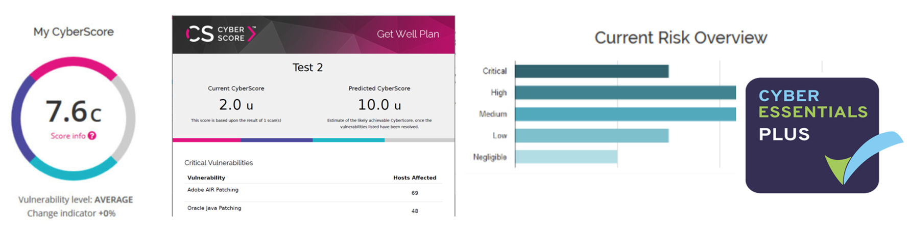

# XQ Cyber CyberScore from UKCloud Service Definition

## Why UKCloud?

UKCloud is dedicated to helping the UK Public Sector and UK citizens by delivering more choice and flexibility through safe and trusted cloud technology. We own and operate a UK-sovereign, industry-leading, multi-cloud platform, located within the Government’s Crown Campus, offering multiple cloud technologies, including VMware, Azure, OpenStack, OpenShift and Oracle. This enables customers to choose the right technology for creating new workloads or migrating existing applications to the cloud.

We recognise the importance of government services in making the country run smoothly, which is why we include the highest level of support to all our customers at no extra cost. This includes a dedicated 24/7 UK telephone and ticket support, and Network Operations Centre (NOC) utilising protective and proactive monitoring tools, and access to UKCloud’s technical experts.

## What is XQ Cyber CyberScore from UKCloud?

CyberScore is a fully automated, rapid, scalable, cyber security testing and rating service. CyberScore helps organisations of all sizes improve their cybersecurity by scanning their network, highlighting vulnerabilities and providing advice on how to harden their IT infrastructure. It is a fully automated service which enables organisations to dramatically reduce penetration testing costs.

CyberScore provides a fair, balanced and standardised assessment of your estate through automated scanning of devices within your network. CyberScore’s Get Well Plans and automated Technical Reports (pen tests) explain how to raise your security posture to a Pass level and where to focus security remediation efforts.

CyberScore provides an affordable path to Cyber Essentials Plus Certification. From registration to generating your certificate, the machine-based approach dramatically reduces your assessment costs and improves your true security in one process.

For full information regarding this product, visit our [Knowledge Centre](https://docs.ukcloud.com).

## What the service can help you achieve

- Identify cyber security risk and identify business risk

- Create standardised, high quality penetration test reports

- Easily demonstrate to stakeholders your cybersecurity posture

- Benchmark your security posture against industry peers

- View and track your progress since your last CyberScore

- Share your Get Well Plan with your team or your IT partners

- Reduce compliance testing costs, employ penetration testing for strategic tasks

- Receive a Cyber Essentials Plus Advisory recommendation

## Free trial

A free trial of CyberScore is available for a 2-week period to scan up to 20 devices.

## Pricing and packaging

Using CyberScore is free and provides your “CyberScore” and high-level information.

To unlock the full CyberScore data, sort vulnerabilities, generate or share your Get Well Plans, patch reports and Technical Reports, you will be required to pay for CyberScore.

CyberScore is charged per credit, from £1.80 per credit, where a credit gives access to the full CyberScore report for one scanned device. Full pricing is available in the [*3rd Party Software Pricing Guide*](https://ukcloud.com/wp-content/uploads/2019/06/ukcloud-3rd-party-software-pricing-guide-11.0.pdf).

## Accreditation and information assurance

The security of our platform is our number one priority. We’ve always been committed to adhering to exacting standards, frameworks and best practice. Everything we do is subject to regular independent validation by government accreditors, sector auditors, and management system assessors. Details are available on the [UKCloud website](https://ukcloud.com/governance/).

## Connectivity options

UKCloud provides one of the best-connected cloud platforms for the UK Public Sector. We offer a range of flexible connectivity options detailed in the [*UKCloud Pricing Guide*](https://ukcloud.com/wp-content/uploads/2019/06/ukcloud-pricing-guide-11.0.pdf) which enable access to our secure platform by DDoS-protected internet, native PSN, Janet, HSCN and RLI and your own lease lines via our HybridConnect service.

## The small print

For full terms and conditions including onboarding and responsibilities, please refer to the [*Terms and conditions documents*](../other/other-ref-terms-and-conditions.md).

## Feedback

If you find an issue with this article, click **Improve this Doc** to suggest a change. If you have an idea for how we could improve any of our services, visit the [Ideas](https://community.ukcloud.com/ideas) section of the [UKCloud Community](https://community.ukcloud.com).
