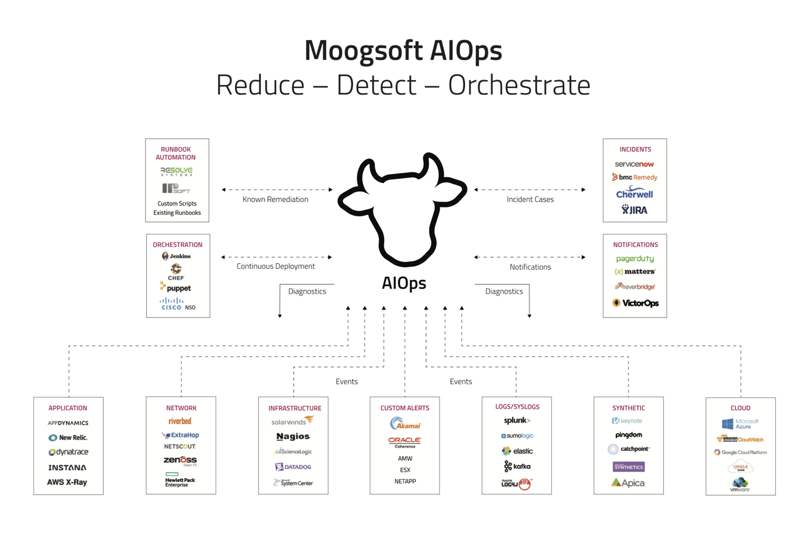

# Moogsoft AIOps from UKCloud Service Definition

## Why UKCloud?

UKCloud is dedicated to helping the UK Public Sector and UK citizens by delivering more choice and flexibility through safe and trusted cloud technology. We own and operate a UK-sovereign, industry-leading, multi-cloud platform, located within the Government’s Crown Campus, offering multiple cloud technologies, including VMware, Azure, OpenStack, OpenShift and Oracle. This enables customers to choose the right technology for creating new workloads or migrating existing applications to the cloud.

We recognise the importance of government services in making the country run smoothly, which is why we include the highest level of support to all our customers at no extra cost. This includes a dedicated 24/7 UK telephone and ticket support, and Network Operations Centre (NOC) utilising protective and proactive monitoring tools, and access to UKCloud’s technical experts.

## What is Moogsoft AIOps from UKCloud?

Moogsoft AIOps is the pioneering AI platform for IT operations, powered by purpose-built machine learning algorithms. It improves the signal to noise ratio by reducing and then correlating related alerts together; and then the AIOps platform suggests root cause and enables cross-team collaboration to solve incidents faster. Moogsoft improves the detection and remediation of incidents, ensuring continuous service delivery of your organisation.

## What the service can help you achieve

- Deliver unified visibility across production stacks

- Eliminate operational noise and alert fatigue

- Automated event correlation across tools

- Provide proactive warning of production incidents

- Streamline team workflow and collaboration

- Capture, codify, and reuse team knowledge

## Pricing and packaging

Moogsoft AIOps from UKCloud is priced per managed device per year, starting at £1.10. Full pricing according to managed device type and number of managed devices is available in the [*3rd Party Software Pricing Guide*](https://ukcloud.com/3rd-party-pricing-guide).

## Free trial

Moogsoft AIOps is available as a free trial. To discuss conducting a proof of value trial for your environment, please contact UKCloud.

## Accreditation and information assurance

The security of our platform is our number one priority. We’ve always been committed to adhering to exacting standards, frameworks and best practice. Everything we do is subject to regular independent validation by government accreditors, sector auditors, and management system assessors. Details are available on the [UKCloud website](https://ukcloud.com/governance/).

## Connectivity options

UKCloud provides one of the best-connected cloud platforms for the UK Public Sector. We offer a range of flexible connectivity options detailed in the [*UKCloud Pricing Guide*](https://ukcloud.com/wp-content/uploads/2019/06/ukcloud-pricing-guide-11.0.pdf) which enable access to our secure platform by DDoS-protected internet, native PSN, Janet, HSCN and RLI and your own lease lines via our HybridConnect service.

## The small print

For full terms and conditions including onboarding and responsibilities, please refer to the [*Terms and conditions documents*](../other/other-ref-terms-and-conditions.md).

## Feedback

If you find an issue with this article, click **Improve this Doc** to suggest a change. If you have an idea for how we could improve any of our services, visit the [Ideas](https://community.ukcloud.com/ideas) section of the [UKCloud Community](https://community.ukcloud.com).
