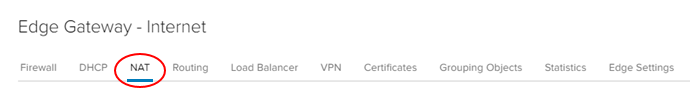

# How to build a virtual machine with UKCloud for VMware

## Overview

This article leads you through the three basic steps for using UKCloud for VMware to quickly build a simple virtual machine (VM) in VMware Cloud Director, and connect it to the internet.

For more information about how to use other Cloud Director functions to make the most of UKCloud for VMware and create more complex virtual data centres (VDCs), take a look at the [*Getting Started Guide for UKCloud for VMware*](vmw-gs.md).

The three steps covered in this article are:

1. Create a network (to move requests around your VMs)

2. Configure the edge gateway (in this article we focus on the firewall and NAT configuration)

3. Create a VM

If you follow these steps, you can have a VM up and running with a connection to the internet in about 20 to 25 minutes.

## Before you begin

You should have received your UKCloud Portal login credentials from your Portal administrator.

You should have created a compute service and VDC within your account. For more information, see the [*Getting Started Guide for UKCloud for VMware*](vmw-gs.md#creating-your-ukcloud-for-vmware-estate).

You should also have created an edge gateway, which enables communication between your VDC and the outside world. For more information, see [*How to build an edge gateway using the UKCloud Portal*](vmw-how-build-edge.md).

To perform the tasks in this article, you'll need to open Cloud Director:

1. [*Log in to the UKCloud Portal*](../portal/ptl-gs.md).

2. If necessary, select your account.

   

3. In the Portal navigation panel, expand **VMware Cloud** and then select the compute service in which you want to create your VM.

   

4. On the **VMware Cloud Director** tab, enter your Portal password and click **Confirm**.

    

## Create a network

Before you can start building VMs in your VDC, you need to create the network that connects the VMs to each other and the outside world.

First, you need to create a network that can connect to external networks outside your VDC (including the internet). This is called an *external routed network*. You can find more information about routed networks in [*How to create a routed VDC network*](vmw-how-create-routed-network.md).

1. In the VMware Cloud Director *Virtual Datacenters* dashboard, select your VDC.

2. You're creating a network, so, in the left navigation panel, under *Networking*, select **Networks**.

   

3. To create a new network, click **New**.

   

4. You want your VM to connect to the internet (rather than just other VMs in the same VDC), so on the *Network Type* page of the *New Organization VDC Network* dialog box, select **Routed**.

   

5. Click **Next**.

6. On the *General* page, give the network a **Name** and **Description**.

7. In the **Gateway CIDR** field, enter the details for the gateway address, for example `192.168.1.1/24`.

8. The **Shared** option enables you to make your network available to other VDCs within the same region so that VMs can communicate with each other, regardless of which VDC they are in. For example, you may have a single repository server that provides updates for all the VMs in a region.

   For the purposes of this tutorial, leave the **Shared** option deselected.

   

9. Click **Next**.

10. When you connect a network to the outside world, it's important that you control exactly what can access your environment via that network. UKCloud for VMware uses edge gateways to do this.

    On the *Edge Connection* page, select the edge that you want your new network to use (we'll work more with the edge gateway later on).

    

    For the purposes of this tutorial, you can ignore the other fields on this page.

11. Click **Next**.

12. VMs need IP addresses to identify them on the network, so you'll need to create a pool of IP addresses that your VMs can use.

    On the *Static IP Pools* page, identify the range of IP addresses that VMs connecting to this network can use then click **Add**.

    For example, if your **Gateway CIDR** is `192.168.1.1/24`, you could use the `192.168.1.10-192.168.1.100` range for your static IP pool, giving 91 usable internal IP addresses.

    

13. Click **Next**.

14. On the *DNS* page, enter your DNS information.

    

15. Click **Next**.

16. On the *Ready to Complete* page, review your selections then click **Finish**.

    

## Configure the edge gateway

The edge gateway is possibly the most complex part of the VDC because of its high level of functionality. The following steps show you how to quickly configure the edge gateway to enable you to access the internet from a VM.

1. In the VMware Cloud Director *Virtual Datacenters* dashboard, select your VDC.

2. This time you're working with the edge gateway, so in the left navigation panel, under *Networking*, click **Edges**.

   

3. Select the edge gateway you want to work with.

   

4. Click **Services**.

    

5. Each tab in the *Edge Gateway* dialog box provides access to a different service provided by the edge gateway. The main tabs are:

   

   - **Firewall** - As well as a physical firewall, you can control which networks and ports can communicate through the edge gateway. You'll set up some firewall rules later in this exercise.

   - **DHCP** - The edge gateway can act as a DHCP server for VMs connected to Org networks connected to an edge. The DHCP tab shows DHCP information for any VDC networks that have been configured with DHCP, and so acts as a centralised view. For more information, see [*How to create a DHCP pool*](vmw-how-create-dhcp-pool.md).

   - **NAT** - Network address translation, both in (DNAT) and out (SNAT) of the edge gateway. You'll set up some NAT rules later in this exercise.

   - **Routing** - You can provide static routes from the edge gateway to other networks, for example networks in other VDCs in your compute service. For more information, see [*How to create a static route*](vmw-how-create-static-route.md).

   - **Load Balancer** - The edge gateway provides simple HTTP and HTTPS load balancing using round robin. For more information, see [*How to configure a load balancer*](vmw-how-configure-load-balancer.md).

   - **VPN** - IPsec site‑to‑site VPN is available on the edge gateway. You can configure an IPsec VPN within Cloud Director, but you may need to perform additional configuration through the API. For more information, see [*How to configure IPsec VPN*](vmw-how-configure-ipsec-vpn.md).

   To access the internet from a VM, you'll need to create firewall rules to determine who can access your network and NAT rules to route traffic within your network.

### Creating firewall rules

Let's start with firewall rules. To enable your VMs to communicate with the outside world, you need configure your edge gateway to allow traffic out of your VDC.

1. In the *Edge Gateway* dialog box, make sure the **Firewall** tab is selected.

   

2. Make sure the **Enabled** option is selected.

   

   > [!IMPORTANT]
   > For security reasons, you should ensure that the firewall is always enabled.

3. Click the **+** button to add a new row to the firewall rules table.

   

4. Select each of the fields in the row for the **New Rule** and update them as shown below:

   - **Name** - `HTTPS outbound`

   - **Source** - `internal`

     - Click the **+** (Add object) button

       

     - In the *Select objects* dialog box, select **Internal**, click the right arrow button, then click **Keep**.

       

   - **Destination** - `external`

     - Click the **+** (Add object) button.

       

     - In the *Select objects* dialog box, select **External**, click the right arrow button, then click **Keep**.

       

   - **Service** - `tcp:443:any`

     - Click the **+** button.

       

     - Enter the following values in the *Add Service* dialog box:
  
       - **Protocol** - **TCP**

       - **Source Port** - `any`

       - **Destination Port** - `443`

         

       - Click **Keep** when you're done.

   - **Action** - **Accept**

     

   These settings allow traffic from the VMs inside your VDC (**Source** = `internal`) to reach destinations outside the VDC (**Destination** = `external`) on port `443` (HTTPS).

   You'll need to repeat these steps for ports `80` (HTTP) and `53` (DNS).

   > [!NOTE]
   > For DNS, the protocol should be UDP.

   You can also allow traffic to reach your VMs from outside your VDC by swapping the **Source** and **Destination** values. However, because this opens up your firewall to a lot of traffic, we recommend that you first complete this guide to get comfortable with general networking concepts, and then take a look at the information in [*How to create firewall rules*](vmw-how-create-firewall-rules.md) where you can find out how to lock the firewall down.

   

5. Click **Save changes**.

   

### Creating NAT rules

Now that you've set up the firewall rules, you can create NAT rules. NAT rules enable traffic to move through the edge gateway to your VMs.

For the VMs in your VDC to access the internet, you need to translate the internal IP addresses to the public IP internet addresses provided by UKCloud when you set up your service.

> [!IMPORTANT]
> NAT rules only work if the firewall is enabled.

1. In the *Edge Gateways* dialog box, select the **NAT** tab.

   

2. In the *NAT44 Rules* section, click the **SNAT Rule** button to create a source NAT (SNAT) rule to translate internal IP addresses into something that the external network can understand.

   

3. In the *Add SNAT Rule* dialog box, from the **Applied on** list, choose the edge gateway that you want to apply the SNAT rule to.

4. In the **Original Source IP/Range** field, enter the range of addresses you created when you created the network in the previous exercise. These are the internal addresses used by the VDC's VMs.

5. In the **Translated Source IP/Range** field, enter one or more of the external IP addresses provided to you by UKCloud.

6. Make sure the **Enabled** option is selected.

   

   > [!TIP]
   > If you're not sure what your external IP addresses are, see [*How to find your allocated external IP addresses*](vmw-how-find-ip-addresses.md).

7. When you're done, click **Keep**.

   You can also add destination NAT (DNAT) rules to translate external IP addresses to route traffic to the appropriate internal addresses. However, because at the moment the firewall only provides outbound access to the internet, you don't need to add DNAT rules just yet.

   You can find more information about setting up NAT rules in [*How to create NAT rules*](vmw-how-create-nat-rules.md).

   

8. Click **Save changes**.

   

## Create a virtual machine

Now that you've laid the groundwork, it's time to create your VM. The best way to do this is to create a virtual application (vApp). You can think of a vApp as a container for your VMs; it enables you to group related VMs together to manage them in one place. See [*How to create a vApp*](vmw-how-create-vapp.md) to find out more.

1. In the VMware Cloud Director *Virtual Datacenters* dashboard, select your VDC.

2. In the left navigation panel, click **vApps**.

   

3. In this exercise, you'll create the vApp from scratch, so click **New vApp**.

   

   > [!TIP]
   > If your VDC already contains one or more vApps, click **New**, then select **New vApp**.
   >
   > 

4. In the *New vApp* dialog box, give the vApp a **Name** and **Description**.

5. Click **Add Virtual Machine**.

   

6. In the *New VM* dialog box, you can create your VM. Enter a **Name**, **Computer Name** and **Description** for the VM.

   > [!TIP]
   > The **Name** is to identify the VM, the **Computer Name** is the host name of the VM.
   >
   > The **Computer Name** is copied from the **Name** field but can contain only alphanumeric characters and hyphens so you may need to edit it if your VM **Name** contains spaces or special characters.

7. The easiest way to create a VM is to use a pre-built template from a catalog, so from the **Type** radio buttons, select **From Template**.

8. From the list of **Templates**, select the one you want to use.

   

9. In the *NICs* section, select **Connected**.

10. In the **Networks** list you should see the network that you created in the first exercise. Select this network to connect your VM to the network.

11. From the **IP Mode** list, choose **Static - IP Pool** to assign the VM an IP address from the IP pool you defined earlier when you created your network.

    

12. If possible, from the **Network Adapter Type** list, select VMXNET3 for optimised performance.

13. Click **OK**.

14. Back in the *New vApp* dialog box, you can add more VMs if you want, but for now click **Create** to create the vApp and the single VM.

## Testing your virtual machine

When your vApp and VM have been successfully created, you can test if your VM is working and can access the internet.

1. If your vApp is not already powered on, in the card for the vApp, select **Actions** then **Power On**. This powers on all the VMs within the vApp.

   

2. In the card for the vApp, click **Details**.

   

3. Select the **Virtual Machines** tab to list all the VMs within the vApp.

   

4. Click **VM Console** to open the popout web console and go through the setup procedure.

   

5. To confirm that your VM has connectivity to the internet and has an assigned IP address:

   - Type `ipconfig` into the Command Prompt. If you've configured the networking correctly, your VM will return an IP address.

   - Open an internet browser page and navigate to an external web page

   - Ping the IP address of your DNS (for example, `8.8.8.8`) through the command line.

## Next steps

In this guide, you've learned how to build a simple virtual machine and connect it to the internet.

For information about more creating complex VDCs so that you can make the most of UKCloud for VMware, see the [*Getting Started Guide for UKCloud for VMware*](vmw-gs.md). This *Getting Started Guide* provides links to documents that describe each of the different parts of your environment in more detail.

If you want a more comprehensive guide to the platform, take a look at the [*vCloud Director Administrator's Guide*](https://docs.vmware.com/en/vCloud-Director/9.7/com.vmware.vcloud.admin.doc/GUID-3A4FBE1E-6BDB-4AE4-93F8-D23A8DCBD1F1.html) and the [*vCloud Director Tenant Portal Guide*](https://docs.vmware.com/en/vCloud-Director/9.7/com.vmware.vcloud.tenantportal.doc/GUID-74C9E10D-9197-43B0-B469-126FFBCB5121.html).

## Feedback

If you find a problem with this article, click **Improve this Doc** to make the change yourself or raise an [issue](https://github.com/UKCloud/documentation/issues) in GitHub. If you have an idea for how we could improve any of our services, send an email to <feedback@ukcloud.com>.
