# How to build a virtual machine with UKCloud for VMware (vCloud Director 9.1)

## Overview

This guide leads you through the three basic steps for using UKCloud for VMware to quickly build a simple virtual machine (VM) in vCloud Director 9.1, and connect it to the internet.

For more information about how to use other vCloud Director functions to make the most of UKCloud for VMware and create more complex virtual data centres (VDCs), take a look at the [*Getting Started Guide for UKCloud for VMware*](vmw-gs.md).

The three steps covered in this guide are:

1. Create a network (to move requests around your VMs)
2. Configure the edge gateway (in this guide we focus on the firewall and NAT configuration)
3. Create a virtual machine

If you follow these steps, you can have a VM up and running with a connection to the internet in about 20 to 25 minutes.

> [!NOTE]
> The steps in this guide are for vCloud Director 9.1. If your environment uses vCloud Director 8.20, see [here](vmw-how-build-vm.md).

## Before you begin

You should have received your UKCloud Portal login credentials from your Portal administrator.

You should have created a compute service and VDC within your account. For more information, see the [*Getting Started Guide for UKCloud for VMware*](vmw-gs.md#creating-your-ukcloud-for-vmware-estate).

You should also have created an edge gateway, which enables communication between your VDC and the outside world. For more information, see [*How to build an edge gateway using the UKCloud Portal*](vmw-how-build-edge.md). The steps in this guide assume that you've converted your edge gateway to an advanced edge. For more information, see [*How to convert your edge to an advanced gateway*](vmw-how-convert-edge.md).

## Create a network

Before you can start building VMs in your VDC, you need to create the network that connects the VMs to each other and the outside world.

First, you need to create a network that can connect to external networks outside your VDC (including the internet). This is called an *external routed network*.

1. Log in to the UKCloud Portal.

    For more detailed instructions, see the [*Getting Started Guide for the UKCloud Portal*](../portal/ptl-gs.md)

2. Select your account.

3. In the Portal navigation panel, expand **VMware Cloud** and then select the compute service in which you want to create your VM.

    > [!TIP]
    > If you haven't created a compute service yet, see the [*Getting Started Guide for UKCloud for VMware*](vmw-gs.md#building-a-compute-service).

4. On the **vCloud Director** tab, enter your Portal password and click **Confirm**.

    

5. In the vCloud Director *Virtual Datacenters* dashboard, select your VDC.

    > [!TIP]
    > If you haven't created a VDC yet, see the [*Getting Started Guide for UKCloud for VMware*](vmw-gs.md#building-a-virtual-data-centre).

6. You're creating a network, so, in the left navigation panel, select **Network**.

    

7. To create a new network, click the **Add** button.

    

8. Give the network a **Name** and **Description**.

9. You can make your network available to other VDCs within the same region so that VMs can communicate with each other, regardless of which VDC they are in. For example, you may have a single repository server that provides updates for all the VMs in a region.

    For the purposes of this exercise, leave the **Share this network** check box empty.

10. You want your VM to connect to the internet (rather than just other VMs in the same VDC), so in the *Add Org VDC Network* dialog box, choose the **Routed network** option.

    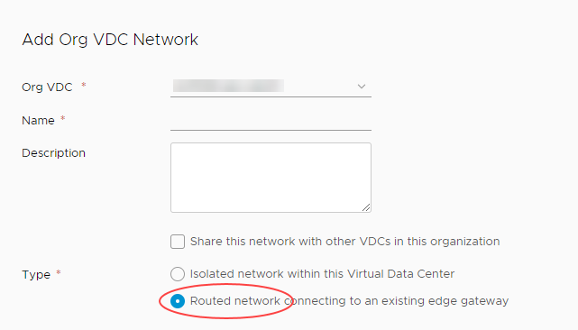

11. When you connect a network to the outside world, it's important that you control exactly what can access your environment via that network. UKCloud for VMWare uses edge gateways to do this, so select the edge that you want your new network to use (we'll work more with the edge gateway later on).

    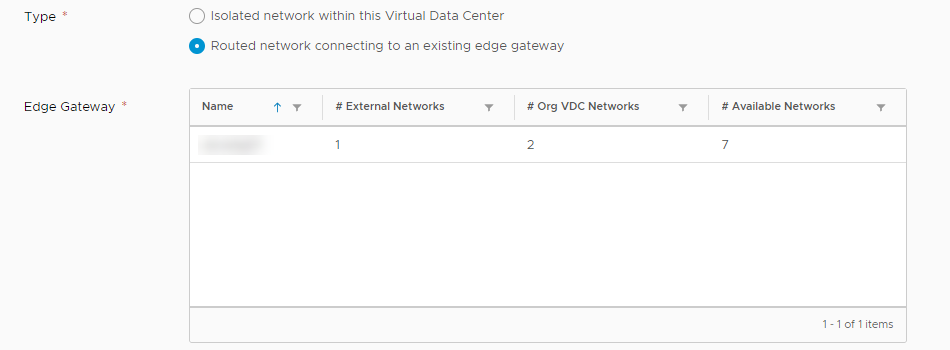

    > [!TIP]
    > If you haven't created an edge gateway, see [*How to build an edge gateway using the UKCloud Portal*](vmw-how-build-edge.md).

12. Scroll down the page to enter the details for the **Gateway address**, **Network mask** and **Primary DNS**.

    The example below uses `192.168.1.1` for the gateway, `255.255.255.0` for the mask and `8.8.8.8` for the DNS.

    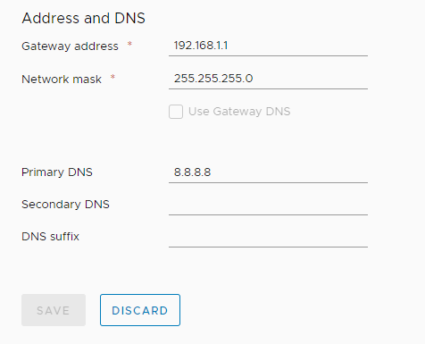

13. A VM needs an IP address to identify it on the network. Use the **Static IP Pool** field to identify the range of IP addresses that VMs connecting to this network can use then click **Add**. For example, if your default gateway is `192.168.1.1`, you can use the `192.168.1.10-192.168.1.100` range for your static IP pool, giving 91 usable internal IP addresses.

    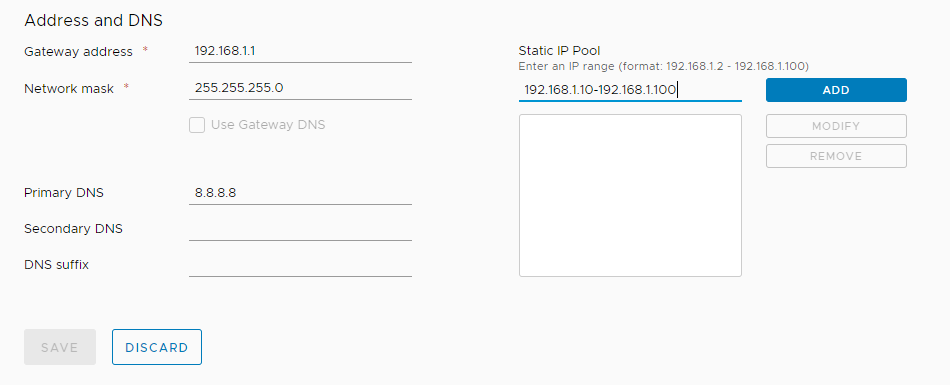

    When you're done, click **Add**.

    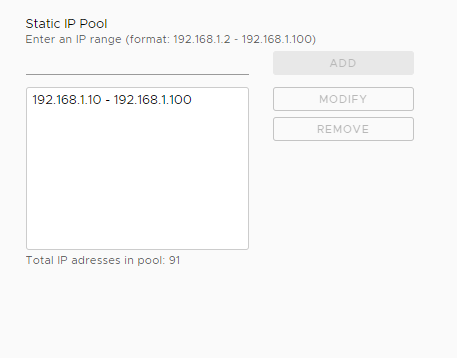

14. When you're done, click **Save**.

    You can find more information about routed networks in [*How to create a routed VDC network*](vmw-how-create-routed-network.md).

## Configure the edge gateway

The edge gateway is possibly the most complex part of the VDC because of its high level of functionality. The following steps show you how to quickly configure the edge gateway to enable you to access the internet from a VM.

1. In the vCloud Director *Virtual Datacenters* dashboard, select your VDC.

2. This time you're working with the edge gateway, so in the left navigation panel, click **Edges**.

    

3. Select the edge gateway you want to work with and click the **Configure Services** button.

    

    > [!NOTE]
    > The steps that follow describe how to change the edge gateway settings for an advanced gateway. If necessary, convert your edge using the steps in [*How to convert your edge to an advanced gateway*](vmw-how-convert-edge.md).

4. Each tab in the *Edge Gateway* dialog box provides access to a different service provided by the edge gateway. The main tabs are:

    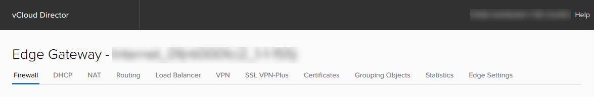

    - **Firewall** - As well as a physical firewall, you can control which networks and ports can communicate through the edge gateway. You'll set up some firewall rules later in this exercise.

    - **DHCP** - The edge gateway can act as a DHCP server for VMs connected to Org networks connected to an edge. The DHCP tab shows DHCP information for any VDC networks that have been configured with DHCP, and so acts as a centralised view. For more information, see [*How to create a DHCP pool*](vmw-how-create-dhcp-pool.md).

    - **NAT** - Network address translation, both in (DNAT) and out (SNAT) of the edge gateway. You'll set up some NAT rules later in this exercise.

    - **Routing** - You can provide static routes from the edge gateway to other networks, for example networks in other VDCs in your compute service. For more information, see [*How to create a static route*](vmw-how-create-static-route.md).

    - **Load Balancer** - The edge gateway provides simple HTTP and HTTPS load balancing using round robin. For more information, see [*How to configure a load balancer*](vmw-how-configure-load-balancer.md).

    - **VPN** - IPsec site‑to‑site VPN is available on the edge gateway. It can be configured within the vCloud user interface, but may require additional configuration through the API. For more information, see [*How to configure IPsec VPN*](vmw-how-configure-ipsec-vpn.md).

    To access the internet from a VM, you'll need to create firewall rules to determine who can access your network and NAT rules to route traffic within your network.

### Creating firewall rules

Let's start with firewall rules:

1. In the *Edge Gateway* dialog box, select the **Firewall** tab.

2. Make sure the **Enabled** option is selected.

    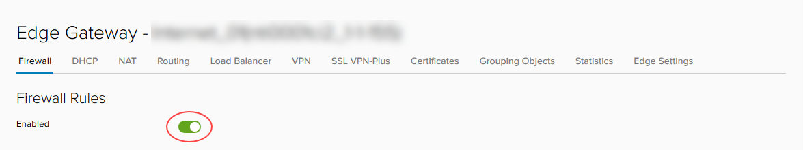

3. Click the **+** button to add a new row to the firewall rules table.

    

4. Edit the values in the row for the **New Rule** using the settings below:

    - **Name** - `HTTPS outbound`
  
    - **Source** - `internal`

    - **Destination** - `external`

    - **Service** - Click the **+** button and enter the following values in the *Add Service* dialog box
  
      - **Protocol** - **TCP**

      - **Source Port** - `any`

      - **Destination Port** - `443`

        

        Click **Keep** when you're done.

    - **Action** - **Accept**

    These settings allow traffic from the VMs (**Source** = `internal`) to reach destinations outside your VDC (**Destination** = `external`) on port `443` (HTTPS). You'll need to repeat these steps for ports `80` (HTTP) and `53` (DNS).
    
    > [!NOTE]
    > For DNS, the protocol should be UDP.

    You can also allow traffic to reach your VMs from outside your VDC by swapping the **Source** and **Destination** values. However, because this opens up your firewall to a lot of traffic, we recommend that you first complete this guide to get comfortable with general networking concepts, and then take a look at the information in [*How to create firewall rules*](vmw-how-create-firewall-rules.md) where you can find out how to lock the firewall down.

    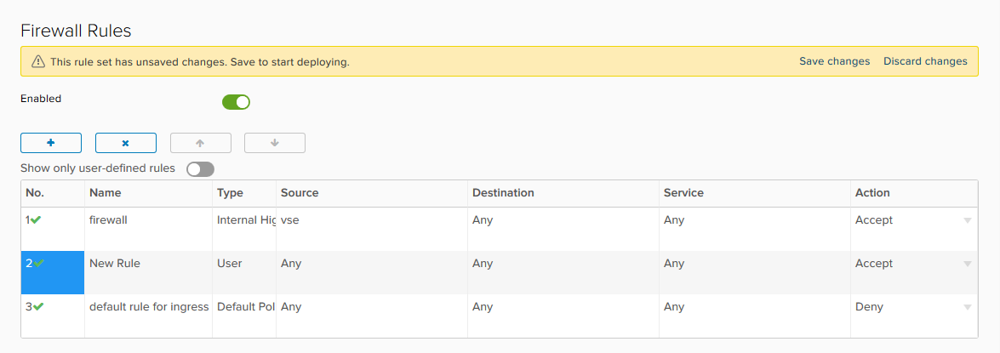

5. Click **Save changes**.

    

### Creating NAT rules

Now that you've set up the firewall rules, you can create NAT rules:

1. In the *Edge Gateways* dialog box, select the **NAT** tab.

    

2. Click the **SNAT Rule** button to create a source NAT (SNAT) rule to translate internal IP addresses into something that the external network can understand.

    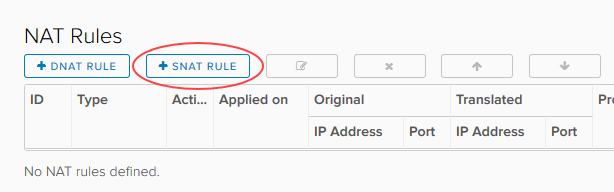

3. In the *Add SNAT Rule* dialog box, from the **Applied on** list, choose the edge gateway to which you want to apply the SNAT rule.

4. In the **Original Source IP/Range** field, enter the range of addresses you created when you created the network in the previous exercise.

5. In the **Translated Source IP/Range** field, enter one or more of the external IP addresses provided to you by UKCloud.

    If you are not sure what your IP addresses are, see [*How to find your allocated external IP addresses*](vmw-how-find-ip-addresses.md).

    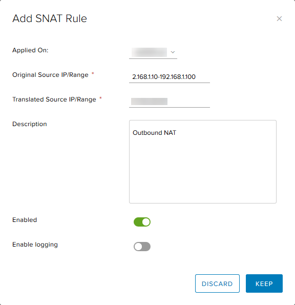

6. When you're done, click **Keep** and then **Save changes**.

    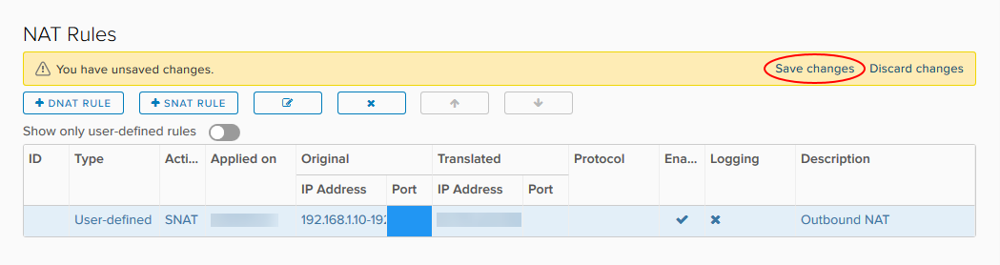

    You can also add destination NAT (DNAT) rules to translate external IP addresses to route traffic to the appropriate internal addresses. However, because the firewall only provides outbound access to the internet, we don't need to add DNAT rules at the moment.

    You can find more information about setting up NAT rules in [*How to create NAT rules*](vmw-how-create-nat-rules.md).

## Create a virtual machine

Now that you've laid the groundwork, it's time to create your VM. The best way to do this is to create a virtual application (vApp). You can think of a vApp as a container for your VMs; it enables you to group related VMs together to manage them in one place. See [*How to create a vApp*](vmw-how-create-vapp.md) to find out more.

1. In the vCloud Director *Virtual Datacenters* dashboard, select your VDC.

2. In the left navigation panel, click **vApps**.

    

3. In this exercise, you'll create the vApp from scratch, so click the **Build New vApp** button.

    

4. In the *Build new vApp* dialog box, give the vApp a **Name** and **Description**.

5. Click **Add Virtual Machine**.

    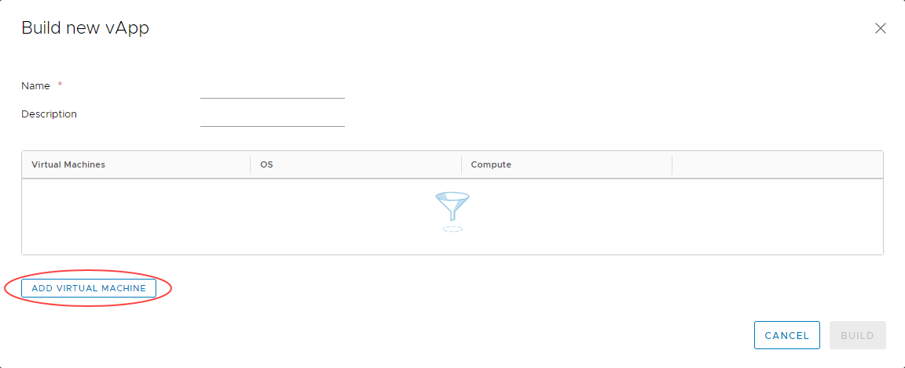

6. In the *Create VM* dialog box, you can create your VM. Enter a **Name**, **Computer Name** and **Description** for the VM.

    > [!TIP]
    > The **Name** is to identify the VM, the **Computer Name** is the host name of the VM.

7. The easiest way to create a VM is to use a pre-built template from a catalog, so from the **Type** radio buttons, select **From Template**.

8. From the list of **Templates**, select the one you want to use then click **OK**.

9. Back in the *Build new vApp* dialog box, you can add more VMs if you want, but for now click **Build** to create the vApp and the single VM.

10. There are some more configuration tasks to complete for your new VM, so in the left navigation panel, click **Virtual Machines** to list all the VMs in the VDC.

    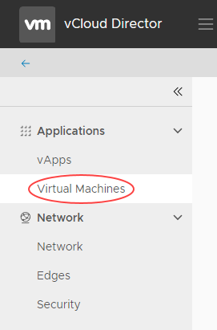

11. In the card for your new VM, click **Details**.

    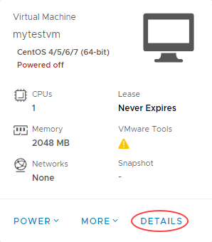

12. In the *General* section, you can change the VM name in the **Name** field, but keep the default **Storage Policy** option.

    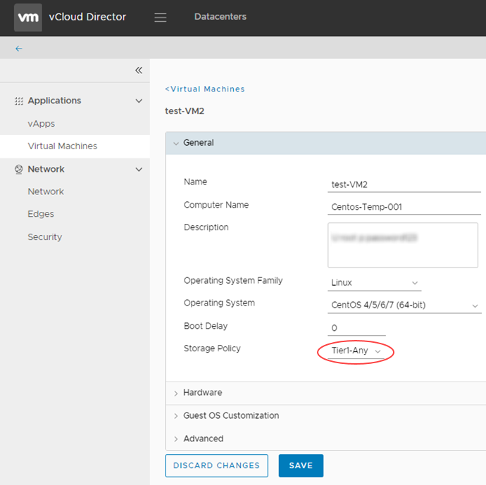

13. Expand the *Hardware* section and, in the **NICs** section, click **Add** and select the externally routed **Network** you created in the first exercise.

14. From the **IP Mode** list, choose **Static - IP Pool** to use the IP pool you defined earlier when you created your network.

15. Select the **Connected** check box.

    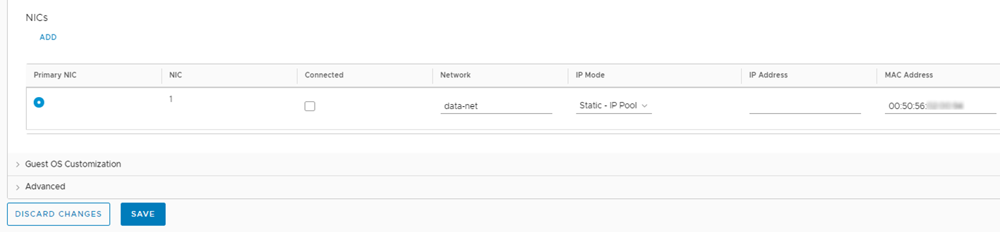

16. You don't need to change anything in the other sections, so click **Save**.

17. In the card for the VM, click **Power** and select **Power On**

18. Click the monitor icon to open the popout console and go through the setup procedure.

    

19. To confirm that you have connectivity to the internet and have an assigned IP address:

    - Type `ipconfig` into the Command Prompt. If you've configured the networking correctly, your VM will return an IP address.
    - Open an internet browser page and navigate to an external web page
    - Ping the IP address of your DNS (for example, `8.8.8.8`) through the command line.

## Next steps

In this guide, you've learned how to build a simple virtual machine and connect it to the internet.

For information about more creating complex VDCs so that you can make the most of UKCloud for VMware, see the [*Getting Started Guide for UKCloud for VMware*](vmw-gs.md). This *Getting Started Guide* provides links to documents that describe each of the different parts of your environment in more detail.

If you want a more comprehensive guide to the platform, take a look at the [*vCloud Director Administrator's Guide*](https://docs.vmware.com/en/vCloud-Director/9.1/com.vmware.vcloud.admin.doc/GUID-3A4FBE1E-6BDB-4AE4-93F8-D23A8DCBD1F1.html) and the [*vCloud Director Tenant Portal Guide*](https://docs.vmware.com/en/vCloud-Director/9.1/com.vmware.vcloud.tenantportal.doc/GUID-74C9E10D-9197-43B0-B469-126FFBCB5121.html).

## Feedback

If you have any comments on this document or any other aspect of your UKCloud experience, send them to <products@ukcloud.com>.
