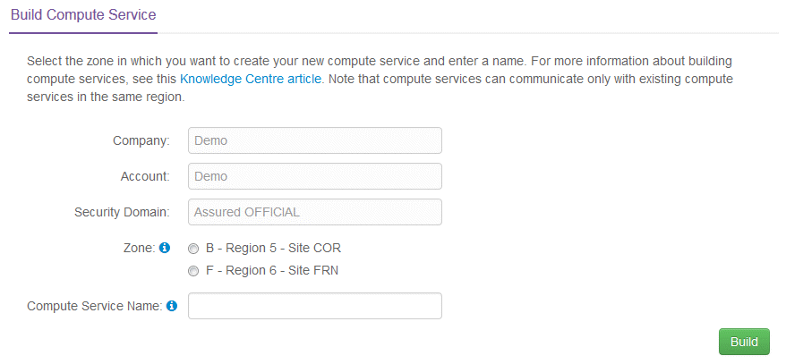
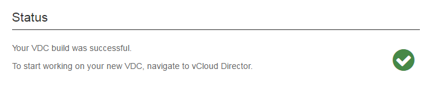

# Getting Started Guide for UKCloud for VMware

## Overview

UKCloud for VMware is a trusted, connected and flexible cloud, based on VMware technology, that enables you to either migrate existing workloads or create new workloads on our secure sovereign cloud platform quickly and easily whilst enjoying the economies of scale of the cloud.

This Getting Started Guide helps get you up and running using UKCloud for VMware, providing basic information about how to log in and set up your environment.

### Intended audience

This article is intended for any new UKCloud for VMware user. To complete the steps in this article you must have access to the UKCloud Portal and VMware Cloud Director. To build compute services and virtual data centres (VDCs) you must be a VMware Cloud Director administrator.

## Introduction to UKCloud for VMware

We understand that each enterprise application has its own set of technical and service requirements that must be addressed on an individual basis. UKCloud for VMware is highly configurable and gives you the flexibility to use different service levels, VM sizes, security domains, connectivity and data protection options.

You can build completely tailored solutions by mixing and matching service options. The choice doesn't lock you in to one service or size and you can always change it later.

Services within UKCloud belong to an account, which in turn belongs to a company. A company can own multiple accounts. You can use accounts to create separate environments for different projects or, in the case of UKCloud partners, to create separate environments for different customers. Within an account you can have multiple UKCloud services, one of which could be UKCloud for VMware. You can have multiple instances of a service within an account.

## Logging in to the UKCloud Portal

You access your UKCloud for VMware environment through the UKCloud Portal, so the first thing you need to do to get started is to log in to the Portal.

The location of the Portal depends on the security domain your service is located in:

- **Assured OFFICIAL:** <https://portal.ukcloud.com>

- **Elevated OFFICIAL:** Contact your Portal administrator, your Service Delivery Manager (or <servicedelivery@ukcloud.com>), or UKCloud Support (call 01252 303 300 and select option 2)

You'll need your Portal credentials, which you should have received from your Portal administrator or the Service Delivery team. You may also need to set up two-factor authentication (2FA).

For detailed instructions for how to log in to the Portal, and for more information about all the functionality it provides, see the [*Getting Started Guide for the UKCloud Portal*](../portal/ptl-gs.md).

## Creating your UKCloud for VMware estate

When you first access UKCloud for VMware, you'll need to create a compute service (sometimes called a vOrg) to act as a top-level container for your cloud resources. As your estate grows, you can add more compute services to logically organise your resources.

Within your compute service, you create VDCs to contain your VMs. VMs in the same VDC share workload characteristics and have access to the same resources, such as networking infrastructure, storage and external connectivity. We recommend that you organise related VMs within vApps to make your applications easier to manage. For example, you can start all the VMs within a vApp with a single operation, rather than having to start up each VM separately. vApps are also useful to help maintain crash‑consistency within an application in the event of a disaster.

### Building a compute service

If you have the appropriate permissions, you can use the Portal to create a compute service in your account, without having to raise a support ticket.

> [!NOTE]
> You can also create a compute service using the Portal API. For more information, see [*UKCloud Portal API Reference Guide*](../portal/ptl-ref-portal-api.md#post-apiaccountsaccount_idvorgs)

1. In the UKCloud Portal, select the account in which you want to create the compute service.

2. In the navigation panel, expand **Tools** and then select **Create Compute Service**.

    

3. On the *Build Compute Service* page, from the **Zone** radio buttons, select the zone in which you want to create the new compute service.

    > [!NOTE]
    > To create a compute service using the Portal, your environment must be in region 5, 6, 13 or 14.

4. Enter a **Compute Service Name**.

    > [!TIP]
    > The name can be up to 32 characters long and can include any character except +.

    

5. Click **Build**.

6. The *Build Compute Service Status* page displays information about the compute service you're building and lets you know how the build is progressing.

    > [!TIP]
    > You can stay on this page until the build is finished, or you can leave this page and check the status of the build later by going to the *VMware Cloud Build History* report.

    

7. When the build is complete, the page displays either a success or fail message.

    If the build is successful, you can start building VDCs in your compute service (see [Building a virtual data centre](#building-a-virtual-data-centre)).

    

    If the build is unsuccessful, raise a support ticket (quoting the **Build ID**) to resolve any issues.

    

### Building a virtual data centre

After creating your compute service, the next step is to create one or more VDCs.

> [!NOTE]
> You can also create a VDC using the Portal API. For more information, see [*UKCloud Portal API Reference Guide*](../portal/ptl-ref-portal-api.md#post-apiaccountsaccount_idvorgsvorg_idvdcs).

> [!NOTE]
> You can build VDCs in any of your compute services in regions 5, 6, 13 and 14, including those created by support tickets or the Portal API, not just those you created using the Portal.

1. In the Portal navigation panel, expand **VMware Cloud** and then select the compute service in which you want to create the VDC.

    > [!NOTE]
    > To create a VDC using the Portal, the compute service must be in region 5, 6, 13 or 14.

    

2. From the **Actions** menu, select **Build VDC**.

    > [!NOTE]
    > If this option is greyed out, either you do not have the appropriate permissions or your compute service is not in region 5, 6, 13 or 14.

    

3. On the *Build VDC* page, from the **VM Type** radio buttons, select the option that describes the characteristics of the workload of the VDC:

    - **ESSENTIAL.** For lower priority workloads, such as temporary applications, data processing or system modelling tasks. VMs in the VDC can have contended compute resource allocation (CPU/RAM) and automated rebalancing is enabled to ensure the workload receives the requested performance.

    - **POWER.** For key workloads that are resource intensive, such as web and application workloads, mid-sized databases and caching services. VMs in the VDC have an uncontended compute resource allocation and automated rebalancing is enabled to pre-emptively optimise performance and availability.

    - **PRIORITY.** For critical workloads that handle important business processes that benefit from a steady state of operation. VMs in the VDC have an uncontended compute resource allocation and automated rebalancing is configured to reduce workload movement around the platform.

4. Enter a **VDC Name**.

    > [!TIP]
    > The name can be up to 32 characters long and can include any character except `+`, `(` or `)`.

    

5. Click **Build**.

6. The *VDC Build Status* page displays information about the VDC you're building and lets you know how the build is progressing.

    > [!TIP]
    > You can stay on this page until the build is finished, or you can leave this page and check the status of the build later by going to the *VMware Cloud Build History* report.

    

7. When the build is complete, the page displays either a success or fail message.

    If the build is successful, you can start building VMs. To provide external access to the VDC, you'll need to create an edge gateway (see [*How to build an edge gateway using the UKCloud Portal*](vmw-how-build-edge.md)).

    

    If the build is unsuccessful, raise a support ticket (quoting the **Build ID**) to resolve any issues.

    

## Logging in to VMware Cloud Director

After you've created your compute service and VDC, you can start to build up your applications. To do this, you must log in to VMware Cloud Director, which you can access from the UKCloud Portal.

1. In the Portal navigation panel expand **VMware Cloud** then select your compute service.

    

2. On the **VMware Cloud Director** tab, for additional security, re-enter your UKCloud Portal password, then click **Confirm**.

    

3. VMware Cloud Director launches in your browser window.

    

4. The tasks you can perform in VMware Cloud Director will depend on the permissions you have been granted.

    For more information, see [*How to manage permissions for VMware Cloud Director*](vmw-how-manage-vcd-permissions.md).

5. To return to the UKCloud Portal, click your user name in the top right corner, and select **Log out**.

    

## Next steps

In this *Getting Started Guide*, you've learned:

- About your UKCloud for VMware environment and how your estate is organised

- How to log in to the UKCloud Portal

- How to create a compute service and VDC to set up your environment

- How to log in to VMware Cloud Director so that you can start to build your applications

Now that you've set up your basic environment, you can start building your applications. If you want to get up and running quickly, you can take a look at [*How to build a virtual machine with UKCloud for VMware*](vmw-gs-build-vm-vcd.md), which provides a walkthrough of the process.

For more detailed information about the different aspects of your UKCloud for VMware environment, see:

- To create virtual machines to define your applications:

  - [*How to create a virtual machine from scratch*](vmw-how-create-vm-from-scratch.md)

  - [*How to create a virtual machine from a template*](vmw-how-create-vm-from-template.md)

- To create a VDC network to enable your virtual machines to communicate with each other and the outside world:

  - [*How to create a routed VDC network*](vmw-how-create-routed-network.md)

  - [*How to create an isolated VDC network*](vmw-how-create-isolated-network.md)

- To configure your edge gateway to control access to your VMs:

  - [*How to create firewall rules*](vmw-how-create-firewall-rules.md)

  - [*How to create NAT rules*](vmw-how-create-nat-rules.md)

  - [*How to create a DHCP pool*](vmw-how-create-dhcp-pool.md)

  - [*How to configure IPsec VPN*](vmw-how-configure-ipsec-vpn.md)

  - [*How to configure a load balancer*](vmw-how-configure-load-balancer.md)

  - [*How to create a static route*](vmw-how-create-static-route.md)

## Glossary

This section provides a glossary of terms specific to UKCloud for VMware. For a full list of terms, see the [*UKCloud Glossary*](../other/other-ref-glossary.md).

Term | Definition
-----|-----------
**account** | Within the UKCloud for VMware environment there are two types of account: <ul><li>**customer account** &ndash; A collection of related compute services associated with a particular customer or partner.</li><li>**user account** &ndash; The account you use to log in to the UKCloud Portal or authenticate with the Portal API. Your user account determines which customer accounts you have access to. Each user account can be associated with multiple customer accounts.</li></ul>
**company** | A UKCloud construct to organise business accounts. Each company can own multiple accounts.
**compute service** | A top-level container within a customer account that includes a VMware Cloud Director organization and its VDCs, catalogues, users and resources.
**UKCloud for VMware** | A UKCloud IaaS service that provides a compute infrastructure specifically designed to deliver traditional enterprise applications to the cloud.
**ESSENTIAL** | A type of VM that may have contended resource allocation. Automated rebalancing is enabled to ensure the workload receives the requested performance.
**POWER** | A type of VM with uncontended compute resource allocation. Automated balancing is enabled to pre-emptively optimise performance and availability.
**PRIORITY** | A type of VM with uncontended compute resource allocation. Automated balancing is configured to reduce workload movement around the platform, reducing workload disruption.
**vApp** | A container for VMs that enables you to group related VMs together to manage them in one place.
**virtual data centre (VDC)** | A container for VMs, where each VM has the same workload characteristics and access to the same resources, such as networking infrastructure, storage and external connectivity.
**virtual machine (VM)** | Software that emulates the functionality of a physical computer, running an operating system and applications. Customers can define a VM's resource requirements and the UKCloud platform optimises its placement to ensure it receives the requested resources.

## Feedback

If you find a problem with this article, click **Improve this Doc** to make the change yourself or raise an [issue](https://github.com/UKCloud/documentation/issues) in GitHub. If you have an idea for how we could improve any of our services, send an email to <feedback@ukcloud.com>.
