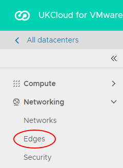

# How to access edge gateway settings

## Overview

An edge gateway provides access to your environment from the outside world and is possibly the most complex part of the virtual data centre (VDC) because of its high level of functionality. Many tasks involving connectivity to your VDC will involve editing edge gateway settings.

## To access edge gateway settings

# [Using Tenant UI](#tab/tabid-1)

1. In vCloud Director *Virtual Datacenters* dashboard, select the VDC that contains the edge gateway you want to configure.

2. In the left navigation panel, click **Edges**.

    

3. Select the edge that you want to configure and click **Configure Services**.

    

# [Using Legacy UI](#tab/tabid-2)

1. In vCloud Director, click the **Administration** tab.

    

2. Double-click the VDC that you want to work with, or right-click the VDC and select **Open**.

3. Select the **Edge Gateways** tab.

    

4. Right-click the edge gateway and select **Edge Gateway Services**.

***

## Next steps

In this article you've learned how to access edge gateway settings. To find out how you can configure your edge gateway, see:

- [*How to create firewall rules*](vmw-how-create-firewall-rules.md)

- [*How to create NAT rules*](vmw-how-create-nat-rules.md)

- [*How to create a DHCP pool*](vmw-how-create-dhcp-pool.md)

- [*How to configure IPsec VPN*](vmw-how-configure-ipsec-vpn.md)

- [*How to configure a load balancer*](vmw-how-configure-load-balancer.md)

- [*How to create a static route*](vmw-how-create-static-route.md)

## Feedback

If you find a problem with this article, click **Improve this Doc** to make the change yourself or raise an [issue](https://github.com/UKCloud/documentation/issues) in GitHub. If you have an idea for how we could improve any of our services, send an email to <feedback@ukcloud.com>.
