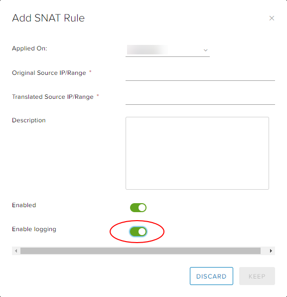
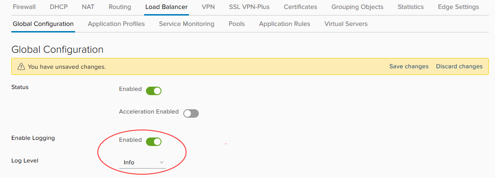

# How to access syslog data for your advanced gateway

## Overview

Your NSX edge is globally configured to send syslog messages to a specific IP address (`100.127.255.250`). By configuring a new network or IP address within your virtual data centre (VDC) and deploying a collector with the syslog IP address, you can access your NSX edge syslog data. You can then use this data to check:

- Allowed and denied network traffic

- Load balancer statistics

- Load balancer health

This guide explains the network configuration required to provision a syslog collector within your VDC to receive syslog information direct from your NSX gateway.

## Collecting syslog data for a single NSX edge

The simplest scenario is to gather syslog data from a single NSX edge into one collector. To do this you need to create a routable location for the syslog IP address, by either:

- [*Adding the syslog IP address to an existing network interface card (NIC) on a routed subnet*](#adding-the-syslog-ip-address-to-an-existing-nic)

- [*Configuring a new routed network*](#configuring-a-new-routed-network)

### Adding the syslog IP address to an existing NIC

1. Add the syslog IP address to a subnet on the routed network.

    For example, if your existing monitoring server has a NIC on **eth0** (for example, `10.0.1.10`), on routed VDC network `10.0.1.0/24`, you'd add the syslog IP address to **eth0**.

2. Add a route on the NSX edge that routes the syslog IP address via the subnet.

    For example, route `100.127.255.250 MASK 255.255.255.255` via `10.0.1.10`.

3. Configure the software on your existing monitoring server to capture data from the IP address of the NSX edge.

    > [!NOTE]
    > The steps to achieve this depend on your operating system and chosen syslog server.

### Configuring a new routed network

1. Create a new routed network with the following details:

    - **Org Network Name:** Customer defined

    - **Gateway:** `100.127.255.249`

    - **Subnet Mask:** `255.255.255.248`

    - **DNS:** Customer defined

    - **Static IP Pool:** `100.127.255.250-100.127.255.254`

    You can find more detailed steps for creating a routed network in [*How to create a routed VDC network*](vmw-how-create-routed-network.md).

2. Deploy a new syslog server connected to the new routed network with a static address of `100.127.255.250` and install and configure the syslog server's NSX edge.

    > [!NOTE]
    > The steps to achieve this depend on your operating system and chosen syslog server.

## Collecting syslog data for multiple NSX edges

If you have multiple NSX edges under a single NFT, you can gather the data from all those edges into the same syslog collector.

1. Set up a single syslog collector for one of your NSX edges as described in the previous section.

    > [!NOTE]
    > We'll refer to this NSX edge as the *syslog edge* and all the other NSX edges as *source edges*.

2. Confirm that you can see the local syslog traffic from the local syslog edge.

3. Create a firewall rule on the syslog edge to allow syslog traffic from the source edges' TRANSIT IPs (`172.26.`*`x`*`.`*`x`* in Assured or `172.26.`*`LOWER OCTET`*`.`*`x`* in Elevated) through to the syslog server IP.

    You can create individual rules using the following suggestions:

    - *`SOURCE TRANSIT IP`*`:Any` to `100.127.255.250` on UDP

    - `Any:Any` to `100.127.255.250:514` on UDP

    - *`NFT TRANSIT CIDR/SUBNET`*`:Any` to `100.127.255.250:514` on UDP

4. On each of the source edges, create a static route to direct traffic to the syslog edge. Use the following settings:

    - **Applied On:** *`nft_network`*

    - **Name:** Syslog traffic (or any other name you prefer)

    - **Network:** `100.127.255.248/29`

    - **Next Hop IP:** The TRANSIT IP address of the syslog edge

    Syslog packets from each source edge will now be forwarded to the syslog edge, with the source of the syslog traffic being the TRANSIT IP of the source edge.

5. Perform a packet capture on the syslog collector to confirm it's receiving packets from the source edges.

    > [!NOTE]
    > You may have to enable or disable logging on firewall rules to trigger syslog traffic.

6. When you've confirmed that your syslog collector is receiving the syslog data, configure your syslog server to capture packets from the new syslog source.

## Enabling logging

After setting up your syslog collector, you need to make sure that your NSX edge sends network traffic to the log.

1. In the vCloud Director *Virtual Datacenters* dashboard, select the VDC to which the NSX edge belongs.

2. In the left navigation panel, click **Edges**.

    

3. Select the edge that you want to configure and click **Configure Services**.

    

4. Select the **Edge Settings** tab.

    

5. Click **Edit Syslog Server**.

    

6. In the *Edit Syslog Server* dialog box, in the **Syslog Server** field, enter the IP address of your syslog server then click **Keep**.

    

7. Select the **Firewall Rules** tab.

8. For each firewall rule that you want to log, select the **Enable logging** check box.

    

9. When you're done, click **Save changes**.

10. Select the **NAT** tab.

11. For each NAT rule that you want to log, select the rule, click the **Edit** icon, select the **Enable logging** option then click **Keep**.

    

12. When you're done, click **Save changes**.

13. Select the **Load Balancer** tab.

14. On the **Global Configuration** tab, select the **Enable Logging** option.

15. From the **Log Level** list, select the logging level.

    

    You can find more detailed steps for editing load balancer settings in [*How to configure a load balancer*](vmw-how-configure-load-balancer.md).

16. When you're done, click **Save changes**.

## Sample syslog captures

### Firewall denied

`firewall[]: [073ab562-9147-428c-bf0c-33139c6ec51e]:DROP_131073IN= OUT=vNic_0 SRC=192.168.33.13 DST=10.80.115.2 LEN=44 TOS=0x00 PREC=0x00 TTL=254 ID=25689 PROTO=ICMP TYPE=8 CODE=0 ID=7 SEQ=62584 MARK=0x207`

### Firewall allowed

`firewall[]: [073ab562-9147-428c-bf0c-33139c6ec51e]: ACCEPT_319IN= OUT=vNic_4 SRC=192.168.31.10 DST=192.168.32.10 LEN=36 TOS=0x00 PREC=0x00 TTL=63 ID=0 DF PROTO=ICMP TYPE=8 CODE=0 ID=27693 SEQ=1 MARK=0x6`

### Load balancer statistics

`loadbalancer[5899]: [073ab562-9147-428c-bf0c-33139c6ec51e]: xx.xxx.xxx.xxx:51699 [23/May/2016:14:43:38.242] TEST_CONN_8040_1625_HTTP TEST CONN_UAT_8040_1625_HTTP/TEST CONN_UAT_8040_1625_HTTP_192.168.32.15 0/0/0/1/1 200 2127 - - --VN 12/5/4/2/0 0/0 "GET /OA_MEDIA/FNDSSCORP.gif HTTP/1.1"`

Refer to
<http://cbonte.github.io/haproxy-dconv/1.5/configuration.html#8> for information about how to interpret the load balancer logs.

## Feedback

If you find an issue with this article, click **Improve this Doc** to suggest a change. If you have an idea for how we could improve any of our services, visit the [Ideas](https://community.ukcloud.com/ideas) section of the [UKCloud Community](https://community.ukcloud.com).
