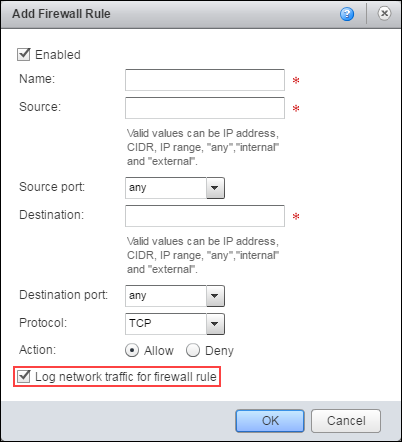
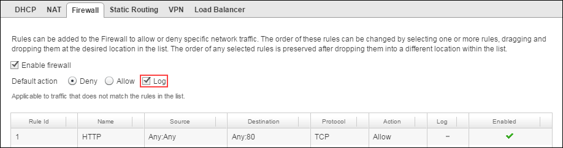
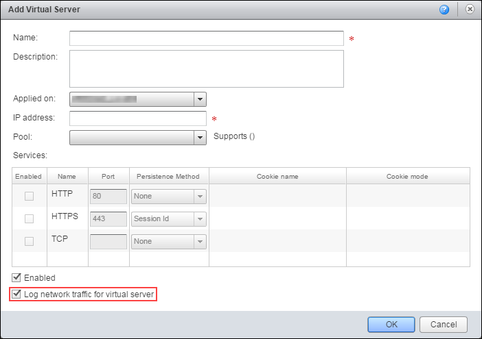

# How to access syslog data for your edge gateway

## Overview

Your edge gateway is globally configured to send syslog messages to a specific IP address (`100.127.255.250`). By configuring a new network or IP address within your virtual data centre (VDC) and deploying a collector with the syslog IP address, you can access your edge gateway
syslog data. You can then use this data to check:

- Allowed and denied network traffic
- Load balancer statistics
- Load balancer health

This guide explains the network configuration required to provision a syslog collector within your VDC to receive syslog information direct from your edge gateway.

## Collecting syslog data for a single edge gateway

The simplest scenario is to gather syslog data from a single edge gateway into one collector. To do this you need to create a routable location for the syslog IP address, by either:

### Adding the syslog IP address to an existing network interface card (NIC) on a routed subnet

1. Add the syslog IP address to a subnet on the routed network.

    For example, if your existing monitoring server has a NIC on **eth0** (for example, `10.0.1.10`), on routed Org VDC network `10.0.1.0/24`, you'd add the syslog IP address to **eth0**.

2. Add a route on the vCNS Edge that routes the syslog IP address via the subnet.

    For example, route `100.127.255.250 MASK 255.255.255.255` via `10.0.1.10`.

3. Configure the software on your existing monitoring server to capture data from the IP address of the vCNS edge.

    > [!NOTE]
    > The steps to achieve this depend on your operating system and chosen syslog server.

### Configuring a new routed network

1. Create a new routed network with the following details:

    - **Org Network Name:** Customer defined
    - **Gateway:** `100.127.255.249`
    - **Subnet Mask:** `255.255.255.248`
    - **DNS:** Customer defined
    - **Static IP Pool:** `100.127.255.250 -- 100.127.255.254`

    You can find more detailed steps for creating a routed network in [*Creating routed Org VDC networks*](https://portal.ukcloud.com/support/knowledge_centre/2b989ddd-c018-4289-8a06-0482f0674bc1).

2. Deploy a new syslog server connected to the new routed network with a static address of `100.127.255.250` and install and configure the syslog server's edge gateway.

    > [!NOTE]
    > The steps to achieve this depend on your operating system and chosen syslog server.

## Collecting syslog data for multiple edge gateways

If you have multiple edge gateways under a single NFT you can gather the data from all those edges into the same syslog collector.

1. Set up a single syslog collector for one of your vCNS Edges as described in the previous section.

    > [!NOTE]
    > We'll refer to this edge gateway as the *syslog edge* and all the other edge gateways as *source edges*.

2. Confirm that you can see the local syslog traffic from the local syslog edge.

3. Create a firewall rule on the syslog edge to allow syslog traffic from the source edges' TRANSIT IPs (`172.26.`*`x`*`.`*`x`* in Assured or `172.26.`*`LOWER OCTET`*`.`*`x`* in Elevated) through to the syslog server IP.

    You can create individual rules using the following suggestions:

    - *`SOURCE TRANSIT IP`*`:Any` to `100.127.255.250` on UDP
    - `Any:Any` to `100.127.255.250:514` on UDP
    - *`NFT TRANSIT CIDR/SUBNET`*`:Any` to `100.127.255.250:514` on UDP

4. On each of the source edges, create a static route to direct traffic to the syslog edge. Use the following settings:

    - **Applied On:** *`nft_network`*
    - **Name:** Syslog traffic (or any other name you prefer)
    - **Network:** `100.127.255.248/29`
    - **Next Hop IP:** The TRANSIT IP address of the syslog edge

    Syslog packets from each source edge will now be forwarded to the syslog edge, with the source of the syslog traffic being the TRANSIT IP of the source edge.

5. Perform a packet capture on the syslog collector to confirm it's receiving packets from the source edges.

    > [!NOTE]
    > You may have to enable or disable logging on firewall rules to trigger syslog traffic.

6. When you've confirmed that your syslog collector is receiving the syslog data, configure your syslog server to capture packets from the new syslog source.

## Enabling logging

After setting up your syslog collector, you need to make sure that your edge gateway sends network traffic to the log.

1. Edit your vCNS Edge firewall settings to log firewall rules:

    - You must log each rule individually by selecting the **Log network traffic for firewall rule** option:

        

    - To log data for actions not covered by individual rules, select the **Log** option next to the **Default action** setting:

        

        You can find more detailed steps for editing firewall settings in *[vCNS Edge services: firewall*](https://portal.ukcloud.com/support/knowledge_centre/e8ec5a0b-e5c7-4e44-b353-ab89505fefbe).

2. Edit your load balancer settings to log virtual servers:

    

    You can find more detailed steps for editing load balancer settings in [*vCNS Edge services: load balancer*](https://portal.ukcloud.com/support/knowledge_centre/9b4f5898-9464-4ea6-8a64-6bacb686bd0e).

## Sample syslog captures

### Firewall denied

`firewall[]: [073ab562-9147-428c-bf0c-33139c6ec51e]:**DROP**_131073IN= OUT=vNic_0 SRC=192.168.33.13 DST=10.80.115.2 LEN=44 TOS=0x00 PREC=0x00 TTL=254 ID=25689 PROTO=ICMP TYPE=8 CODE=0 ID=7 SEQ=62584 MARK=0x207`

### Firewall allowed

`firewall[]: [073ab562-9147-428c-bf0c-33139c6ec51e]: **ACCEPT**_319IN= OUT=vNic_4 SRC=192.168.31.10 DST=192.168.32.10 LEN=36 TOS=0x00 PREC=0x00 TTL=63 ID=0 DF PROTO=ICMP TYPE=8 CODE=0 ID=27693 SEQ=1 MARK=0x6`

### Load balancer statistics

`loadbalancer[5899]: [073ab562-9147-428c-bf0c-33139c6ec51e]: xx.xxx.xxx.xxx:51699 [23/May/2016:14:43:38.242] TEST_CONN_8040_1625_HTTP TEST CONN_UAT_8040_1625_HTTP/TEST CONN_UAT_8040_1625_HTTP_192.168.32.15 0/0/0/1/1 200 2127 - - --VN 12/5/4/2/0 0/0 "GET /OA_MEDIA/FNDSSCORP.gif HTTP/1.1"`

Refer to
<http://cbonte.github.io/haproxy-dconv/1.5/configuration.html#8> for information about how to interpret the load balancer logs.

## Feedback

If you have any comments on this document or any other aspect of your UKCloud experience, send them to <products@ukcloud.com>.
