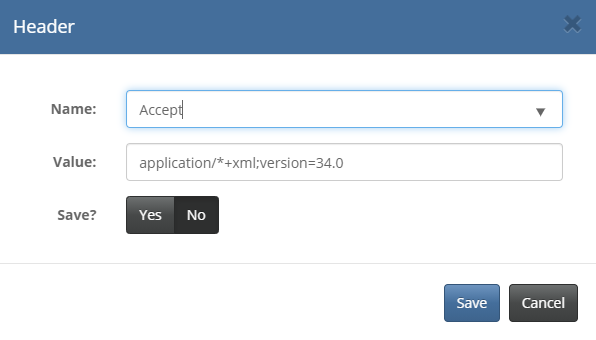
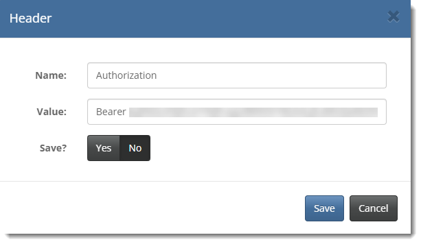

#### UKCloud Limited (“UKC”) and Virtual Infrastructure Group Limited (“VIG”) (together “the Companies”) – in Compulsory Liquidation

On 25 October 2022, the Companies were placed into Liquidation with the Official Receiver appointed as Liquidator and J Robinson and A M Hudson simultaneously appointed as Special Managers to manage the liquidation process on behalf of the Official Receiver.

Further information regarding the Liquidations can be found here: <https://www.gov.uk/government/news/virtual-infrastructure-group-limited-and-ukcloud-limited-information-for-creditors-and-interested-parties>

Contact details: 
For any general queries relating to the Liquidations please email <ukcloud@uk.ey.com> 
For customer related queries please email <ukcloudcustomers@uk.ey.com> 
For supplier related queries please email <ukcloudsuppliers@uk.ey.com>

# How to access VMware Cloud Director through the Cloud Director API

## Overview

To perform some tasks within your UKCloud for VMware environment, you may need to access VMware Cloud Director through the Cloud Director API. This guide shows you how to access the Cloud Director API.

## Before you begin

Before using the Cloud Director API, we recommend that you install a REST client that enables you to access the API using a more intuitive interface. The steps in this article use a plugin called YARC; if you use a different client, some of the steps will be different.

## Finding your Cloud Director API credentials

Before using the Cloud Director API, you first need to find your API credentials.

1. [*Log in to the UKCloud Portal*](../portal/ptl-gs.md#logging-in-to-the-ukcloud-portal).

2. Select your account.

3. In the top right corner of the page, click your username and then select **API**.

    

4. The *API* page provides a view of your personal credentials for accessing the Cloud Director API. In particular, the page provides the following information for each compute service:

    - **API URL** - Use this URL at the beginning of your calls to the Cloud Director API.

        > [!NOTE]
        > This URL will be different depending on the region in which your compute service is located.

    - **API Username** - The user ID to use to authenticate yourself with the Cloud Director API.

        > [!NOTE]
        > The compute service ID is added to the end of the username. This is because you may have access to multiple compute services.

    - **Username** - The API username without the appended compute service ID.

    - **Org ID** - Use this to uniquely identify the compute service (or vOrg) when using the Cloud Director API.

    - **Password** - For authentication with the Cloud Director API. This password is the same as the one you use to log in to the UKCloud Portal.

    

5. Make a note of the **Org ID**, the **API URL** and your **API Username**.

## Obtaining an authorisation token

To start interacting with the Cloud Director API, you first need to obtain an `x-vmware-vcloud-access-token` token; to do this you need to adjust some settings in your chosen REST client. The steps below provide an example of how to do this in YARC.

1. Open your REST client.

2. Create a POST request to obtain the token using the API URL you recorded earlier, adding the following to the end of the URL:

        /cloudapi/1.0.0/sessions

   a. To do this in YARC, from the list of methods, select **POST**.

   b. In the **URL** field, enter the API URL followed by `/cloudapi/1.0.0/sessions`.

    

3. Add a Basic Authentication header.

   a. To do this in YARC, expand the *Authentication* section and click **Add Credentials**.

      

   b. In the *Basic Authorization* dialog box, in the **Username** field, enter your API username recorded earlier from the Portal API page.

   c. In the **Password** field, enter your UKCloud Portal password and then click **Save**.

      

4. Add an Accept header.

   a. To do this in YARC, expand the *Custom Headers* section and click **Add New Header**.

      

   b. In the *Header* dialog box, in the **Name** field, enter `Accept`.

   c. In the **Value** field enter `application/json;version=36.2` and then click **Save**.

      

   d. The table in the *Headers* section now displays the Accept header.

     

5. Your REST client has now got all the required settings in place to make a request to the Cloud Director API to obtain a `x-vmware-vcloud-access-token` token, so send the request.

6. If the request is successful, in the response, you'll see an `x-vmware-vcloud-access-token` token.

   In YARC you can find this in the *Response* section on the **Response Headers** tab.

   

   > [!NOTE]
   > If at any point while following the instructions in this article, the output displayed in the REST client does not look similar to that shown in the images, you can use the value of the returned HTTP response code to determine what went wrong and needs investigation. For a list of HTTP response codes, see [HTTP Response Codes](https://developer.mozilla.org/en-US/docs/Web/HTTP/Status).

7. The `x-vmware-vcloud-access-token` token becomes part of an Authorization header, which replaces the Basic Authentication header added earlier.

   In the response, highlight and copy the string of characters displayed after the word `x-vmware-vcloud-access-token`.

8. Add an Authorization header.

   a. To do this in YARC, in the *Headers* section, select **Add New Header**.

   b. In the *Header* dialog box, in the **Name** field enter `Authorization`.

   c. In the **Value** field, enter `Bearer ` (with a trailing space) followed by the string of characters copied in the previous step, then click **Save**.

      

9. Now that you've obtained an `x-vmware-vcloud-access-token` token, you can remove the Basic Authentication that you added in step 3.

## Feedback

If you find a problem with this article, click **Improve this Doc** to make the change yourself or raise an [issue](https://github.com/UKCloud/documentation/issues) in GitHub. If you have an idea for how we could improve any of our services, send an email to <feedback@ukcloud.com>.
