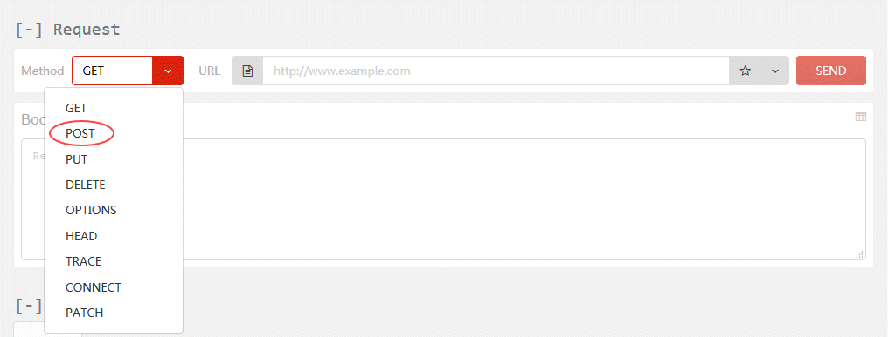
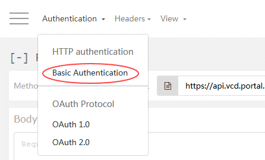
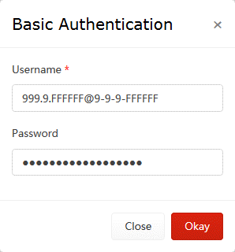
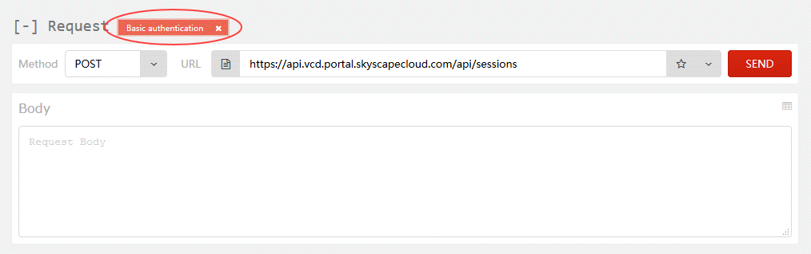
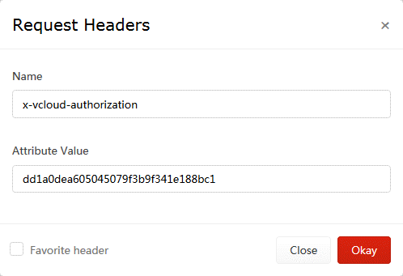

# How to access vCloud Director through the vCloud API

## Overview

To perform some tasks within your UKCloud for VMware environment, you may need to access vCloud Director through the vCloud API. This guide shows you how to access the vCloud API.

## Before you begin

Before using the vCloud API, we recommend that you install a REST client that enables you to access the API. The steps in this article use a Firefox plugin called RESTClient. For information about how to install this plugin, see [*How to install a REST client to access the vCloud API*](vmw-how-install-vcloud-api-rest-client.md).

## Finding your vCloud API credentials

Before using the vCloud API, you first need to find your API credentials.

1. Log in to the UKCloud Portal.

    For more detailed instructions, see the [*Getting Started Guide for the UKCloud Portal*](../portal/ptl-gs.md).

2. Select your account.

3. In the top right corner of the page, click your username and then select **API**.

    

4. The *API* page provides a view of your personal credentials for accessing the vCloud API. In particular, the page provides the following information for each compute service:

    - **API URL** - Use this URL at the beginning of your calls to the vCloud API.

        > [!NOTE]
        > This URL will be different depending on the region in which your compute service is located.

    - **API Username** - The user ID to use to authenticate yourself with the vCloud API.

        > [!NOTE]
        > The compute service ID is appended to the end of the username. This is because you may have access to multiple compute services.

    - **Username** - The API username without the appended compute service ID.

    - **Org ID** - Use this to uniquely identify the compute service (or vOrg) when using the vCloud API.

    - **Password** - For authentication with the vCloud API. This password is the same as the one you use to log in to the UKCloud Portal.

    

5. Make a note of the **Org ID**, the **API URL** and your **API Username**.

## Obtaining an authorisation token

To start interacting with the vCloud API, you first need to obtain an `x-vcloud-authorization` token; to do this you need to adjust some settings in the RESTClient.

1. In your browser, click the **RESTClient** icon.

    

2. From the **Method** menu, select **POST**.

    

3. In the **API** field, enter the API URL you recorded earlier and append the following to the end of the URL:

        /api/sessions

    

4. Next add a Basic Authentication header. To do this, from the **Authentication** menu at the top of the RESTClient, select **Basic Authentication**.

    

5. In the *Basic Authentication* dialog box, in the **Username** field, enter your API username recorded earlier from the API page.

6. In the **Password** field enter your UKCloud Portal password and then click **Okay**.

    

7. The *Request* section now includes an Authorization header.

    

8. Next add an Accept header. To do this, from the **Headers** menu, select **Custom Header**.

    

9. In the *Request Header* dialog box, in the **Name** field, enter `Accept`.

10. In the **Value** field enter `application/*+xml;version=32.0` and then click **Okay**.

    

11. The *Headers* section should now be displayed, containing the Accept header.

    

12. The RESTClient has now got all the required settings in place to make a request to the vCloud API to obtain a `x-vcloud-authorization` token, so click the **Send** button.

13. When a response is received the **Headers** tab in the *Response* section will be populated, including an `x-vcloud-authorization` token.

    

14. The `x-vcloud-authorization` token will replace the Basic Authentication header added earlier. To do this highlight and copy the string of characters displayed after the word `x-vcloud-authorization`.

    > [!NOTE]
    > If at any point while following the instructions in this guide, the output displayed in the RESTClient does not look similar to that shown in the images, you can use the value of the **Status Code** field to determine what went wrong and needs investigation. In this case above, **Status Code** received was HTTP 200 OK, which means that the request succeeded. For a list of HTTP response codes, see [HTTP Response Codes](https://developer.mozilla.org/en-US/docs/Web/HTTP/Status).

15. To add an `x-vcloud-authorization` header, from the **Headers** menu, select **Custom Header**.

16. In the *Request Header* dialog box, in the **Name** field enter `x-vcloud-authorization`.

17. In the **Value** field, paste the string of characters copied in the previous step, then click **Okay**.

    

18. Now that you've obtained an `x-vcloud-authorization` token, you can remove the Basic Authentication Header. Click the **x** in the upper right-hand corner of the header.

    ## Retrieving organisation details via the API

    You must send this token in a header with any subsequent requests to authenticate yourself with the vCloud API.

## Feedback

If you find an issue with this article, click **Improve this Doc** to suggest a change. If you have an idea for how we could improve any of our services, visit the [Ideas](https://community.ukcloud.com/ideas) section of the [UKCloud Community](https://community.ukcloud.com).
