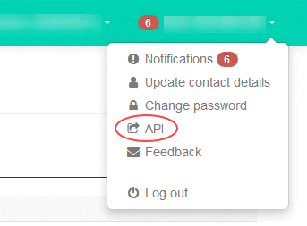

# How to access vCloud Director through the vCloud API

## Overview

To perform some tasks within your UKCloud for VMware environment, you may need to access vCloud Director through the vCloud API. This guide shows you how to access the vCloud API.

## Finding your vCloud API credentials

Before using the vCloud API, you first need to find your API credentials.

1. Log in to the UKCloud Portal.

    For more detailed instructions, see the [*Getting Started Guide for the UKCloud Portal*](../portal/ptl-gs.md).

2. Select your account.

3. In the top right corner of the page, click your username and then select **API**.

    

4. The *API* page provides a view of your personal credentials for accessing the vCloud API. In particular, the page provides the following information for each compute service:

    - **API URL** - Use this URL at the beginning of your calls to the vCloud API.

        > [!NOTE]
        > This URL will be different depending on the region in which your compute service is located.

    - **API Username** - The user ID to use to authenticate yourself with the vCloud API.

        > [!NOTE]
        > The compute service ID is appended to the end of the username. This is because you may have access to multiple compute services.

    - **Username** - The API username without the appended compute service ID.

    - **Org ID** - Use this to uniquely identify the compute service (or vOrg) when using the vCloud API.

    - **Password** - For authentication with the vCloud API. This password is the same as the one you use to log in to the UKCloud Portal.

    

5. Make a note of the **Org ID**, the **API URL** and your **API Username**.

## Obtaining an authorisation token

Now that you have your API credentials, you can start interacting with the vCloud API. First you need to obtain an `x-vcloud-authorization` token.

1. Send the following request to the vCloud API:

        POST https://<vcloud_api_url>/api/sessions Authorization: Basic <encoded_credentials> Accept: application/*+xml; version=5.6

    Parameter | Description | Example
    ----------|-------------|--------
    `vcloud_api_url` | The URL you use to access the vCloud API that you noted in [Finding your vCloud API credentials](#finding-your-vcloud-api-credentials) | `api.vcd.portal.skyscapecloud.com`
    `encoded_credentials` | Your login credentials that you noted in [Finding your vCloud API credentials](#finding-your-vcloud-api-credentials) in the format: `<username>@<compute_service_id>:<password>` These credentials must be supplied in a MIME Base64 encoding, as specified in RFC 1421 | `auser@mycompute:pA5#word`

    For example:

        POST https://api.vcd.portal.skyscapecloud.com/api/sessions Authoriziation: Basic dXN1cjpwYXNzCg== Accept: application/*+xml; version=5.6

2. The vCloud API response includes your `x-vcloud-authorization` token, for example:

        x-vcloud-authorization: cn9uYmdugN8E2j96+5Lqrc3YBvFsEgDHXzyfJrJ/6bM=\ Content-Type: application/vnd.vmware.vcloud.session+xml;version=5.6

    You must send this token in a header with any subsequent requests to authenticate yourself with the vCloud API.

## Feedback

If you find an issue with this article, click **Improve this Doc** to suggest a change. If you have an idea for how we could improve any of our services, visit the [Ideas](https://community.ukcloud.com/ideas) section of the [UKCloud Community](https://community.ukcloud.com).
