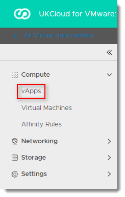

# How to apply vApp fencing

## Overview

Fencing a vApp allows identical VMs within different vApps to be powered on without conflict, by isolating the MAC and IP addresses of the VMs. It's done when the VMs within the vApp sit on the VDC network, rather than on their own vApp network.

This feature is particularly useful if you're copying vApps or creating catalog images of vApps where these details can't be altered.

## Applying vApp fencing

You can apply vApp fencing during or after vApp creation.

To apply vApp fencing after vApp creation:

1. In the left navigation panel, select **vApps**.

   

2. In the card for the vApp, select **Details**.

3. Select **Networks**.

4. In the *vApp Fencing* section, click **Edit**.

    

5. Select the **Fence vApp** option then click **OK**.

    

## Related articles

- [*How to create a vApp*](vmw-how-create-vapp.md)

- [*How to create a vApp network*](vmw-how-create-vapp-network.md)

- [*How to migrate vApps between virtual data centres*](vmw-how-migrate-vapp.md)

## Feedback

If you find a problem with this article, click **Improve this Doc** to make the change yourself or raise an [issue](https://github.com/UKCloud/documentation/issues) in GitHub. If you have an idea for how we could improve any of our services, send an email to <feedback@ukcloud.com>.
