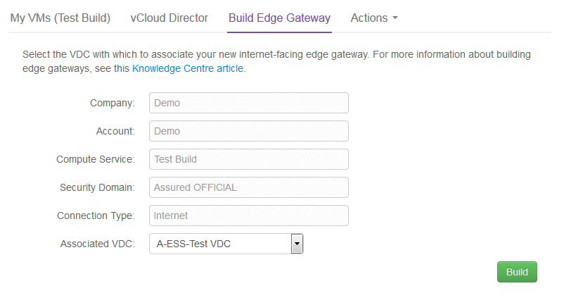
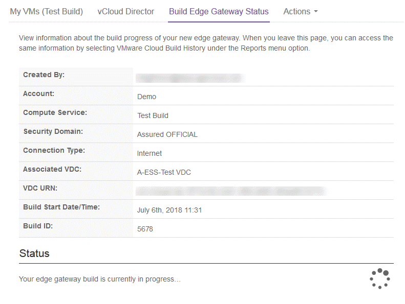
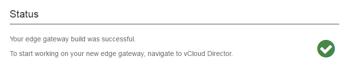
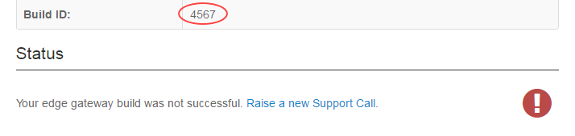

# How to build an edge gateway using the UKCloud Portal

## Overview

To enable your end users to access your VDC, you need to create an edge gateway to provide connectivity. The UKCloud Portal provides the ability to build an edge gateway, without having to raise a service request.

You can also create edge gateways using the Portal API. For more information, see the [*UKCloud Portal API User Guide*](../portal/ptl-ref-portal-api.md).

### Intended audience

To complete the steps in this guide, you must be a vCloud Director administrator.

## Building an edge gateway

If your VDC is located on the Assured OFFICIAL security domain, its edge gateway provides access to the internet. If your VDC is located on the Elevated OFFICIAL security domain, its edge gateway provides access to your other VDCs in the Elevated OFFICIAL domain.

> [!NOTE]
> You can build edge gateways in any of your compute services in regions 5 or 6, not just those you created using the Portal. For information about building compute services and VDCs, see the [*Getting Started Guide for UKCloud for VMware*](vmw-gs.md).

1. Log in to the UKCloud Portal.

    For more detailed steps, see the [*Getting Started Guide for the UKCloud Portal*](../portal/ptl-gs.md).

2. In the Portal navigation panel, expand **VMware Cloud** and then select the compute service in which you want to create the edge gateway.

    

3. From the **Actions** menu, select **Build Edge Gateway**.

    > [!NOTE]
    > If this option is greyed out, either you do not have the appropriate permissions or your compute service is not in region 5 or 6.

    

4. On the *Build Edge Gateway* page, from the **Associated VDC** list, select the VDC for which you are creating the edge gateway.

    The VDC names in the list include information about the security domain in which the VDC is located and the VM type of the VDC.

    > [!NOTE]
    > The list of VDCs includes all VDCs in the compute service, whether or not they already have an edge gateway. If you select a VDC that already has an edge gateway of the same type, you will get an error.

    

5. Click **Build**.

6. The *Edge Gateway Build Status* page displays information about the edge gateway you're building and lets you know how the build is progressing.

    > [!TIP]
    > You can stay on this page until the build is finished, or you can leave this page and check the status of the build later by expanding **Reports** in the Portal navigation panel and selecting **VMware Cloud Build History**.

    

7. When the build is complete, the page displays either a success or fail message.

    If the build is successful, you can now start configuring the edge gateway. For a quick guide on how to do this, see [*How to build a virtual machine with UKCloud for VMware*](vmw-gs-build-vm-vcd.md).

    

    If the build is unsuccessful, raise a support ticket (quoting the **Build ID**) to resolve any issues.

    

## Next steps

For information about how to configure your new edge gateway, see:

- [*How to create firewall rules*](vmw-how-create-firewall-rules.md)

- [*How to create NAT rules*](vmw-how-create-nat-rules.md)

- [*How to create a DHCP pool*](vmw-how-create-dhcp-pool.md)

- [*How to configure IPsec VPN*](vmw-how-configure-ipsec-vpn.md)

- [*How to configure a load balancer*](vmw-how-configure-load-balancer.md)

- [*How to create a static route*](vmw-how-create-static-route.md)

## Feedback

If you find a problem with this article, click **Improve this Doc** to make the change yourself or raise an [issue](https://github.com/UKCloud/documentation/issues) in GitHub. If you have an idea for how we could improve any of our services, send an email to <feedback@ukcloud.com>.
