# How to change IPsec VPN settings via the vCloud Director API

## Overview

This guide shows you how to retrieve, modify, and submit blocks of XML that represent the configuration of the IPsec VPN tunnels. The guide covers modifications to the local and peer IP addresses, local and peer IDs as well the addition or removal of local and peer subnets. In addition to this, the guide also outlines the steps required to modify the shared secret key used on a given IPsec VPN tunnel.

Use cases:

- Enabling customers to quickly amend IPsec configurations

    Modifications of this nature are not possible in the vCloud Director graphical user interface without first deleting the existing IPsec VPN configuration entirely and re-entering the settings. Depending on the number of tunnels, this can be a lengthy task. Making changes to the IPsec VPN configuration via the vCloud API can greatly speed up this process.

- Edge gateway configuration data

    You can also use the steps in this guide to obtain a backup of the current configuration applied to an edge gateway. You can then use this to restore the configuration of the edge gateway at a later point in time. By following the instructions in this guide you can make amendments to the IPsec VPN configuration without first needing to engage with UKCloud Support.

## Before you begin

Before using the vCloud API to view and update IPsec VPN settings, we recommend that you install a REST client that enables you to access the API. The steps in this article use a Firefox plugin called RESTClient. For information about how to install this plugin, see [*How to install a REST client to access the vCloud API*](vmw-how-install-vcloud-api-rest-client.md).

You also need to find your API credentials. For more information, see [*How to access vCloud Director through the vCloud API*](vmw-how-access-vcloud-api.md)

## Obtaining an authorisation token

To start interacting with the vCloud API, you first need to obtain an `x-vcloud-authorization` token; to do this you need to adjust some settings in RESTClient.

1. In your browser, click the **RESTClient** icon.

    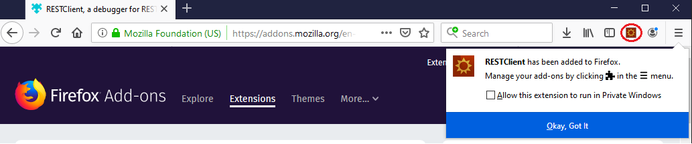

2. From the **Method** menu, select **POST**.

    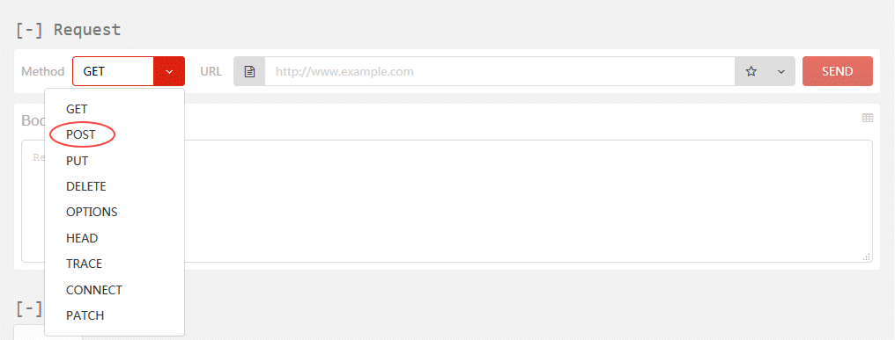

3. In the **API** field, enter the API URL you recorded earlier and append the following to the end of the URL:

        /api/sessions

    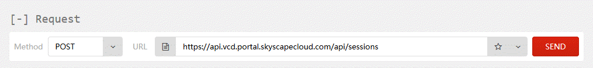

4. Next add a Basic Authentication header. To do this, from the **Authentication** menu at the top of the REST Client, select **Basic Authentication**.

    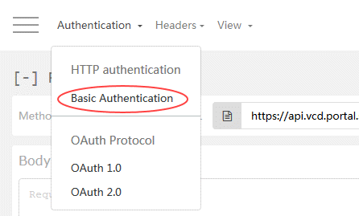

5. In the *Basic Authentication* dialog box, in the **Username** field, enter your API username recorded earlier from the API page.

6. In the **Password** field enter your UKCloud Portal password and then click **Okay**.

    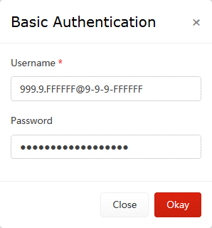

7. The *Request* section now includes an Authorization header.

    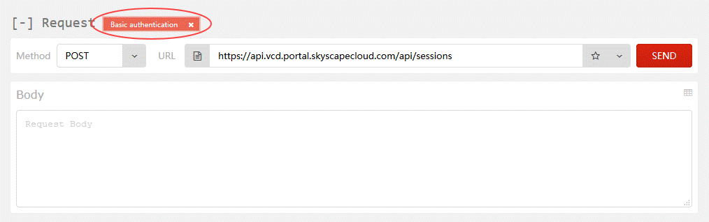

8. Next add an Accept header. To do this, from the **Headers** menu, select **Custom Header**.

    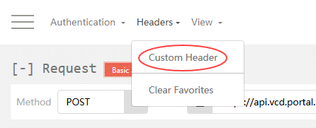

9. In the *Request Header* dialog box, in the **Name** field, enter `Accept`

10. In the **Value** field enter `application/*+xml;version=5.5` and then click **Okay**.

    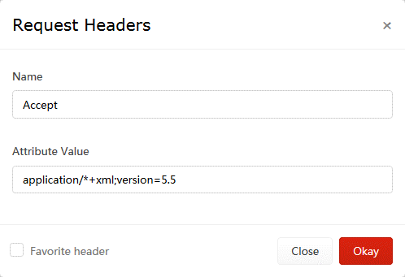

11. The *Headers* section should now be displayed, containing the Accept header.

    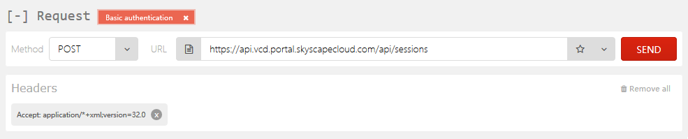

12. The RESTClient has now got all the required settings in place to make a request to the vCloud API to obtain a `x-vcloud-authorization` token, so click the **Send** button.

13. When a response is received the **Headers** tab in the *Response* section will be populated, including an `x-vcloud-authorization` token.

    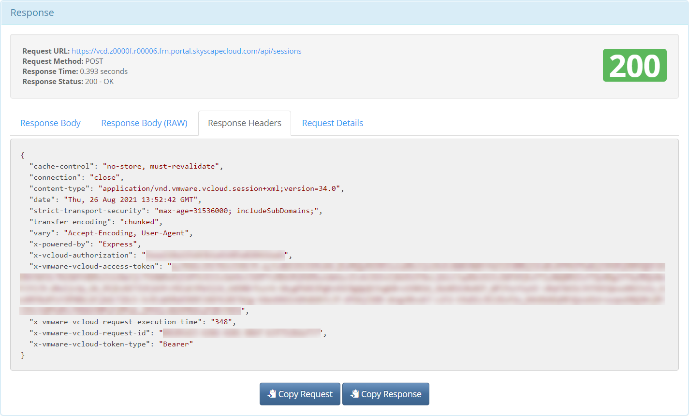

14. The `x-vcloud-authorization` token will replace the Basic Authentication header added earlier. To do this highlight and copy the string of characters displayed after the word `x-vcloud-authorization`.

    > [!NOTE]
    > If at any point while following the instructions in this guide, the output displayed in the REST Client does not look similar to that shown in the images, you can use the value of the **Status Code** field to determine what went wrong and needs investigation. In this case above, **Status Code** received was HTTP 200 OK, which means that the request succeeded. For a list of HTTP response codes, see [HTTP Response Codes](https://developer.mozilla.org/en-US/docs/Web/HTTP/Status).

15. To add an `x-vcloud-authorization` header, from the **Headers** menu, select **Custom Header**.

16. In the *Request Header* dialog box, in the **Name** field enter `x-vcloud-authorization`.

17. In the **Value** field, paste the string of characters copied in the previous step, then click **Okay**.

    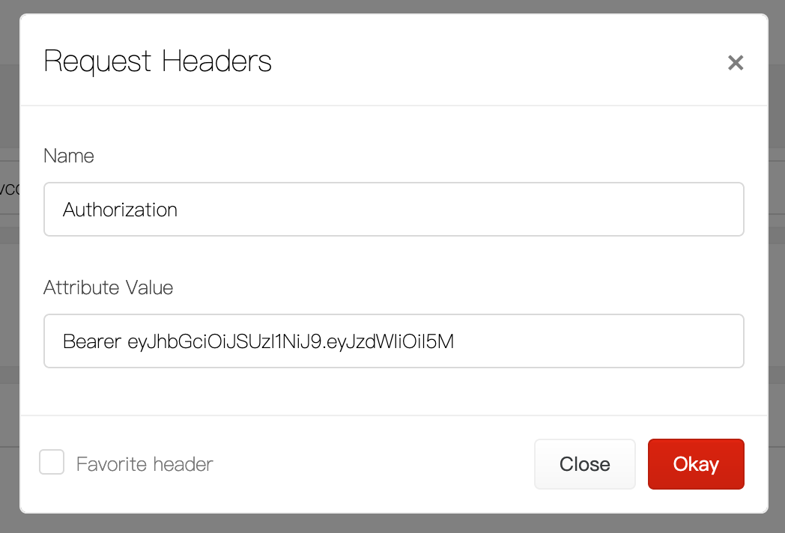

18. Now that you've obtained an `x-vcloud-authorization` token, you can remove the Basic Authentication Header. Click the **x** in the upper right-hand corner of the header.

    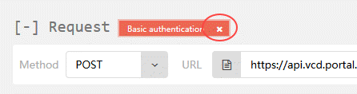## Retrieving organisation details via the API

## Retrieving organisation details via the API

Now that you've obtained an `x-vcloud-authorization` token, you can call the vCloud API to retrieve the information that you need about your organisation to set up your IPsec VPN.

1. Set the **Method** to **GET**.

    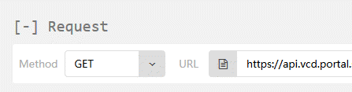

2. In the *Response* section, select the **Preview** tab.

    This view lists the links that you can use to drill down into the various objects exposed via the vCloud API. Of interest in the output below is a link that will, when queried, return details about the organisation and the objects contained within it.

    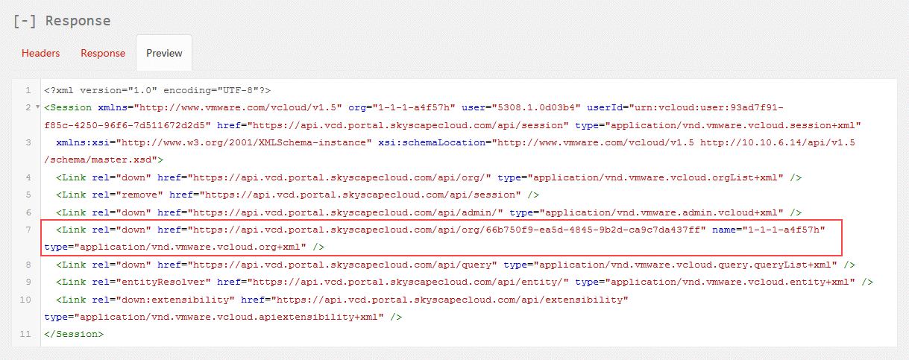

    The link should look something like:

        https://<api_url>/api/org/<org_id>

3. Copy the URL and paste it into the Request **URL** field.

    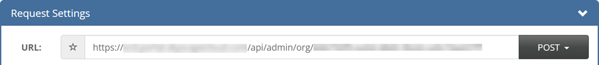

4. Click **Send**.

    After a short amount of time the contents of the Response **Preview** tab will be updated to reflect the response from the vCloud API to your latest request, including links to each VDC in the organisation.

## Retrieving virtual data centre details via the API

To retrieve details about the VDCs in an organisation:

1. Copy the link for the VDC containing the target edge gateway for your IPsec VPN.

    The link should look something like:

        https>//<api_url>/api/vdc/<vdc_id>

2. Click **Send**.

    The contents of the Response **Preview** tab will be updated again.

## Retrieving edge gateway configuration via the API

To retrieve details of the edge gateway configuration:

1. The response this time will probably be quite long. To easily locate a specific section in the response, use your browser's search utility. You can invoke this in Firefox by pressing **CTRL+F**. In the search dialog window at the bottom of the screen enter `edgeGateways`, and then click the down arrow button to locate a section that looks similar to the one shown below:

        <Link rel="edgeGateways" href="https://api.vcd.portal.skyscapecloud.com/api/admin/vdc/<vdc_id>/edgeGateways" type="application/vnd.vmware.vcloud.query.records+xml" />

2. Copy the link ending in `/edgeGateways` and paste it into the URL field at the top of the RESTClient. Ensure that the **Method** drop down is set to **GET** and click **Send**.

    If this request is successful, the response will contain a link to the edge gateway which, when queried, will return the configuration of the edge gateway. Once you have received a response, use your browser's search utility to locate the `EdgeGatewayRecord` section within the response.

        <EdgeGatewayRecord gatewayStatus="READY" haStatus="UP" isBusy="false" name="UKCloud Gateway (nft00002i2)" numberOfExtNetworks="1" numberOfOrgNetworks="8" vdc="https://api.vcd.portal.skyscapecloud.com/api/vdc/<vdc_id>" href="https://api.vcd.portal.skyscapecloud.com/api/admin/edgeGateway/<edge_id>"     task="https://api.vcd.portal.skyscapecloud.com/api/task/<task_id>" isSyslogServerSettingInSync="true" taskOperation="networkConfigureEdgeGatewayServices" taskStatus="success" taskDetails=" " />

3. Within the `EdgeGatewayRecord` section of the above from the response, locate the link to the edge gateway that starts with the following:

        https://<api_url>/api/admin/edgeGateway/

4. Appended to the end of the URL will be a unique identifier for the edge gateway within the VDC. Copy this link, paste it into the URL field and then click **Send**.

    After a short amount of time the current configuration of the edge gateway will be displayed in a block of XML.

## Reviewing the edge gateway configuration

The edge configuration information is contained between an opening `<Configuration>` and closing `</Configuration>` tag.

This block of XML is split into sections which detail the configuration settings applied to a specific item, function or service available on the edge gateway. There are twelve sections in total; however only the configuration settings contained under the `<GatewayIpsecVpnService>` tags will be discussed in this guide.

The example below shows a high‑level overview of the structure of the XML block returned, including the `<GatewayIpsecVpnServices>` tags.

```
<EdgeGateway>
   <Configuration>
      <GatewayBackingConfig>
      </GatewayBackingConfig>
      <GatewayInterfaces>
      </GatewayInterfaces>
      <EdgeGatewayServiceConfiguration>
         <FirewallService>
         </FirewallService>
         <NatService>
         </NatService>
         <GatewayIpsecVpnService>
         </GatewayIpsecVpnService>
         <StaticRoutingService>
         </StaticRoutingService>
         <LoadBalancerService>
         </LoadBalancerService>
      </EdgeGatewayServiceConfiguration>
      <HaEnabled>
      </HaEnabled>
      <UseDefaultRouteForDnsRelay>
      </UseDefaultRouteForDnsRelay>
   </Configuration>
</EdgeGateway\>
```

Before making any changes to the edge gateway via the API it is highly recommended to keep a copy of the XML returned. You can then use this backup to restore the configuration of the edge gateway to a known working configuration if the need arises.

To copy the XML:

1. Select the Response **Preview** tab of the RESTClient.

2. Scroll down to the opening `<Configuration>` tag and highlight     everything up to and including the closing `<\Configuration>` tag. The length of the XML to copy is dependent on the number of NAT, firewall rules and another configuration applied to the edge gateway.

3. With the contents of the `<Configuration>` tags highlighted, right click and select **Copy**.

4. Paste the configuration into a text editor, saving the file to a known location on your computer. Using a text editor that offers syntax highlighting such as Notepad++ will simplify the editing process.

### Locating the IPsec VPN settings in the returned XML

To locate the IPsec VPN settings, open a new text editor window and copy and paste the contents between the opening `<GatewayIpsecVpnService>` and closing `</GatewayIpsecVpnService>` tags. The contents should look similar to the XML block shown below:

```
<GatewayIpsecVpnService>
   <IsEnabled>true</IsEnabled>
   <Endpoint>
      <Network type="application/vnd.vmware.admin.network+xml" href="https://api.vcd.portal.ukcloud.com/api/admin/network/3c284ec8-2850- ba77-098c-7f697a3d8769"/>
      <PublicIp>37.26.88.73</PublicIp>
   </Endpoint>
   <Tunnel>
      <Name>UKCloud IPSEC VPN Demo</Name>
      <Description/>
      <IpsecVpnThirdPartyPeer>
         <PeerId>134.170.188.221</PeerId>
      </IpsecVpnThirdPartyPeer>
      <PeerIpAddress>134.170.188.221</PeerIpAddress>
      <PeerId>134.170.188.221</PeerId>
      <LocalIpAddress>172.26.45.97</LocalIpAddress>
      <LocalId>172.26.45.97</LocalId>
      <LocalSubnet>
         <Name>VPN Test Network 1</Name>
         <Gateway>192.168.1.254</Gateway>
         <Netmask>255.255.255.0</Netmask>
      </LocalSubnet>
      <PeerSubnet>
         <Name>192.168.2.0/24</Name>
         <Gateway>192.168.2.254</Gateway>
         <Netmask>255.255.255.0</Netmask>
      </PeerSubnet>
      <SharedSecret>UKCloudIPSECVPNDemoSharedSecretKey</SharedSecret>
      <SharedSecretEncrypted>false</SharedSecretEncrypted>
      <EncryptionProtocol>AES256</EncryptionProtocol>
      <Mtu>1500</Mtu>
      <IsEnabled>true</IsEnabled>
      <IsOperational>true</IsOperational>
   </Tunnel>
</GatewayIpsecVpnService>
```

## Modifying the IPsec VPN configuration

This section outlines common tasks performed via the API to manipulate the IPsec VPN configuration applied to a given edge gateway.

### Modifying the local endpoint IP and local ID

You can change the local IP and local ID by editing the contents between the opening `<localIpAddress>` and closing `</localIpAddress>` and
`<localId>` and `</localId>` tags.

This is by far the most commonly performed modification to the IPsec VPN configuration via the vCloud API. You can use this to change the local IP address from the IP address assigned to the edge gateway on the transit network to the IP address assigned to the edge gateways on the public network. For the tunnel to come up successfully, the local IP address must be set to the edge gateway's public IP address. The local ID must also match the public IP address specified.

### Modifying the peer endpoint IP and peer ID

If you need to move the remote endpoint of the tunnel to a new device or IP address, then you can adjust the `<PeerIpAddress>` and `<PeerId>` tags.

When changing the peer IP address of the tunnel you must ensure that the peer ID is also updated to match the new peer IP address.

### Adding or removing local subnets

You can add additional local subnets to the IPsec VPN tunnel. This involves adding a new `<LocalSubnet>` definition to the IPsec VPN config.

### Adding or removing peer subnets

You can use the same process to add or remove a `<PeerSubnet>`.

### Amending the shared secret

If you need to update or amend the shared secret on an IPsec VPN, edit the value between the opening `<SharedSecret>` and closing `</SharedSecret>` tags.

> [!NOTE]
> The shared secret must be at least 32 characters in length. To enhance the security of the tunnel, we highly recommend that you avoid using dictionary words in the shared secret key.

## Applying the new configuration

When you've updated the relevant sections of the configuration, you can apply it to the edge gateway.

1. Enclose the new configuration in a pair of `<EdgeGatewayServiceConfiguration>` tags.

2. Copy and paste this configuration into the Request *Body* section of the RESTClient.

3. From the **Method** list, select **POST**.

4. Append the following to the URL in the **URL** field:

        /action/configureServices

    For example, if the original contents of the URL were:

        https://<api_url>/api/admin/edgeGateway/<id>

    The updated URL would be:

        https://<api_url>/api/admin/edgeGateway/<id>/action/configureServices

5. You must also add one more Header to the RESTClient prior to submitting the new configuration. From the **Headers** menu at the top of the REST Client select **Custom Header**.

6. In the **Name** field, enter **Content-Type**.

7. In the **Attribute Value** field enter the following:

        application/vnd.vmware.admin.edgeGatewayServiceConfiguration+xml

8. Click **Okay**.

9. To submit the new configuration, click **Send**.

10. The status of the edge gateway as viewed from vCloud Director will briefly show as **Updating Configuration**. Once this process has completed, right click the edge gateway and select **Configure Services**.

11. In the *Configure Services* window select the **VPN** tab.

12. You should see the new configuration settings. Verify the status of the IPsec VPN tunnel on your remote device to ensure that the tunnel has been established successfully.

## Next steps

If you need any further assistance, or if you want to discuss any aspect of this service or settings specific to your domain, log a support ticket via the UKCloud Portal.

## Feedback

If you find an issue with this article, click **Improve this Doc** to suggest a change. If you have an idea for how we could improve any of our services, visit the [Ideas](https://community.ukcloud.com/ideas) section of the [UKCloud Community](https://community.ukcloud.com).
