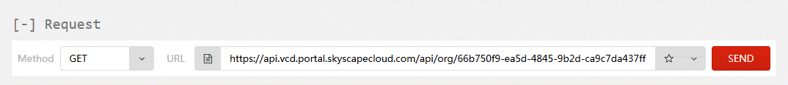

<br>**UKCloud Limited (“UKC”) and Virtual Infrastructure Group Limited (“VIG”) (together “the Companies”) – in Compulsory Liquidation**

On 25 October 2022, the Companies were placed into Liquidation with the Official Receiver appointed as Liquidator and J Robinson and A M Hudson simultaneously appointed as Special Managers to manage the liquidation process on behalf of the Official Receiver.

Further information regarding the Liquidations can be found here: <https://www.gov.uk/government/news/virtual-infrastructure-group-limited-and-ukcloud-limited-information-for-creditors-and-interested-parties>

Contact details:<br>
For any general queries relating to the Liquidations please email <ukcloud@uk.ey.com><br>
For customer related queries please email <ukcloudcustomers@uk.ey.com><br>
For supplier related queries please email <ukcloudsuppliers@uk.ey.com>

# How to change IPsec VPN settings via the Cloud Director API

## Overview

This article shows you how to retrieve, modify, and submit blocks of XML that represent the configuration of the IPsec VPN tunnels. The guide covers modifications to the local and peer IP addresses, local and peer IDs as well the addition or removal of local and peer subnets. In addition to this, the article also outlines the steps required to modify the shared secret key used on a given IPsec VPN tunnel.

Use cases:

- Enabling customers to quickly amend IPsec configurations

  Modifications of this nature are not possible in the VMware Cloud Director graphical user interface without first deleting the existing IPsec VPN configuration entirely and re-entering the settings. Depending on the number of tunnels, this can be a lengthy task. Making changes to the IPsec VPN configuration via the Cloud Director API can greatly speed up this process.

- Edge gateway configuration data

  You can also use the steps in this article to obtain a backup of the current configuration applied to an edge gateway. You can then use this to restore the configuration of the edge gateway at a later point in time. By following the instructions in this guide you can make amendments to the IPsec VPN configuration without first needing to engage with UKCloud Support.

## Before you begin

Before using the Cloud Director API to view and update IPsec VPN settings, we recommend that you install a REST client that enables you to access the API using a more intuitive interface. The steps in this article use a plugin called YARC; if you use a different client, some of the steps will be different.

## Obtaining an authorisation token

To start interacting with the Cloud Director API, you first need to find your API credentials and use those to obtain an `x-vmware-vcloud-access-token` token.

For detailed steps for how to do this, see [*How to access VMware Cloud Director through the Cloud Director API*](vmw-how-access-vcloud-api.md).

## Retrieving organisation details via the API

Now that you've obtained an `x-vmware-vcloud-access-token` token, you can call the Cloud Director API to retrieve the information that you need about your organisation to set up your IPsec VPN.

To retrieve organisation information using the YARC client:

1. In the *Response* section returned by the request when you obtained your authorisation token, select the **Response Body** tab.

   This view lists the links that you can use to drill down into the various objects exposed via the Cloud Director API. Of interest in the output below is a link that will, when queried, return details about the organisation and the objects contained within it.

   

   The link should look something like:

   `https://<api_url>/api/org/<org_id>`

2. Copy the URL and paste it into the Request **URL** field.

3. You must be in admin mode to retrieve the list of VDCs in the organisation, so change the URL to:

   `https://<api_url>/api/admin/org/<org_id>`

   

4. From the list of methods, select **GET**.

   

5. Click **Send Request**.

   After a short amount of time the contents of the **Response Body** tab will be updated to reflect the response from the Cloud Director API to your latest request.

## Retrieving virtual data centre details via the API

To retrieve details about the VDCs in an organisation using the YARC client:

1. The response this time will probably be quite long. To easily locate a specific section in the response, use your browser's search utility (typically accessed by pressing **CTRL+F**). In the search field, enter `Vdcs` to locate a section that looks similar to the one shown below:

   ```xml
   <Vdcs>
        <Vdc href="https://<api-url>/api/vdc/<vdc1-id>" id="urn:vcloud:vdc:<vdc1-id>" name="<vdc-name>" type="application/vnd.vmware.vcloud.vdc+xml"/>
        <Vdc href="https://<api-url>/api/vdc/<vdc2-id>" id="urn:vcloud:vdc:<vdc2-id>" name="<vdc-name>" type="application/vnd.vmware.vcloud.vdc+xml"/>
        <Vdc href="https://<api-url>/api/vdc/<vdc3-id>" id="urn:vcloud:vdc:<vdc3-id>" name="<vdc-name>" type="application/vnd.vmware.vcloud.vdc+xml"/>
    </Vdcs>
    ```

2. Copy the link for the VDC containing the target edge gateway for your IPsec VPN.

3. Paste the VDC link into the **URL** field at the top of the page (the method should still be set to **GET**) and click **Send Request**.

   The contents of the **Response Body** tab will be updated again.

## Retrieving edge gateway configuration via the API

To retrieve details of the edge gateway configuration using the YARC client:

1. Use your browser's search utility to locate the `edgeGateways` link, which will look similar to:

   `<Link rel="edgeGateways" href="https://<api_url>/api/admin/vdc/<vdc_id>/edgeGateways" type="application/vnd.vmware.vcloud.query.records+xml" />`

2. Copy the link ending in `/edgeGateways` and paste it into the **URL** field at the top of the REST client. Ensure that the method is still set to **GET** and click **Send Request**.

   Once you've received a response, locate the `EdgeGatewayRecord` section for the target edge gateway for your IPsec VPN.

   

3. Within the `EdgeGatewayRecord` section of the above from the response, locate the link to the edge gateway that starts with the following:

   `https://<api_url>/api/admin/edgeGateway/`

4. At the end of the URL you'll find a unique identifier for the edge gateway within the VDC. Copy the whole link, paste it into the **URL** field (the method should still be set to **GET**) and then click **Send Request**.

   After a short amount of time the current configuration of the edge gateway will be displayed in a block of XML.

## Reviewing the edge gateway configuration

The edge configuration information is contained between `<Configuration>` and `</Configuration>` tags.

This block of XML is split into sections that detail the configuration settings applied to a specific item, function or service available on the edge gateway. There are several sections in total; however only the configuration settings contained under the `<GatewayIpsecVpnService>` tags will be discussed in this guide.

The example below shows a high‑level overview of the structure of the XML block returned, including the `<GatewayIpsecVpnServices>` tags:

```xml
<EdgeGateway>
   <Configuration>
      <GatewayBackingConfig> </GatewayBackingConfig>
      <GatewayInterfaces> </GatewayInterfaces>
      <EdgeGatewayServiceConfiguration>
         <GatewayDhcpService> </GatewayDhcpService>
         <FirewallService> </FirewallService>
         <NatService> </NatService>
         <GatewayIpsecVpnService> </GatewayIpsecVpnService>
         <StaticRoutingService> </StaticRoutingService>
         <LoadBalancerService> </LoadBalancerService>
      </EdgeGatewayServiceConfiguration>
   </Configuration>
</EdgeGateway\>
```

Before making any changes to the edge gateway via the API it is highly recommended to keep a copy of the XML returned. You can then use this backup to restore the configuration of the edge gateway to a known working configuration if the need arises.

To copy the XML using the YARC client:

1. In the **Response Body** tab, scroll down to the opening `<Configuration>` tag and highlight everything up to and including the closing `<\Configuration>` tag. The length of the XML to copy is dependent on the number of NAT, firewall rules and another configuration applied to the edge gateway.

2. With the contents of the `<Configuration>` tags highlighted, right click and select **Copy**.

3. Paste the configuration into a text editor, saving the file to a known location on your computer. Using a text editor that offers syntax highlighting such as Notepad++ will simplify the editing process.

### Locating the IPsec VPN settings in the returned XML

To locate the IPsec VPN settings, open a new text editor window and copy and paste the contents between the `<GatewayIpsecVpnService>` and `</GatewayIpsecVpnService>` tags. The contents should look similar to the XML block shown below:

```xml
<GatewayIpsecVpnService>
   <IsEnabled>true</IsEnabled>
   <Endpoint>
      <Network type="application/vnd.vmware.admin.network+xml" href="https://<api-url>/api/admin/network/<network-id>"/>
      <PublicIp>x.x.x.x</PublicIp>
   </Endpoint>
   <Tunnel>
      <Name>UKCloud IPSEC VPN Demo</Name>
      <Description/>
      <IpsecVpnThirdPartyPeer>
         <PeerId>x.x.x.x</PeerId>
      </IpsecVpnThirdPartyPeer>
      <PeerIpAddress>x.x.x.x</PeerIpAddress>
      <PeerId>x.x.x.x</PeerId>
      <LocalIpAddress>x.x.x.x</LocalIpAddress>
      <LocalId>x.x.x.x</LocalId>
      <LocalSubnet>
         <Name>VPN Test Network 1</Name>
         <Gateway>x.x.x.x</Gateway>
         <Netmask>255.255.255.0</Netmask>
      </LocalSubnet>
      <PeerSubnet>
         <Name>x.x.x.x/24</Name>
         <Gateway>x.x.x.x</Gateway>
         <Netmask>255.255.255.0</Netmask>
      </PeerSubnet>
      <SharedSecret>UKCloudIPSECVPNDemoSharedSecretKey</SharedSecret>
      <SharedSecretEncrypted>false</SharedSecretEncrypted>
      <EncryptionProtocol>AES256</EncryptionProtocol>
      <Mtu>1500</Mtu>
      <IsEnabled>true</IsEnabled>
      <IsOperational>true</IsOperational>
   </Tunnel>
</GatewayIpsecVpnService>
```

## Modifying the IPsec VPN configuration

This section outlines common tasks performed via the API to manipulate the IPsec VPN configuration applied to a given edge gateway.

### Modifying the local endpoint IP and local ID

You can change the local IP and local ID by editing the contents between the `<localIpAddress>` and `</localIpAddress>` and `<localId>` and `</localId>` tags respectively.

This is by far the most commonly performed modification to the IPsec VPN configuration via the Cloud Director API. You can use this to change the local IP address from the IP address assigned to the edge gateway on the transit network to the IP address assigned to the edge gateways on the public network. For the tunnel to come up successfully, the local IP address must be set to the edge gateway's public IP address. The local ID must also match the public IP address specified.

### Modifying the peer endpoint IP and peer ID

If you need to move the remote endpoint of the tunnel to a new device or IP address, then you can adjust the `<PeerIpAddress>` and `<PeerId>` tags.

When changing the peer IP address of the tunnel you must ensure that the peer ID is also updated to match the new peer IP address.

### Adding or removing local subnets

You can add additional local subnets to the IPsec VPN tunnel. This involves adding a new `<LocalSubnet>` definition to the IPsec VPN config.

### Adding or removing peer subnets

You can use the same process to add or remove a `<PeerSubnet>`.

### Amending the shared secret

If you need to update or amend the shared secret on an IPsec VPN, edit the value between the `<SharedSecret>` and `</SharedSecret>` tags.

> [!NOTE]
> The shared secret must be at least 32 characters in length. To enhance the security of the tunnel, we highly recommend that you avoid using dictionary words in the shared secret key.

## Applying the new configuration

When you've updated the relevant sections of the configuration, you can apply it to the edge gateway.

The steps below outline how to apply the amended your IPsec VPN configuration using the YARC client.

1. Enclose the new configuration in a pair of `<EdgeGatewayServiceConfiguration>` tags.

2. Copy and paste this configuration into the **Payload** field of the *Request Settings* section.

3. Select the **POST** method.

4. Append the following to the URL in the **URL** field:

   `/action/configureServices`

   For example, if the original contents of the URL were:

   `https://<api_url>/api/admin/edgeGateway/<id>`

   The updated URL would be:

   `https://<api_url>/api/admin/edgeGateway/<id>/action/configureServices`

   

5. You must also add another header prior to submitting the new configuration.

   In the *Custom Headers* section, select **Add New Header**.

6. In the **Name** field, enter **Content-Type**.

7. In the **Value** field enter the following:

   `application/vnd.vmware.admin.edgeGatewayServiceConfiguration+xml`

   

8. Click **Save**.

9. To submit the new configuration, click **Send Request**.

10. The status of the edge gateway as viewed from VMware Cloud Director will briefly show as **Updating Configuration**. Once this process has completed, select the edge gateway and click **Services**.

11. On the **VPN** tab of the *Edge Gateway* page, you should see the new configuration settings. Verify the status of the IPsec VPN tunnel on your remote device to ensure that the tunnel has been established successfully.

## Next steps

If you need any further assistance, or if you want to discuss any aspect of this service or settings specific to your domain, log a support ticket via the [My Calls](https://portal.skyscapecloud.com/support/ivanti) section of the UKCloud Portal.

## Feedback

If you find a problem with this article, click **Improve this Doc** to make the change yourself or raise an [issue](https://github.com/UKCloud/documentation/issues) in GitHub. If you have an idea for how we could improve any of our services, send an email to <feedback@ukcloud.com>.
