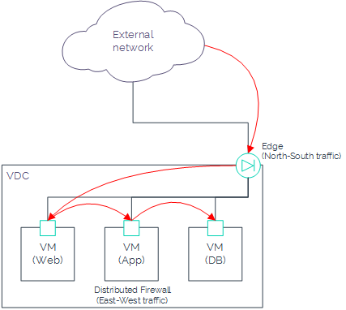
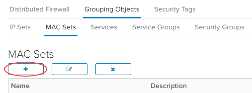
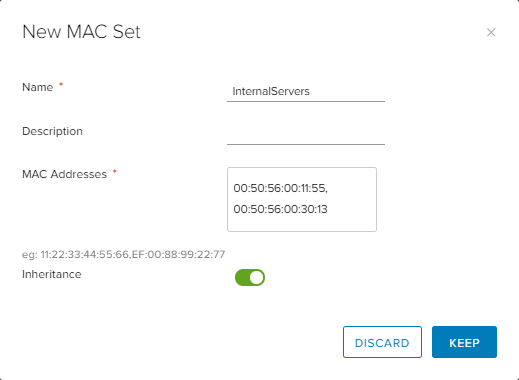

# How to configure a Distributed Firewall

## Overview

UKCloud for VMware provides Distributed Firewall (DFW) functionality as part of its Advanced Management bundle (additional charges apply). DFW enables microsegmentation of networks at the virtual data centre (VDC) level. It can inspect every packet and frame coming to and leaving the VM regardless of the network topology. Packet inspection is done at the VM virtual NIC (vNIC) level, which enables ACLs to be applied closest to the source.

You can have a routed or isolated network on a vApp and still use a DFW at the VDC level to complement it. The NSX edge handles North-South bound traffic while the DFW is designed to manage East-West bound traffic.

The DFW rules can be based on Layer 2 (L2) up to Layer 4 (L4).

- L2 rules (Ethernet tab) are based on MAC address L2 protocols like ARP, RARP and LLDP
- L3 rules (General tab) are based on Ip source destination
- L4 uses a TCP or UDP service port

Layer 2 (Ethernet) firewall rules are processed before Layer 3 rules. The default firewall rule allows L2 and L3 traffic to pass through your VDCs. Once you have implemented all the rules, you can change this to block. Rules are always read and enforced from top-to-bottom ordering like any traditional firewall.

DFW rules can have one or more of the following entities as the source or destination: Org VDC networks, virtual machines, Org VDCs, MAC sets (L2 – Ethernet), IP sets (L3 – General) or security groups.

> [!NOTE]
> Running open VMare tools on VMs has not been validated with DFW.

## Configuring a Distributed Firewall

To access the DFW:

1. Log in to vCloud Director via the UKCloud Portal.

    For more detailed instructions, see the [*Getting Started Guide for UKCloud for VMware*](vmw-gs.md).

2. In the *Virtual Datacenters* dashboard, select the VDC that contains the DFW you want to manage.

3. In the left navigation panel, click **Security**.

    

4. Select the **Security Services** for your VDC, then click **Configure Services**.

    Even though other VDC security policies are listed in this section, you cannot launch the configuration until you switch to the relevant VDC. You can confirm which VDC you are in by looking in the top right corner. To go back to all VDCs, click the back arrow.

    

5. In the **Distributed Firewall > General** tab of the *Services* dialog box, select **Enable Distributed Firewall**.

    This creates default rules in both the **General** (L3) and **Ethernet** (L2) tabs.

    

6. In the **General** tab, click the **+** button to add a new L3 rule.

    

7. Define the L3 rule:

    Field | Action | &nbsp;
    ------|--------|-------
    Name | Enter a name for the rule. |
    Source | Hover over the field, then click the **IP** button to enter a single IP address or an IP range. When you're done, click **Keep**. | 
    Destination | Hover over the field, then click the **IP** button to enter a single IP address or an IP range. When you're done, click **Keep**. | 
    Service | Hover over the field, then click the **IP** button to add the relevant **Protocol** and **Port**. When you're done, click **Keep**. | 
    Action | Select **Allow** or **Deny**. |
    Direction | Select **In**, **Out** or **In/Out**. |
    Packet Type | Select **IPv4**, **IPv6** or **Any**. |
    Applied To | Hover over the field, then click the **+** button to select whether to apply the rule to an edge, Org VDC network, virtual machine, Org VDC or security group. Select the specific object then click the right arrow to add it. When you're done, click **Keep**. | 

    

8. When you're done, click **Save changes**.

    

## Creating a group of objects

In some VDCs, you may want to use the same set of objects in multiple rules. For example, you may want to group web servers or other application servers together to use in a ruleset. Grouping objects keeps the firewall ruleset clean and easy to read.

### Creating a group of IP addresses

You can create a group of IP addresses (IP set). This can be a combination of individual IPs and IP ranges.

To create an IP set:

1. In the *Services* dialog box, select the **Grouping Objects** tab.

    

2. In the **IP Sets** tab, click the **+** button.

    

3. Fill out the fields in the *New IP Set* dialog box:

    Field | Action
    ------|-------
    Name | Enter a name for the IP set, ideally without any spaces or special characters.
    Description | Enter a description for the IP set.
    IP Addresses | Enter the IP addresses that you want to include in the IP set. You can include a combination of individual IP addresses and IP ranges. You can also use CIDR format, for example `192.168.1.1/24`.
    Inheritance | Select this option to enable the IP set to be consumed by underlying scopes.

    

4. When you're done, click **Keep**.

### Creating a group of MAC addresses

If you want to use MAC address based filtering, it is easier to group the addresses in a MAC set. In a cloud environment, you need to be prepared for MAC address changes.

> [!TIP]
> We recommend that you base firewall rules on VMs, Org VDC networks or security groups for L2 filtering.

To create a MAC set:

1. In the *Services* dialog box, click the **Grouping Objects** tab.

2. In the **MAC Sets** tab, click the **+** button.

    

3. Fill out the fields in the *New MAC Set* dialog box:

    Field | Action
    ------|-------
    Name | Enter a name for the MAC set.
    Description | Enter a description for the MAC set.
    MAC Addresses | Enter the individual MAC addresses for your servers.
    Inheritance | Select this option to enable the MAC set to be consumed by underlying scopes.

    

4. When you're done, click **Keep**.

### Creating services and service groups

> [!NOTE]
> Currently, you cannot create custom services or service groups.

You can use predefined services with relevant protocols and ports in your firewall rules.

Service groups contain multiple application ports and components, for example, Microsoft SQL Server requires a number of ports for all different services, which is simplified in the Microsoft SQL Server service group.

### Creating a security group

Security groups enable you to categorise based on the access level required. If you have a number of servers performing similar roles and services, you can create a security group for them. Security groups also enable you to add dynamic members based on VM guest OS name, VM name and VM guest host name

1. In the *Services* dialog box, click the **Grouping Objects** tab.

2. In the **Security Groups** tab, click the **+** button.

    

3. In the *New Security Group* dialog box, enter a **Name** and **Description** for the security group.

4. In the *Dynamic Member Sets* section, click the **+** button and specify the criteria for the security group.

    In the image below, any existing VM with `App` in its name and any VM created in the future with `App` in its name will be included in the security group.

    

5. In the *Include Members* section, instead of creating the members of the group dynamically, you can explicitly specify members to include in the group. Members can include VMs, Org VDC networks, IP sets, MAC sets or security tags.

    Select the type of object, then select individual objects and click the right arrow to add them to the group.

6. In the *Exclude Members* section, you can exclude specific objects from the security group.

    Select the type of object, then select individuval objects and click the right arrow to exclude them from the group.

    

7. When you're done, click **Keep**.

    

## Related videos

- [*VMware Distributed Firewall video*](vmw-vid-dfw.md)

## Feedback

If you find an issue with this article, click **Improve this Doc** to suggest a change. If you have an idea for how we could improve any of our services, visit the [Ideas](https://community.ukcloud.com/ideas) section of the [UKCloud Community](https://community.ukcloud.com).
