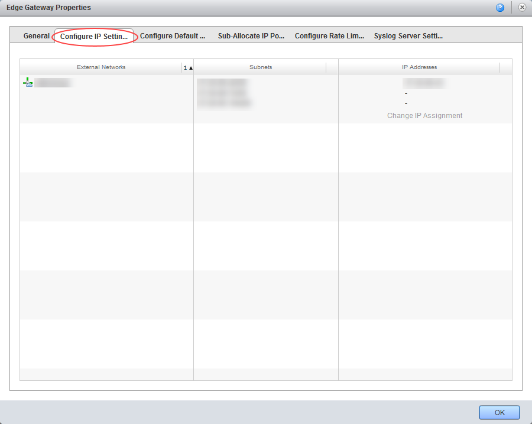
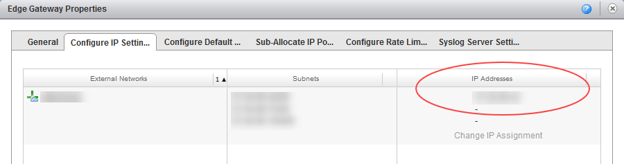
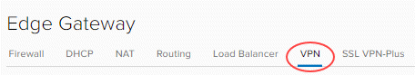
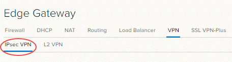
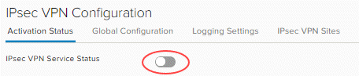
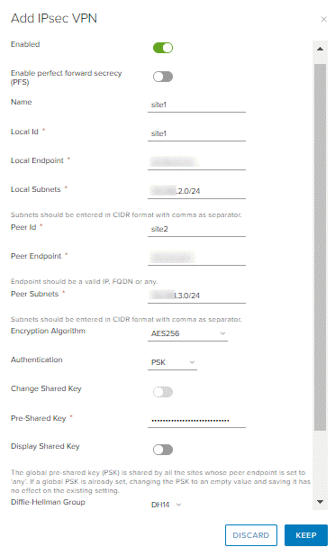
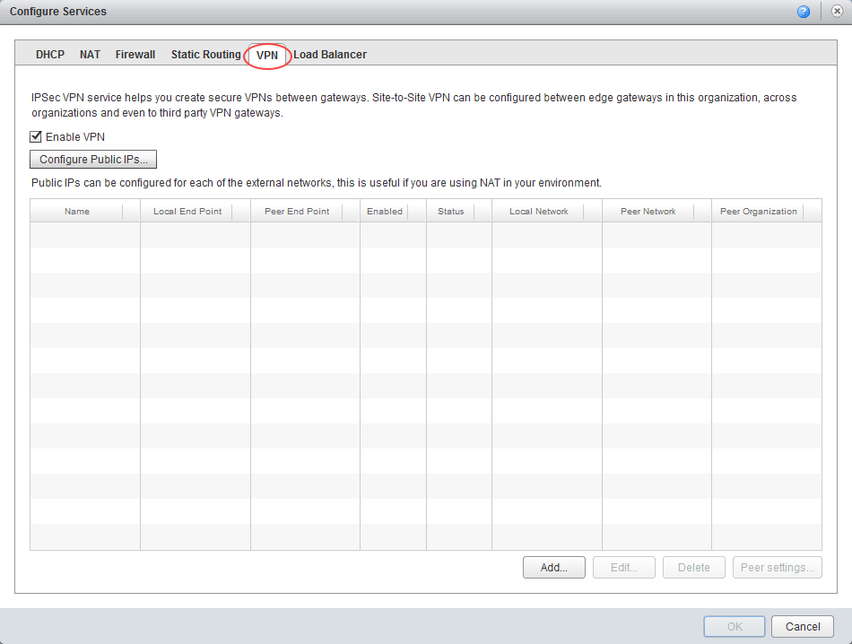
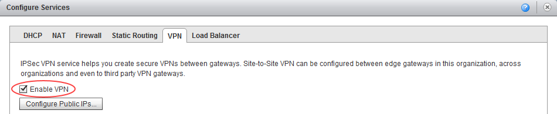
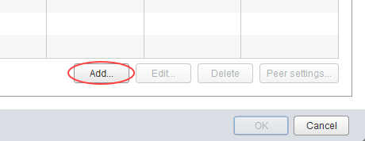
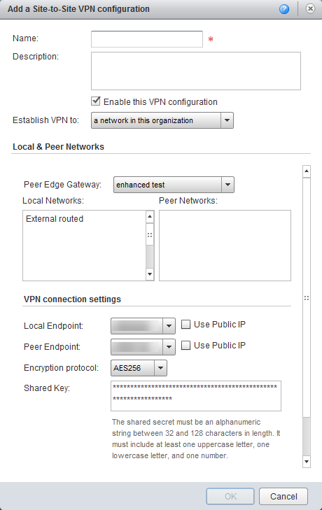

# How to configure IPsec VPN

## Overview

vCloud Director supports the following types of site-to-site VPN:

- Another edge gateway in the same organisation
- An edge gateway in another organisation (UKCloud or another vCloud service provider)
- A remote network offering IPsec VPN endpoint capability

Depending on the type of connection required, you'll need to complete IP addressing for both ends, together with a shared secret, and indicate which VDC networks are allowed to connect to the VPN link.

## Configuring edge gateway IPsec VPN settings for an advanced gateway

To configure the IPsec VPN, you first need to configure the VPN settings on your edge gateway.

The steps for configuring edge gateway IPsec VPN settings vary depending on what type of edge gateway you're working with:

- [Configuring edge gateway IPsec VPN settings for an advanced gateway](#configuring-edge-gateway-ipsec-vpn-settings-for-an-advanced-gateway)
- [Configuring edge gateway IPsec VPN settings for a standard edge](#configuring-edge-gateway-ipsec-vpn-settings-for-a-standard-edge)

> [!NOTE]
> We recommend that you convert your edge to an advanced gateway to access the latest vCloud Director functionality. For more information, see [*How to convert your edge to an advanced gateway*](vmw-how-convert-edge.md).

### Configuring edge gateway IPsec VPN settings for an advanced gateway

1. In vCloud Director, click the **Administration** tab.

    

    For more detailed instructions, see the [*Getting Started Guide for UKCloud for VMware*](vmw-gs.md)

2. Double-click the virtual data centre (VDC) that you want to work with, or right-click the VDC and select **Open**.

3. Select the **Edge Gateways** tab.

    

4. Right-click the edge gateway and select **Properties**.

5. In the *Edge Gateway Properties* dialog box, select the **Configure IP Settings**

    

6. Make a note of the IP address in the **IP Addresses** column then click **OK**.

    You'll need to use this IP address later to use as your tunnel endpoint address.

    

7. Right-click the edge gateway and select **Edge Gateway Services**.

8. Select the **VPN** tab.

    

9. Select the **IPsec VPN** tab.

    

10. On the **Activation Status** tab, select the **IPsec VPN Service Status** toggle.

    

11. Select the **IPsec VPN Sites** tab.

12. Click the **+** icon.

13. In the *Add IPsec VPN* dialog box, select the **Enabled** toggle.

14. Complete the configuration as follows:

    - Enable perfect forward secrecy (PFS) - Select this if your on-premises/remote site has that capability.
    - Name
    - Local Id
    - Local Endpoint - The external IP of your edge gateway (refer to the first steps of this procedure for more information).
    - Local Subnets - Enter the organisation networks that can access the VPN (separate multiple local subnets with commas).
    - Peer Id
    - Peer Endpoint - The external IP of your remote site or on-premises firewall or edge where VPN is being set up.
    - Peer Subnets - This is the subnet on your on-premises network that you want to make accessible from your UKCloud VDC. For example, if your on-premises networks sit inside the `10.20.0.0/16` range, you could enter `10.20.0.0/16` here or limit your entry to a smaller subnet of that, for example `10.20.0.0/25`.
    - Encryption Algorithm - Select the most secure protocol that is supported by your on-premises gateway.
    - Authentication - Select the authentication method that is supported by your on-premises gateway. If you want to use certificates, then you need to configure those first on the **Certificates** tab.
    - Pre-Shared Key - The shared secret used to authenticate and encrypt the connection. It must be an alphanumeric string between 32 and 128 characters that includes at least one uppercase letter, one lowercase letter and one number. This must be the same on both sites.
    - Diffie-Hellmann Group - We recommend setting this to DH14 or higher if your on-premises environment can support it.

    

15. When you're done, click **Keep** to create the edge end of the VPN tunnel then click **Save changes**.

### Configuring edge gateway IPsec VPN settings for a standard edge

1. In vCloud Director, click the **Administration** tab.

    

    For more detailed instructions, see the [*Getting Started Guide for UKCloud for VMware*](vmw-gs.md)

2. Double-click the virtual data centre (VDC) that you want to work with, or right-click the VDC and select **Open**.

3. Select the **Edge Gateways** tab.

    

4. Right-click the edge gateway and select **Properties**.

5. In the *Edge Gateway Properties* dialog box, select the **Configure IP Settings**

    

6. Make a note of the IP address in the **IP Addresses** column then click **OK**.

    You'll need to use this IP address later to use as your tunnel endpoint address.

    

7. Right-click the edge gateway and select **Edge Gateway Services**.

8. Select the **VPN** tab.

    

9. Select the **Enable VPN** check box.

    

10. Click **Add**.

    

11. In the *Add a Site-to-Site VPN configuration* dialog box, complete the configuration as follows:

    - **Name**
    - **Description**
    - **Establish VPN to** - Choose between:
        - A remote network
        - A network in this organisation
        - A network in another organisation
    - **Local Networks** - Choose the organisation networks that can access the VPN. If you have only one, select that.
    - **Peer Networks** - This is the subnet on your on-premises network that you want to make accessible from your VDC. For example, if your on-premises networks sit inside the `10.20.0.0/16` range, you could enter `10.20.0.0/16` here, or limit your entry to
    a smaller subnet of that, for example `10.20.6.0/25`
    - **Local Endpoint** - The external network of your Edge Gateway. Only one option should be available.
    - **Encryption protocol** - Choose the most secure protocol that is supported by your on-premises gateway
    - **Shared Key** - The shared secret to use to authenticate and encrypt the connection. It must be an alphanumeric string between 32 and 128 characters long and include at least one upper-case letter, one lower-case letter, and one number.
    - **MTU** - Reduce from default to `1350`.

    

12. When you're finished, click **OK**.

## Creating the second VPN gateway

You now need to create the endpoint of the VPN tunnel. If this is a different VDC (in the Elevated security domain) or vOrg, go through the steps described above again to create the tunnel. When you've done that, you can change your firewall settings and validate the connection (see below).

If you're connecting to an external data centre, you'll need to set up the tunnel on that premises.

## Creating an external data centre VPN gateway

Although we can't provide specific instructions on setting up an external data centre gateway to connect to the edge gateway, we've provided information about some configuration requirements below.

### IKE Phase 1 and Phase 2

IKE is a standard method for arranging secure, authenticated communications.

#### Phase 1 parameters

Phase 1 sets up mutual authentication of the peers, negotiates cryptographic parameters, and creates session keys.

The Phase 1 parameters used by an advanced gateway are:

- Main mode
- AES/AES256/AES-GCM (user configurable)
- Diffie-Hellman Group
- Pre-shared secret (user configurable)
- SA lifetime of 28800 seconds (eight hours) with no kbytes rekeying
- ISAKMP aggressive mode disabled

The Phase 1 parameters used by a standard edge are:

- Main mode
- TripleDES / AES (user configurable)
- SHA-1
- MODP group 2 (1024 bits)
- Pre-shared secret (user configurable)
- SA lifetime of 28800 seconds (eight hours) with no kbytes rekeying
- ISAKMP aggressive mode disabled

#### Phase 2 parameters

IKE Phase 2 negotiates an IPSec tunnel by creating keying material for the IPSec tunnel to use (either by using the IKE phase 1 keys as a base or by performing a new key exchange).

The IKE Phase 2 parameters supported by an advanced gateway are:

- AES/AES256/AES-GCM (Will match the Phase 1 setting)
- ESP tunnel mode
- Diffie-Hellman Group
- Perfect forward secrecy for rekeying (only if it was turned on in both endpoints)
- SA lifetime of 3600 seconds (one hour) with no kbytes rekeying
- Selectors for all IP protocols, all ports, between the two networks, using IPv4 subnets

The IKE Phase 2 parameters supported by a standard edge are:

- TripleDES / AES (will match the Phase 1 setting)
- SHA-1
- ESP tunnel mode
- MODP group 2 (1024 bits)
- Perfect forward secrecy for rekeying
- SA lifetime of 3600 seconds (one hour) with no kbytes rekeying
- Selectors for all IP protocols, all ports, between the two networks, using IPv4 subnets

## Configuring the edge gateway firewall

When the VPN tunnel is up and running, you'll need to create firewall rules on the edge gateway for any traffic passing over the tunnel. For how to do this, see [*How to create firewall rules*](vmw-how-create-firewall-rules.md).

Key points to note:

- You need to create a firewall rule for both directions, that is, from data centre to VDC and from VDC to data centre.
- For data centre to VDC, set:
  - Source as the source IP range for your external VDC/data centre network
  - Destination as the destination IP range for your VDC network
- For VDC to data centre, set:
  - Source as the source IP range for your VDC network
  - Destination as the destination IP range for your data centre/VDC network

## Configuring the external data centre gateway firewall

When the VPN tunnel is up and running, you may need to create firewall rules and routes on your on-premises gateway or other internal firewall for traffic passing over the tunnel. This is outside of the scope of this article and will depend on your specific premises network configuration.

## Validating the tunnel

When you've configured both ends of the IPSec tunnel, the connection should start without any issues.

To verify the tunnel status in vCloud Director:

1. In vCloud Director, click the **Administration** tab.

    

    For more detailed instructions, see the [*Getting Started Guide for UKCloud for VMware*](vmw-gs.md)

2. Double-click the virtual data centre (VDC) in which you set up your VPN, or right-click the VDC and select **Open**.

3. Select the **Edge Gateways** tab.

    

4. Right-click the edge gateway and select **Edge Gateway Services**.

5. For advanced gateways:

    - Select the **Statistics** tab and then the **IPsec VPN** tab.
    - For each configured tunnel, if you can see a tick, the tunnel is up and running and operational. If any other status is shown, you'll need to review your configuration and any firewall rules.

    

  For standard edges:

    - Select the **VPN** tab.
    - For each configured tunnel you should see an entry in the **Status** column. If it's a green tick, the tunnel is up and operational. If any other status is shown, you'll need to review your configuration and any firewall rules.

  > [!NOTE]
  > It can take up to two minutes after the tunnel is established to show that the VPN  connection is active.

6. You should now be able to send traffic via the VPN.

> [!NOTE]
> Logs from the vCNS IPsec VPN cannot currently be used to aid fault finding.

## Next steps

In this article you've learned how to configure IPsec VPN. For other edge gateway configuration tasks, see:

- [*How to create firewall rules*](vmw-how-create-firewall-rules.md)
- [*How to create NAT rules*](vmw-how-create-nat-rules.md)
- [*How to create a DHCP pool*](vmw-how-create-dhcp-pool.md)
- [*How to configure a load balancer*](vmw-how-configure-load-balancer.md)
- [*How to create a static route*](vmw-how-create-static-route.md)

## Feedback

If you have any comments on this document or any other aspect of your UKCloud experience, send them to <products@ukcloud.com>.