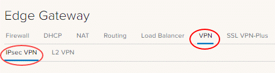

# How to configure IPsec VPN

## Overview

VMware Cloud Director/vCloud Director supports the following types of site-to-site VPN:

- Another edge gateway in the same organisation

- An edge gateway in another organisation (UKCloud or another vCloud service provider)

- A remote network offering IPsec VPN endpoint capability

Depending on the type of connection required, you'll need to complete IP addressing for both ends, together with a shared secret, and indicate which VDC networks are allowed to connect to the VPN link.

## Before you begin

Before you start configuring IPsec VPN settings, you'll need to make a note of the IP address of your edge gateway to use as your tunnel endpoint address. For more information, see [*How to find your allocated external IP addresses*](vmw-how-find-ip-addresses.md).

## Process overview

To configure IPsec VPN, you need to follow these general steps (each of these steps in described in more detail later in this article):

1. [*Configure the edge gateway IPsec VPN settings*](#configuring-edge-gateway-ipsec-vpn-settings).

2. [*Create the second VPN gateway*](#creating-the-second-vpn-gateway).

3. [*Configure the edge gateway firewall*](#configuring-the-edge-gateway-firewall).

4. [*Configure the external data centre gateway firewall*](#configuring-the-external-data-centre-gateway-firewall).

5. [*Validate the tunnel*](#validating-the-tunnel).

## Configuring edge gateway IPsec VPN settings

### [VMware Cloud Director 10.1](#tab/tabid-a)

1. In the VMware Cloud Director *Virtual Data Center* dashboard, select the VDC in which you want to configure IPsec VPN.

2. In the left navigation panel, under *Networking*, select **Edges**.

    

3. On the *Edge Gateways* page, select the edge that you want to configure and click **Services**.

    

4. On the *Edge Gateway* page, select the **VPN** tab, then the **IPsec VPN** tab.

    

5. Select the **IPsec VPN Sites** tab.

    

6. Click the **+** button.

7. In the *Add IPsec VPN* dialog box, select the **Enabled** option.

8. Select the **Enable perfect forward secrecy (PFS)** option if your on-premises/remote site has that capability.

9. In the **Name** field, enter a name for  your IPsec VPN.

10. The **Local ID** field is usually set to the same value as the **Local Endpoint** (see next step).

11. In the **Local Endpoint** field, enter the external IP address of your edge gateway (as noted in the *Prerequisites*).

12. In the **Local Subnets** field, enter the organisation networks that can be accessed via the VPN from the remote location. If you enter multiple local subnets, separate them with commas.

13. The **Peer ID** field is usually set to the same value as the **Peer Endpoint** (see next step).

14. In the **Peer Endpoint** field, enter the external IP address of your remote site or on-premises firewall or edge where the VPN is being set up.

15. In the **Peer Subnets** field, enter the local subnet of your remote network that you want to access from your UKCloud VDC. For example, if your remote networks sit inside the `10.20.0.0/16` range, you could enter `10.20.0.0/16` here or limit your entry to a smaller subnet of that, for example, `10.20.0.0/25`. If you enter multiple subnets, separate them with commas.

16. From the **Encryption Algorithm** list, select the most secure protocol that is supported by your on-premises gateway.

17. From the **Authentication** list, select the authentication method that is supported by your on-premises gateway. If you want to use certificates, you need to configure those first on the **Certificates** tab.

18. If you selected **PSK** as the authentication method, enter the shared secret used to authenticate and encrypt the connection. It must be an alphanumeric string between 32 and 128 characters that includes at least one uppercase letter, one lowercase letter and one number. This must be the same on both sites.

19. We recommend setting the **Diffie-Hellmann Group** to DH14 or higher if your on-premises environment can support it.

    

20. When you're done, click **Keep** to create the edge end of the VPN tunnel.

21. Select the **Activation Status** tab and select the **IPsec VPN Service Status** option.

    

22. Click **Save changes**.

### [vCloud Director 9.7](#tab/tabid-b)

1. In the vCloud Director *Virtual Datacenters* dashboard, select the VDC in which you want to configure IPsec VPN.

2. In the left navigation panel, click **Edges**.

    

3. On the *Edges* page, select the edge that you want to configure and click **Configure Services**.

    

4. On the *Edge Gateway* page, select the **VPN** tab, then the **IPsec VPN** tab.

    

5. Select the **Activation Status** tab, then enable the **IPsec VPN Service Status** option.

    

6. Select the **IPsec VPN Sites** tab.

7. Click the **+** icon.

8. In the *Add IPsec VPN* dialog box, enable the **Enabled** option.

9. Complete the configuration as follows:

    Field | Description
    ------|------------
    Enable perfect forward secrecy (PFS) | Select this if your on-premises/remote site has that capability.
    Name | Enter a desired name for your ipsec vpn
    Local Id | This is usually set to the same value as Local Endpoint
    Local Endpoint | The external IP of your edge gateway (refer to the first steps of this procedure for more information).
    Local Subnets | Enter the organisation networks that can be accessed via the VPN from the remote location (separate multiple local subnets with commas).
    Peer Id | This is usually set to the same value as Peer Endpoint
    Peer Endpoint | The external IP of your remote site or on-premises firewall or edge where VPN is being set up.
    Peer Subnets | This is the local subnet of your remote network that you want to access from your UKCloud VDC. For example, if your remote networks sit inside the `10.20.0.0/16` range, you could enter `10.20.0.0/16` here or limit your entry to a smaller subnet of that, for example `10.20.0.0/25`.
    Encryption Algorithm | Select the most secure protocol that is supported by your on-premises gateway.
    Authentication | Select the authentication method that is supported by your on-premises gateway. If you want to use certificates, then you need to configure those first on the **Certificates** tab.
    Pre-Shared Key | The shared secret used to authenticate and encrypt the connection. It must be an alphanumeric string between 32 and 128 characters that includes at least one uppercase letter, one lowercase letter and one number. This must be the same on both sites.
    Diffie-Hellmann Group | We recommend setting this to DH14 or higher if your on-premises environment can support it.

    

10. When you're done, click **Keep** to create the edge end of the VPN tunnel then click **Save changes**.

***

## Creating the second VPN gateway

You now need to create the endpoint of the VPN tunnel. If this is a different VDC or vOrg, go through the steps described above again to create the tunnel. When you've done that, you can change your firewall settings and validate the connection (see below).

If you're connecting to an external data centre, you'll need to set up the tunnel on that premises.

### Creating an external data centre VPN gateway

Although we can't provide specific instructions on setting up an external data centre gateway to connect to the edge gateway, we've provided information about some configuration requirements below.

> [!IMPORTANT]
> - IPsec VPN supports only time-based rekeying. You must disable lifebytes rekeying.
>
> - Starting in NSX 6.4.5, Triple DES (3DES) cypher algorithm is deprecated in IPsec VPN.

#### IKE Phase 1 and Phase 2

IKE is a standard method for arranging secure, authenticated communications.

##### Phase 1 parameters

Phase 1 sets up mutual authentication of the peers, negotiates cryptographic parameters, and creates session keys. The supported Phase 1 parameters are:

- Main mode

- AES/AES256/AES-GCM (user configurable)

- Diffie-Hellman Group

- Pre-shared secret (user configurable)

- SA lifetime of 28800 seconds (eight hours) with no kbytes rekeying

- ISAKMP aggressive mode disabled

##### Phase 2 parameters

IKE Phase 2 negotiates an IPsec tunnel by creating keying material for the IPsec tunnel to use (either by using the IKE phase 1 keys as a base or by performing a new key exchange). The supported IKE Phase 2 parameters are:

- AES/AES256/AES-GCM (Will match the Phase 1 setting)

- ESP tunnel mode

- Diffie-Hellman Group

- Perfect forward secrecy for rekeying (only if it was switched on in both endpoints)

- SA lifetime of 3600 seconds (one hour) with no kbytes rekeying

- Selectors for all IP protocols, all ports, between the two networks, using IPv4 subnets

## Configuring the edge gateway firewall

When the VPN tunnel is up and running, you'll need to create firewall rules on the edge gateway for any traffic passing over the tunnel. For how to do this, see [*How to create firewall rules*](vmw-how-create-firewall-rules.md).

Key points to note:

- You need to create a firewall rule for both directions, that is, from data centre to VDC and from VDC to data centre.

- For data centre to VDC, set:

  - Source as the source IP range for your external VDC/data centre network

  - Destination as the destination IP range for your VDC network

- For VDC to data centre, set:

  - Source as the source IP range for your VDC network

  - Destination as the destination IP range for your data centre/VDC network

## Configuring the external data centre gateway firewall

When the VPN tunnel is up and running, you may need to create firewall rules and routes on your on-premises gateway or other internal firewall for traffic passing over the tunnel. This is outside of the scope of this article and will depend on your specific premises network configuration.

## Validating the tunnel

When you've configured both ends of the IPsec tunnel, the connection should start without any issues.

> [!NOTE]
> It can take up to two minutes after the tunnel is established to show that the VPN connection is active.

> [!NOTE]
> Logs from the IPsec VPN cannot currently be used to aid fault finding.

To verify the tunnel status:

### [VMware Cloud Director 10.1](#tab/tabid-a)

1. On the *Edge Gateways* page, select the edge that you want to validate and click **Services**.

2. Select the **Statistics** tab and then the **IPsec VPN** tab.

3. For each configured tunnel, if you can see a tick, the tunnel is up and running and operational. If any other status is shown, you'll need to review your configuration and any firewall rules.

    > [!NOTE]
    > It can take up to two minutes after the tunnel is established to show that the VPN  connection is active.

4. You should now be able to send traffic via the VPN.

### [vCloud Director 9.7](#tab/tabid-b)

1. On the *Edges* page, select the edge that you want to validate and click **Configure Services**.

2. Select the **Statistics** tab and then the **IPsec VPN** tab.

3. For each configured tunnel, if you can see a tick, the tunnel is up and running and operational. If any other status is shown, you'll need to review your configuration and any firewall rules.

4. You should now be able to send traffic via the VPN.

***

## Next steps

In this article you've learned how to configure IPsec VPN. For other edge gateway configuration tasks, see:

- [*How to create firewall rules*](vmw-how-create-firewall-rules.md)

- [*How to create NAT rules*](vmw-how-create-nat-rules.md)

- [*How to create a DHCP pool*](vmw-how-create-dhcp-pool.md)

- [*How to configure a load balancer*](vmw-how-configure-load-balancer.md)

- [*How to create a static route*](vmw-how-create-static-route.md)

## Feedback

If you find a problem with this article, click **Improve this Doc** to make the change yourself or raise an [issue](https://github.com/UKCloud/documentation/issues) in GitHub. If you have an idea for how we could improve any of our services, send an email to <feedback@ukcloud.com>.
