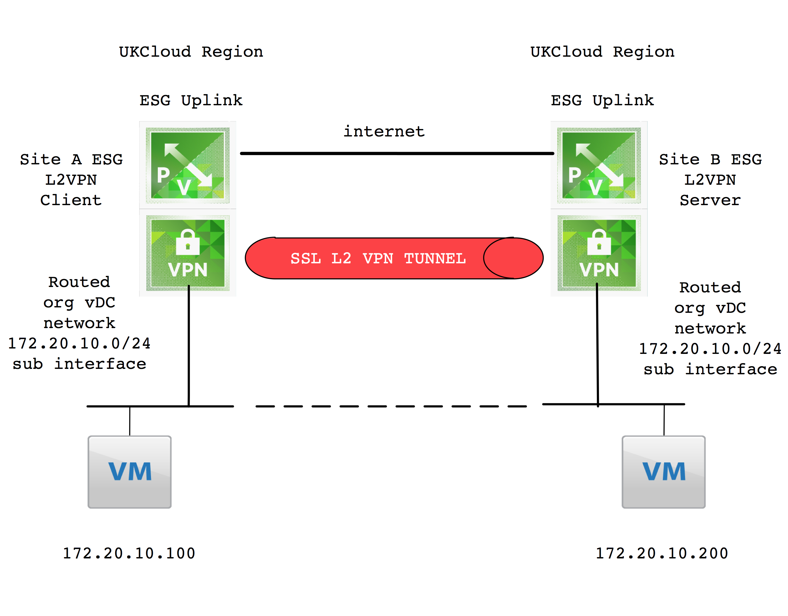
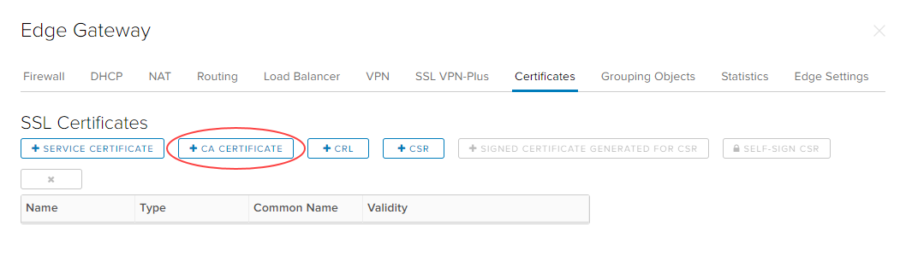
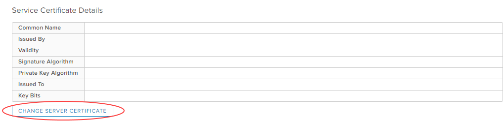
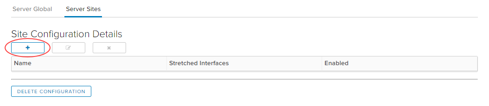
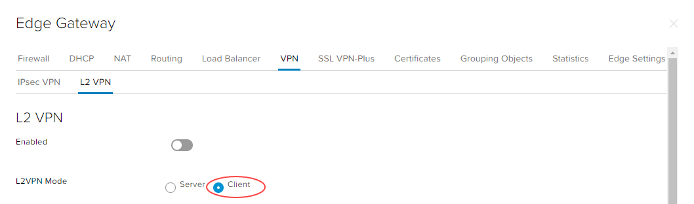
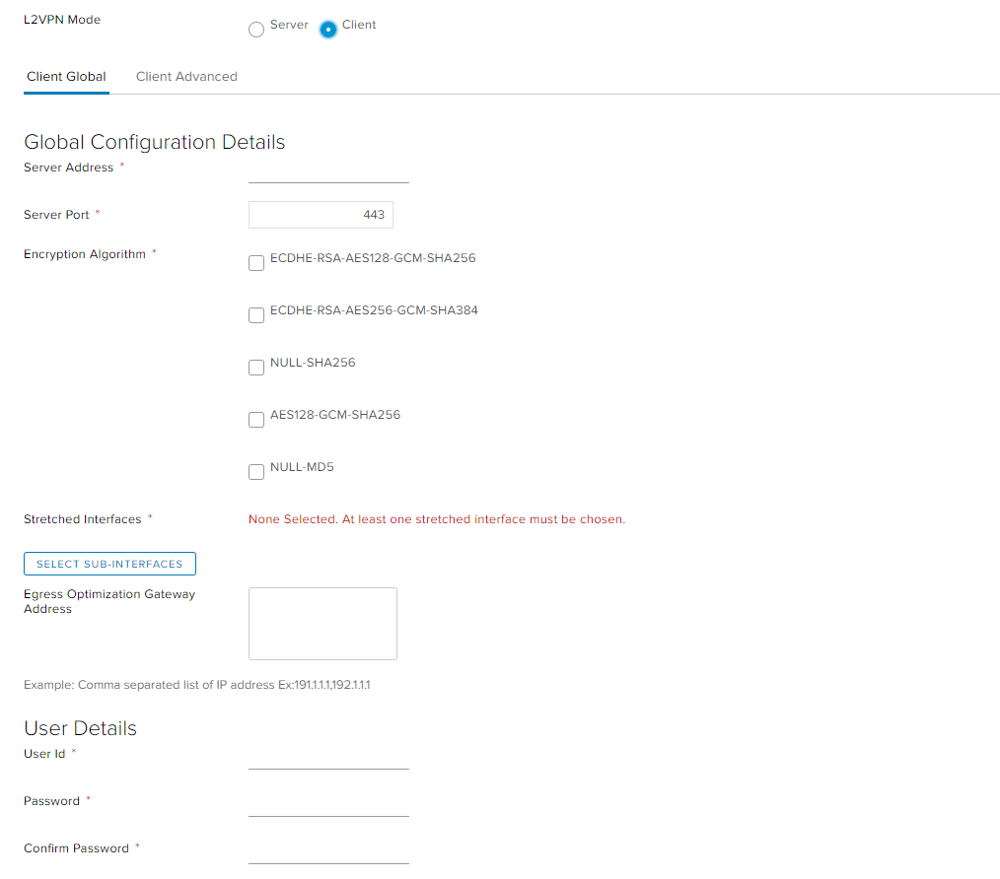
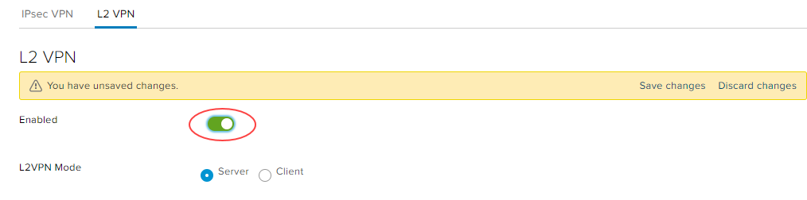

# How to configure an L2 VPN

## Overview

UKCloud for VMware provides Layer 2 (L2) VPN functionality as part of its Advanced Management bundle (additional charges apply). With L2 VPN you can stretch the same L2 broadcast domain over an SSL tunnel across two edge gateways in different sites, meaning that you can move your workloads seamlessly between sites without having to change IP addresses.

L2 VPN is an extension of the edge's SSL functionality. It enables you to configure a tunnel between two sites, extending a logical switch across both sites. The tunnel means that virtual machines (VMs) remain on the same subnet if they are moved between the two sites, enabling you to extend your data centre across multiple sites. An NSX edge at one site can provide all services to VMs on the other site.

UKCloud L2 VPN functionality covers three scenarios:

**L2 connectivity between UKCloud regions**

**Connectivity from your own on-premises site (with vSphere and NSX) to UKCloud**

**L2 connectivity from any remote site (without vSphere and NSX) to UKCloud**

## Before you begin

Before enabling L2 VPN, consider the following:

- You must have purchased the Advanced Management bundle for your UKCloud for VMware service

- This service takes up one of your allocated IP addresses (primary or secondary)

- L2 VPN can only be enabled on a routed Org VDC network

- You cannot use SSL VPN on any edge gateway running L2 VPN

- You may encounter issues with IPsec VPN

- You cannot use load balancers using HTTPS on primary or secondary edge gateway addresses once L2 VPN is enabled

- You'll need to change any existing NAT and firewall rules using the primary or secondary IP of the edge for HTTPS

- If your remote site does not have vSphere or NSX, you'll need to deploy a standalone edge as the L2 VPN client (see [*Deploying a standalone edge as an L2 VPN client*](#deploying-a-standalone-edge-as-an-l2-vpn-client))

## Configuring L2 VPN

To set up L2 VPN, you need to configure an L2 VPN server on the destination edge and an L2 VPN client on the source edge. You must then enable the L2 VPN service on both the server and the client. If one of the sites that you want to stretch is not backed by NSX, you can deploy a standalone edge as the L2 VPN client on that site (see [*Deploying a standalone edge as an L2 VPN client*](#deploying-a-standalone-edge-as-an-l2-vpn-client)).

### Setting up the network

1. [*Create a routed VDC network*](vmw-how-create-routed-network.md) on both the source and destination sites.

   > [!NOTE]
   > To stretch the subnet across the two sites, make sure you use the desired address space on both networks.

2. For each network, select the network and, on the *General* page, click **Edit**

3. In the *Edit network* dialog box, select the **Connection** tab.

4. From the **Interface Type** list, select **Subinterface** to connect the network as a subinterface to the trunk interface on the attached gateway, then click **Save**.

   

5. To be able to move, your VMs need to be able to access your new network, so you need to attach them to it.

### Creating certificates

1. In the VMware Cloud Director *Virtual Data Center* dashboard, select the VDC that contains the *destination* edge gateway.

2. In the left navigation panel, under *Networking*, select **Edges**.

   

3. Select the *destination* edge gateway.

   

4. Click **Services**.

   

5. Select the **Certificates** tab.

6. Click **+ CA Certificate**.

   

7. Add the certificate to use for the L2 VPN server then click **Keep**.

   

8. Repeat this process for the *source* edge gateway.

### Configuring the L2 VPN server on the destination edge gateway

The L2 VPN server is the *destination* edge gateway to which the client is to be connected.

1. On the *Edge Gateway* page for the *destination* edge gateway, select the **VPN** tab, then the **L2 VPN** tab.

2. For **L2VPN Mode**, select **Server**.

   

3. On the **Server Global** tab, from the **Listener IP** list, select the primary or secondary IP address of an external interface of the NSX edge.

4. In the **Listener Port** field, enter the port to use for your L2 VPN. The default port is `443`.

5. Select the **Encryption Algorithm** to use for communication between the server and the client.

   

6. In the *Service Certificate Details* section, click **Change Server Certificate**.

   

7. In the *Change Server Certificate* dialog box, select the **Validate Server Certificate** option, select the certificate you created earlier then click **OK**.

8. Click **Save changes**.

9. Select the **Server Sites** tab.

10. Click the **+** button.

    

11. In the *Add Peer Site* dialog box, specify details for the peer site to enable other sites to connect to the L2 VPN server, then click **Keep**.

    

12. Click **Save changes**.

### Configuring the L2 VPN client on the source edge gateway

The L2 VPN client is the *source* edge gateway that initiates communication with the destination edge (L2 VPN server).

> [!NOTE]
> If the source site is not backed by NSX, you can deploy a standalone edge as the L2 VPN client. For information see [*Deploying a standalone edge as an L2 VPN client*](#deploying-a-standalone-edge-as-an-l2-vpn-client).

1. On the *Edge Gateway* page for the *source* edge gateway, select the **VPN** tab, then the **L2 VPN** tab.

2. For **L2VPN Mode**, select **Client**.

   

3. In the **Server Address** field, enter the address of the L2 VPN server that you set up in the previous section. The address can be the host name or IP address.

4. In the **Server Port** field, enter the port to use for your L2 VPN. The default port is `443`.

5. Select the **Encryption Algorithm** for communicating with the server.

6. Click **Select Sub-Interfaces** and select the sub interfaces to be stretched to the server.

7. In the **Egress Optimization Gateway Address** field, if the default gateway for VMs is the same across the two sites, enter the gateway IP addresses of the sub interfaces or the IP addresses to which traffic should not flow over the tunnel.

8. In the *User Details* section, enter the user credentials to connect to the L2 VPN server.

   

9. Click **Save changes**.

### Completing L2 VPN configuration

1. Configure TCP optimisation.

2. Configure firewall and NAT rules on both the destination and source edge gateways to allow traffic to pass between the L2 VPN server and the L2 VPN client.

3. Enable L2 VPN on the *destination* edge gateway.

   a. On the *Edge Gateway* page for the *destination* edge gateway, select the **VPN** tab, then the **L2 VPN** tab.

   b. For **L2VPN Mode**, select **Server**.

   c. Select the **Enabled** option.

      

   d. Click **Save changes**.

4. Repeat the steps above to enable L2 VPN on the *source* edge gateway (setting **L2VPN Mode** to **Client**).

   

### Deploying a standalone edge as an L2 VPN client

If the source site is not backed by NSX, you can deploy a standalone edge as the L2 VPN client.

1. Download `NSX-l2vpn-client.ovf` and deploy the standalone edge.

   For more information, see the following VMware article: [Configure Standalone Edge as L2 VPN Client](https://docs.vmware.com/en/VMware-NSX-Data-Center-for-vSphere/6.4/com.vmware.nsx.admin.doc/GUID-C9E2B0E4-F1C1-44A7-B142-F814F801FA42.html).

2. Create a port group and convert it to a sub interface.

3. You can now set up your L2 VPN by following the steps below, using the standalone edge as the *source* edge gateway.

   - [*Creating certificates*](#creating-certificates)

   - [*Configuring the L2 VPN server on the destination edge gateway*](#configuring-the-l2-vpn-server-on-the-destination-edge-gateway)

   - [*Configuring the L2 VPN client on the source edge gateway*](#configuring-the-l2-vpn-client-on-the-source-edge-gateway)

   - [*Completing L2 VPN configuration*](#completing-l2-vpn-configuration)

> [!NOTE]
> Make sure you change any existing NAT rules to use other addresses.

## Feedback

If you find a problem with this article, click **Improve this Doc** to make the change yourself or raise an [issue](https://github.com/UKCloud/documentation/issues) in GitHub. If you have an idea for how we could improve any of our services, send an email to <feedback@ukcloud.com>.
