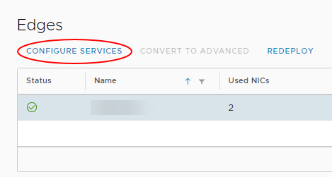

# How to configure a load balancer

## Overview

One of the functions of the edge gateway is to act as a basic Layer 3 load balancer, distributing IP traffic to a pool of servers while appearing as a single virtual server. The load balancing methods offered are round-robin, IP hash, URI, HTTP header or least connected.

Bear in mind, however, that the edge gateway load balancer is quite basic. If you need to meet more complex requirements, you'll need provide your own third-party virtual load balancer.

## Configuring a load balancer

To configure a load balancer:

### [VMware Cloud Director 10.1](#tab/tabid-a)

1. In the VMware Cloud Director *Virtual Data Center* dashboard, select the VDC that contains the edge gateway in which you want to configure the load balancer.

2. In the left navigation panel, under *Networking*, select **Edges**.

    

3. On the *Edge Gateways* page, select the edge that you want to configure and click **Services**.

    

4. On the *Edge Gateway* page, select the **Load Balancer** tab.

    

5. Select the **Global Configuration** tab, then switch on the **Status** toggle.

6. Switch on the **Acceleration Enabled** toggle if you want to use the Layer 4 engine rather than Layer 7.

7. If you have a syslog server configured, switch on the **Enable Logging** toggle and select the **Log Level**.

    For more information about syslog servers, see [*How to access syslog data for your advanced gateway*](vmw-how-access-syslog-data-adv.md)

    

8. Click **Save changes**.

### [vCloud Director 9.7](#tab/tabid-b)

1. In the vCloud Director *Virtual Datacenters* dashboard, select the VDC that contains the edge gateway in which you want to configure the load balancer.

2. In the left navigation panel, click **Edges**.

    

3. On the *Edges* page, select the edge that you want to configure and click **Configure Services**.

    

4. On the *Edge Gateway* page, select the **Load Balancer** tab.

    

5. On the **Global Configuration** tab, enable the **Enabled** option.

6. If you have a syslog server configured, enable the **Enable Logging** option.

    For more information about syslog servers, see [*How to access syslog data for your advanced gateway*](vmw-how-access-syslog-data-adv.md)

7. Click **Save changes**.

***

### Configuring a server pool

Server pools are the real servers that are masked by the load balancer.

> [!NOTE]
> Before you configure the pool of servers, make a list of their IP addresses so that you can populate the pool later in the procedure.

#### [VMware Cloud Director 10.1](#tab/tabid-a)

1. On the **Load Balancer** tab of the *Edge Gateway* page, select the **Pools** tab.

    

2. Click the **+** button.

    

3. In the *Add Pool* dialog box, enter a **Name** and **Description**.

    > [!NOTE]
    > The pool name should not include any spaces.

4. From the **Algorithm** list, select the load balancing algorithm to use.

5. From the **Monitors** list, select the monitors policy to use.

6. Switch on the **Transparent** toggle if you want IP addresses to be transparent.

    

7. In the *Members* section, click **+**.

    

8. In the *Add Member* dialog box, enter the server **Name**, **IP Address**, **Port** and **Weight**. When you're done, click **Keep**.

    

9. Add more pool members as required and when you're done, click **Keep**.

10. To view the status of pool members, click **Show Pool Statistics**.

    

#### [vCloud Director 9.7](#tab/tabid-b)

1. On the **Load Balancer** tab of the *Edge Gateway* page, select the **Pools** tab.

    

2. Click the **+** button.

    

3. In the *Add Pool* dialog box, enter a **Name** and **Description**.

    > [!NOTE]
    > The pool name should not include any spaces.

4. From the **Algorithm** list, select the load balancing algorithm to use.

5. From the **Monitors** list, select the monitors policy.

6. Enable the **Transparent** option if you want IP addresses to be transparent.

    

7. In the *Members* section, click **+**.

    

8. In the *Add Member* dialog box, enter the server **Name**, **IP Address**, **Port** and **Weight**. When you're done, click **Keep**.

    

9. Add more pool members as required and when you're done, click **Keep**.

10. To view the status of pool members, click **Show Pool Statistics**.

    

***

### Configuring a virtual server

A virtual server masks the pool of real servers and presents a single IP address.

#### [VMware Cloud Director 10.1](#tab/tabid-a)

1. On the **Load Balancer** tab of the *Edge Gateway* page, select the **Virtual Servers** tab.

    

2. Click the **+** button.

    

3. In the *Add Virtual Server* dialog box, enable the **Enable Virtual Server** option.

4. Enter a **Name** for the virtual server, assign it a virtual **IP Address**, and assign it to the server pool you want to mask (**Default Pool**). You can also choose which services you want to apply to the virtual server. When you're done, click **Keep**.

    

#### [vCloud Director 9.7](#tab/tabid-b)

1. On the **Load Balancer** tab of the *Edge Gateway* page, select the **Virtual Servers** tab.

    

2. Click the **+** button.

    

3. In the *Add Virtual Server* dialog box, enable the **Enable Virtual Server** option.

4. Enter a **Name** for the virtual server, assign it a virtual **IP Address**, and assign it to the server pool you want to mask. You can also choose which services you want to apply to the virtual server. When you're done, click **Keep**.

    

***

## Next steps

In this article you've learned how to configure a load balancer. For other edge gateway configuration tasks, see:

- [*How to create firewall rules*](vmw-how-create-firewall-rules.md)

- [*How to create NAT rules*](vmw-how-create-nat-rules.md)

- [*How to create a DHCP pool*](vmw-how-create-dhcp-pool.md)

- [*How to configure IPsec VPN*](vmw-how-configure-ipsec-vpn.md)

- [*How to create a static route*](vmw-how-create-static-route.md)

## Feedback

If you find a problem with this article, click **Improve this Doc** to make the change yourself or raise an [issue](https://github.com/UKCloud/documentation/issues) in GitHub. If you have an idea for how we could improve any of our services, send an email to <feedback@ukcloud.com>.
